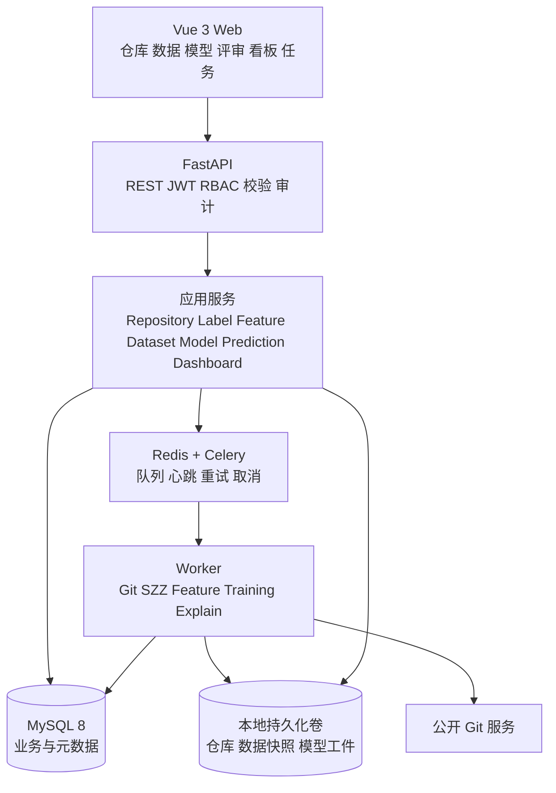
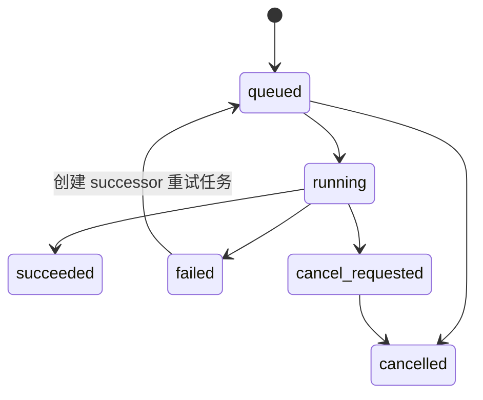
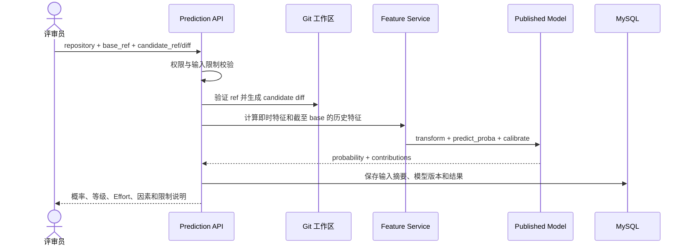

# DefectGuard 系统架构与详细设计

## 1 设计原则

1. 时间因果优先：任何提交的历史特征只能使用当时可得的数据。
2. 版本优先：标签、特征、数据集、训练、工件和预测显式记录版本。
3. 证据优先：Fix、SZZ、指标和测试结果均可追溯。
4. 先纵切后扩展：先交付小数据端到端链路，再扩展模型与评审入口。
5. 模型辅助人：模型用于排序，最终决策由评审者完成。
6. 安全默认开启：外部 URL、凭据、diff 和模型工件均按不受信输入处理。

## 2 总体架构

系统采用模块化单体与异步 Worker。API 保持统一部署，计算密集和长时间任务由 Celery Worker 执行，避免 3 至 4 人团队承担微服务治理成本。



## 3 模块划分

| 模块 | 职责 | 主要输入和输出 | 对应需求 |
|---|---|---|---|
| M1 Auth/Audit | 登录、会话、RBAC、操作审计 | token、角色、operation_log | US-22～23 |
| M2 Repository | URL 校验、克隆、解析、同步 | repository、commit、file_change | US-01～03 |
| M3 Label | Fix 证据、SZZ、成熟度和抽检 | defect_evidence、szz_link、commit_label | US-04～05 |
| M4 Feature | Kamei 14、语义输入、质量统计 | commit_feature、semantic artifact | US-06～07、10 |
| M5 Dataset | 时间切分、不可变快照、不平衡配置 | dataset、dataset_item | US-08～09 |
| M6 Model | 插件注册、训练、评估、校准和发布 | model_run、model_artifact | US-11～15 |
| M7 Prediction | 候选 diff、批量预测和解释 | prediction_task、prediction_result | US-16～19 |
| M8 Dashboard | 趋势、风险队列和下钻 | 聚合结果 | US-18、20 |
| M9 Task | 幂等、心跳、重试、取消和 stale 恢复 | async_task | US-02、12、19、21 |

模块之间通过应用服务接口协作，不允许跨模块直接写对方表。基础设施实现通过依赖注入接入领域接口。

## 4 推荐目录结构

```text
softwaretest/
├─ apps/
│  ├─ api/                 # FastAPI 入口、路由和依赖注入
│  ├─ worker/              # Celery 任务入口
│  └─ web/                 # Vue 3 前端
├─ packages/
│  ├─ domain/              # 领域模型、状态机和服务接口
│  ├─ mining/              # Git、Fix、SZZ
│  ├─ features/            # Kamei 和语义输入
│  ├─ ml/                  # 模型插件、指标、校准和解释
│  └─ persistence/         # SQLAlchemy、仓储和工件存储
├─ tests/
│  ├─ unit/
│  ├─ integration/
│  ├─ e2e/
│  ├─ data/
│  ├─ performance/
│  └─ security/
├─ docs/
├─ openspec/
├─ deploy/
└─ pyproject.toml
```

前端依赖和锁文件放在 `apps/web/`；Python 采用根级工作区配置和锁文件。运行时数据、仓库镜像、模型和密钥不得提交到 Git。

## 5 仓库采集设计

### 5.1 URL 安全

首期只允许 HTTPS。若以后支持 SSH，必须由管理员配置受信主机及独立 deploy key。

1. 拒绝 URL 内嵌凭据、非允许协议、异常端口和语法错误。
2. 解析全部 A/AAAA 地址，拒绝 loopback、私网、链路本地及保留地址。
3. 每次重定向后重新校验 URL 和 DNS。
4. 连接时固定或复核已校验地址，防止 DNS rebinding。
5. 限制仓库大小、克隆时间、diff 规模及并发任务数。
6. 错误响应不得包含本机路径、命令参数、凭据或依赖版本。

### 5.2 解析和同步

- 首次采集记录默认分支 head 和解析边界。
- 提交按确定性拓扑和时间顺序处理；每批 upsert 后保存 checkpoint。
- `repository_id + commit_sha` 唯一，重试不产生重复提交。
- 合并提交保留，但 baseline SZZ 和训练默认跳过；策略写入版本。
- 强推或祖先关系破坏时将仓库标记为 `requires_review`，不得静默删除历史。

## 6 异步任务设计

### 6.1 状态机



### 6.2 幂等、心跳与恢复

- 写任务接受 `Idempotency-Key`。
- 数据库唯一约束 `(task_type, scope_key, idempotency_key)`，禁止使用“先查再插”作为唯一防重手段。
- Worker 定期更新租约和心跳；超过阈值标记 stale，由协调器决定恢复或失败。
- 重试创建 successor 并通过 `retry_of` 关联，不覆盖原失败记录。
- 取消是协作式取消，在批次或安全检查点读取标志并保持事务一致。
- 默认自动重试不超过 3 次；不可重试错误直接失败。

## 7 预测运行链路



候选 diff 在隔离临时工作区处理。不得将用户提供的路径直接拼接进命令，也不得执行仓库内脚本。

## 8 模型插件设计

模型插件统一实现以下能力：

```python
class ModelPlugin(Protocol):
    name: str
    family: Literal["classic", "deep"]
    input_schema: str

    def validate_params(self, params: dict) -> None: ...
    def fit(self, train, valid, seed: int): ...
    def predict_proba(self, data): ...
    def explain(self, data): ...
    def save(self, path): ...

    @classmethod
    def load(cls, path): ...
```

插件不得自行读取任意用户路径。加载工件前验证类型、来源和 SHA-256；不反序列化不受信工件。

## 9 权限与审计

| 角色 | 权限 |
|---|---|
| Viewer | 查询仓库、数据质量、指标、预测和看板 |
| Member | Viewer 权限，加发起仓库、特征、训练和预测任务 |
| Admin | Member 权限，加模型发布、用户管理和审计查询 |

默认关闭公开注册。首次管理员通过部署配置创建。短期 access token 与可撤销 refresh/session 配合使用。模型发布、角色变更、任务取消和重试必须写操作审计。

## 10 隐私、供应链与可观测性

- 作者身份归并后保存哈希或别名，普通导出不包含原始邮箱。
- Git 凭据和应用密钥通过 secret 注入，不进入数据库、命令行和日志。
- Python 和 Node 依赖必须锁定；CI 生成依赖审计结果。
- 统一记录 `request_id`、`task_id`、`run_id`，结构化日志不得含敏感信息。
- 指标至少包含队列长度、任务耗时、失败率、stale 数、预测延迟和模型缓存命中率。
- 健康检查区分 API、MySQL、Redis、Worker 和工件存储；公开端点只返回必要状态，不暴露版本和内部地址。

## 11 部署设计

Docker Compose 至少包含 `web`、`api`、`worker`、`mysql` 和 `redis`。仓库镜像、数据快照和模型工件使用具名持久化卷。API 与 Worker 使用同一版本镜像，通过不同启动命令运行。

开发环境允许直接启动组件，但必须使用相同配置结构。配置按环境分层，密钥仅通过未提交的环境文件或 secret 管理器注入。
