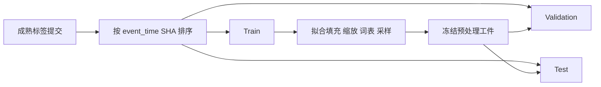

# DefectGuard 数据与算法规格

## 1 版本与时间口径

- `event_time`：以 committer time 为主要排序时间，并使用 SHA 作为稳定并列键；原始 author time 和 committer time 均保留。
- `label_version`：Fix 规则、SZZ 变体、观察窗口、父提交和过滤策略的组合版本。
- `feature_version`：十四维公式、身份别名、子系统映射和语义 tokenizer 的组合版本。
- `dataset`：标签、特征、快照时间、时间边界及预处理配置形成的不可变数据集版本。
- `effort = LA + LD`：全部 effort-aware 指标的统一成本近似。

## 2 Fix 识别

| 等级 | 规则 | 默认处理 |
|---|---|---|
| High | 关联 Issue 明确为 bug，且存在关闭、修复或等价关系 | 纳入 |
| Medium | message 命中带词边界的缺陷修复关键词，可审计和抽检 | 可配置纳入 |
| Low | 只有普通 Issue ID、模糊词、文档修正或回滚 | 不自动纳入 |

每条证据保存 `evidence_type`、`evidence_value`、`confidence`、`rule_version`、`review_status` 和来源摘要。规则必须覆盖大小写、否定语境、单词边界、文档变更和回滚等误报场景。

## 3 Baseline SZZ

```text
for each confirmed fix commit F:
  select parent according to label_version
  for each changed non-binary file:
    identify deleted or replaced lines in the parent revision
    filter whitespace-only and comment-only lines by filter_version
    blame each remaining line in the parent revision
    persist fix, path, fixed line, blamed commit, blamed line and confidence
aggregate blamed commits as candidate bug-introducing commits
```

约束：

- 普通提交使用唯一父提交；合并提交默认跳过，其他策略必须版本化。
- blame 结果等于 Fix 的直接父提交是合法结果，不能因此排除。
- 重命名跟踪、空白和注释过滤属于 baseline 的工程过滤，不构成 RA-SZZ。
- 首次新增、删除文件、二进制文件和无法解析的行应产生明确状态而非静默丢弃。
- 重跑同一版本应幂等；新规则必须生成新 `label_version`。

## 4 标签成熟度

在数据快照时点 `T`，提交 `c` 的标签为：

- `buggy`：在 `T` 前存在已确认 SZZ 证据；
- `clean`：提交年龄至少为观察窗口 `W`，且在 `T` 前无缺陷证据；
- `unknown`：年龄不足 `W`、证据冲突、解析失败或待人工复核。

`unknown` 不进入监督训练。观察窗口由修复延迟分布或预先声明的规则确定，写入 `label_version`，不得根据测试集表现事后调整。

## 5 Kamei 14 特征

全部历史量只使用当前提交之前的数据。身份在计算前通过版本化别名规则映射到 `author_identity_id`。

| 类别 | 特征 | 计算口径 |
|---|---|---|
| Diffusion | NS | 变更涉及的子系统数；子系统映射规则版本化 |
| Diffusion | ND | 变更涉及的目录数 |
| Diffusion | NF | 变更文件数 |
| Diffusion | Entropy | 每文件 `churn_i=LA_i+LD_i`，`p_i=churn_i/sum(churn)`，`H=-Σp_i log2 p_i`；NF>1 时除以 `log2(NF)`，否则为 0 |
| Size | LA | 新增行数，二进制文件不计 |
| Size | LD | 删除行数，二进制文件不计 |
| Size | LT | 变更前文件 LOC 总和；最终聚合口径固定到 `feature_version` |
| Purpose | FIX | 是否为确认的 Fix；候选预测时使用 0/unknown 策略并记录 |
| History | NDEV | 此提交之前修改相关文件的不同开发者数 |
| History | AGE | 文件距上次修改的天数，以当前文件 churn 加权平均；首次文件按版本化缺失规则处理 |
| History | NUC | 此提交之前相关文件的历史变更次数 |
| Experience | EXP | 作者在当前提交之前的总提交数 |
| Experience | REXP | 作者历史提交按 `1/(age_years+1)` 加权之和 |
| Experience | SEXP | 作者此前在相关子系统中的提交数 |

原始特征和模型变换后的输入分开保存。`log1p`、填充和标准化只在 train 拟合，并随模型工件持久化。

## 6 语义输入

首个语义管线包括：

1. 规范化 commit message；
2. 从 unified diff 分离 added/deleted token；
3. 排除二进制和超限文件；
4. 仅在 train 构建词表；
5. 固定最大文件、行和 token 数并生成 mask；
6. 保存 tokenizer、词表、截断策略和输入 schema 版本。

TextCNN/DeepJIT-inspired 使用 message 与 diff 两路输入。若未复现论文架构和输入，不得命名为“DeepJIT 复现”。MLP 的 14 维数值输入不算语义模型。

## 7 数据集构建与防泄漏



- 默认 70%/15%/15%，具体边界保存在数据集记录中。
- 同一提交只属于一个 split；数据集创建后不可变，重建生成新 ID。
- SMOTE、下采样或其他重采样只能作用于 train。
- validation 用于校准、阈值和早停，test 仅用于最终报告。
- 单项目时间切分和跨项目实验必须分开报告。
- 数据集内容生成稳定哈希，创建时执行标签、版本和时间一致性审计。

## 8 模型组合

达标模型固定为：

- 经典模型：Logistic Regression、Naive Bayes、SVM、Random Forest、XGBoost、LightGBM；
- 深度模型：MLP、TextCNN/DeepJIT-inspired。

Naive Bayes 在技术探针后根据输入分布选择 Gaussian 或 Complement。SVM 必须支持概率估计或外置校准。BiLSTM、CodeBERT 属于 P2，不影响硬指标验收。

每个 `model_run` 至少保存代码 SHA、依赖摘要、dataset ID、label/feature version、插件名、参数、随机种子、预处理器、校准器、阈值、指标及工件哈希。

## 9 评估指标

### 9.1 Effort-unaware

报告 Precision、Recall、F1、ROC-AUC、PR-AUC、MCC 和混淆矩阵。类别不平衡时 Accuracy 只作辅助指标。测试集仅有单一类别时，不可计算的指标返回 `null` 和原因，不得伪造为 0。

### 9.2 Effort-aware

按 `probability desc, event_time asc, sha asc` 稳定排序，使用 `LA+LD` 作为 Effort：

- `PofB20`：累计 Effort 首次达到总 Effort 20% 时捕获的 buggy 数占总 buggy 数比例；
- `IFA`：遇到第一个 buggy 前检查的 clean 提交数；
- `Popt`：模型排序曲线相对最优和最差曲线的归一化面积，报告离散积分和截断规则。

主要指标使用时间块 bootstrap 或重复实验给出区间或离散度，避免将相邻提交视为完全独立样本。

## 10 概率、风险和解释

- 输出必须是经声明校准器处理的概率，并携带模型和阈值版本。
- 默认队列按校准概率排序。
- `risk_density = probability / max(1, LA+LD)` 仅作为辅助字段。
- 超大变更必须显著标识，不得因密度低而被隐藏。
- 因素解释返回特征名、原始值、贡献值和方向，并明确“不代表因果根因”。
- 概率阈值只能根据 validation 确定。

## 11 算法测试夹具

SZZ golden fixture 至少包含普通修改、文件重命名、空白行、注释行、首次新增、文件删除、二进制文件、合并提交和 blame 到直接父提交。

Kamei fixture 使用可手算的小型 Git 仓库，逐项验证 14 个特征，尤其是 Entropy、AGE、REXP 和历史特征的时间边界，不接受只断言“字段非空”的测试。

## 12 第七阶段采集输入

初次窗口固定HEAD及全部历史/最近N；事件顺序为committer time、SHA，不以拓扑顺序替代时间切分。双时间/时区偏移、父关系、author identity、文件blob/路径/统计/明确略过状态保存；策略native-pydriller-v1详见 [解析指导](development/提交解析与验收.md)。merge diff、二进制、编码/超限内容不伪造零数据或clean标签。后续特征、Fix/SZZ与数据集需显式检查窗口覆盖、状态和版本；最近N之外的历史不能自动算作EXP/NDEV等为零。身份别名新规则、diff/merge策略改变必须独立版本化，不改写已固定窗口。


## 第八阶段同步输入约束

初次parse_checkpoint不变，多轮sync_window记录接受链条及候选范围，事件时间可能倒退而祖先关系仍正常；增量集合由DAG决定。A11是已提交记录并集，包含中断批次，后续数据集须绑定接受HEAD/窗口/规则和成熟标签。recent_window不能提升为完整历史；requires_review候选不得进入训练或预测基线。Fix仍只产生版本化证据，merge/编码/超限略过不是clean；SZZ独立change。见 [同步指导](development/增量同步与验收.md)。
