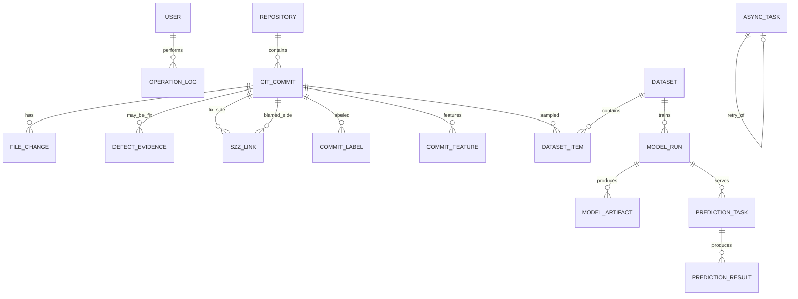

# DefectGuard API 与数据库规格

## 1 API 通用约定

- 基础路径为 `/api/v1`，JSON 字段使用 `snake_case`。
- 所有业务 ID 使用 UUID；时间使用 UTC ISO-8601。
- 同步创建资源返回 `201 Created`；创建异步任务返回 `202 Accepted`；成功取消且无响应体返回 `204 No Content`。
- 错误结构为 `{code, message, request_id, details?}`。生产响应不包含堆栈、SQL、本机路径、命令行或依赖版本。
- 写接口接受 `Idempotency-Key`；同一作用域重复请求返回原资源或明确冲突。
- 分页参数统一为 `page`、`page_size`，`page_size` 最大为 100。
- OpenAPI 由代码生成并由 CI 检查漂移。本文定义产品级契约，最终字段以评审后的 OpenAPI 为准。

## 2 权限模型

| 权限标识 | 含义 |
|---|---|
| Public | 无需登录，仅允许必要的认证和最小健康状态接口 |
| Viewer | 只读查询 |
| Member | Viewer 权限，加发起数据、训练和预测任务 |
| Admin | Member 权限，加发布模型、管理用户和查看审计 |

## 3 接口清单

| ID | 方法与路径 | 用途 | 权限 |
|---|---|---|---|
| A01 | `POST /auth/login` | 登录并创建会话 | Public |
| A02 | `POST /auth/logout` | 撤销当前 refresh/session | Viewer |
| A03 | `POST /auth/refresh` | 刷新 access token | Viewer |
| A04 | `GET /users/me` | 当前用户信息 | Viewer |
| A05 | `GET /admin/users` | 用户列表 | Admin |
| A06 | `PATCH /admin/users/{id}` | 修改角色或禁用状态 | Admin |
| A07 | `POST /repositories` | 添加仓库并返回采集任务 | Member |
| A08 | `GET /repositories` | 仓库列表 | Viewer |
| A09 | `GET /repositories/{id}` | 仓库详情、进度和质量摘要 | Viewer |
| A10 | `POST /repositories/{id}/sync` | 增量同步 | Member |
| A11 | `GET /repositories/{id}/commits` | 提交列表 | Viewer |
| A12 | `POST /repositories/{id}/fix-detection` | 运行 Fix 识别 | Member |
| A13 | `POST /repositories/{id}/szz-runs` | 启动 SZZ | Member |
| A14 | `GET /szz-runs/{id}/links` | 查询 SZZ 行级证据 | Viewer |
| A15 | `POST /repositories/{id}/feature-runs` | 启动特征提取 | Member |
| A16 | `GET /repositories/{id}/feature-quality` | 特征质量摘要 | Viewer |
| A17 | `POST /datasets` | 创建不可变数据集 | Member |
| A18 | `GET /datasets` | 数据集列表 | Viewer |
| A19 | `GET /datasets/{id}` | 数据集详情与审计结果 | Viewer |
| A20 | `POST /model-runs` | 发起训练 | Member |
| A21 | `GET /model-runs/{id}` | 训练状态、配置和指标 | Viewer |
| A22 | `POST /model-runs/{id}/publish` | 发布模型 | Admin |
| A23 | `GET /models` | 已发布模型和插件注册表 | Viewer |
| A24 | `POST /predictions/candidate` | 候选 ref 或 diff 预测 | Member |
| A25 | `POST /prediction-tasks` | 创建批量预测 | Member |
| A26 | `GET /prediction-tasks/{id}/results` | 查询风险队列 | Viewer |
| A27 | `GET /predictions/{id}/explanation` | 预测解释详情 | Viewer |
| A28 | `GET /dashboards/trends` | 标签和预测趋势 | Viewer |
| A29 | `GET /tasks` | 任务列表 | Viewer |
| A30 | `GET /tasks/{id}` | 任务详情 | Viewer |
| A31 | `POST /tasks/{id}/retry` | 创建重试任务 | Member |
| A32 | `POST /tasks/{id}/cancel` | 请求取消任务 | Member |
| A33 | `GET /operations` | 操作审计 | Admin |
| A34 | `GET /health` | 最小存活状态 | Public |

## 4 关键请求与响应

### 4.1 添加仓库

`POST /api/v1/repositories`

```json
{
  "url": "https://github.com/example/project.git",
  "commit_limit": 1000
}
```

返回 `202`：

```json
{
  "repository_id": "uuid",
  "task_id": "uuid",
  "status": "queued"
}
```

`commit_limit` 用于技术探针和受控演示，不改变仓库身份。URL 必须先通过 SSRF 与 Git 可访问性校验。

### 4.2 创建数据集

`POST /api/v1/datasets`

```json
{
  "repository_id": "uuid",
  "label_version": "szz-baseline-v1",
  "feature_version": "kamei-v1",
  "snapshot_at": "2026-09-26T00:00:00Z",
  "split": {"train": 0.70, "validation": 0.15, "test": 0.15},
  "imbalance_strategy": {"kind": "class_weight"}
}
```

没有足够成熟标签、版本不兼容或时间边界无效时返回稳定错误码，不创建部分数据集。

### 4.3 候选预测

`POST /api/v1/predictions/candidate`

```json
{
  "repository_id": "uuid",
  "model_run_id": "uuid",
  "base_ref": "main",
  "candidate_ref": "feature/example"
}
```

也可使用受限的 `diff` 代替 `candidate_ref`，两者必须且只能提供一个。

成功响应：

```json
{
  "prediction_id": "uuid",
  "model_run_id": "uuid",
  "probability": 0.82,
  "calibration": "isotonic-v1",
  "risk_level": "high",
  "effort": 126,
  "risk_density": 0.0065,
  "top_factors": [
    {"feature": "la", "value": 92, "contribution": 0.18, "direction": "increase"}
  ],
  "limitations": ["因素贡献不代表缺陷的因果根因"]
}
```

当计算超过同步时限时返回 `202 + task_id`，由任务接口查询结果。

## 5 错误码分组

| 范围 | 类别 | 示例 |
|---|---|---|
| `AUTH_*` | 认证和权限 | token 失效、角色不足、用户禁用 |
| `REPO_*` | 仓库输入和状态 | URL 被拒绝、克隆失败、强推待确认 |
| `DATA_*` | 标签、特征和数据集 | 成熟样本不足、版本不一致、泄漏审计失败 |
| `MODEL_*` | 训练和模型 | 参数非法、工件校验失败、特征 schema 不兼容 |
| `PRED_*` | 预测 | ref 不存在、diff 超限、base 不可达 |
| `TASK_*` | 异步任务 | 状态不允许、任务 stale、取消冲突 |
| `SYSTEM_*` | 基础设施 | 依赖暂不可用、内部错误 |

错误码使用稳定字符串，不让前端依赖自然语言消息。

## 6 数据关系



表名使用 `git_commit`，避免与 SQL 语义和代码中的提交操作混淆。

## 7 表结构摘要

| 表 | 关键字段与约束 | 用途 |
|---|---|---|
| `user` | `id`, `username UNIQUE`, `email_hash`, `password_hash`, `role`, `is_active` | 系统用户；普通查询不返回密码哈希 |
| `repository` | `id`, `url`, `canonical_url UNIQUE`, `default_branch`, `head_sha`, `status`, `checkpoint_sha` | 仓库及采集状态 |
| `author_identity` | `id`, `name_alias`, `email_hash`, `identity_version` | 版本化作者归并 |
| `git_commit` | `id`, `repository_id`, `sha`, `author_identity_id`, `author_time`, `committer_time`, `message`, `parent_count`; `UNIQUE(repository_id,sha)` | 提交元数据 |
| `file_change` | `id`, `commit_id`, `old_path`, `new_path`, `change_type`, `insertions`, `deletions`, `old_loc`, `is_binary` | 文件变更 |
| `defect_evidence` | `id`, `fix_commit_id`, `type`, `value`, `confidence`, `rule_version`, `review_status` | Fix 证据 |
| `szz_link` | `id`, `fix_commit_id`, `blamed_commit_id`, `path`, `fixed_line`, `blamed_line`, `confidence`, `label_version`; 唯一证据键 | SZZ 行级追溯 |
| `commit_label` | `commit_id`, `label_version`, `state`, `snapshot_at`, `maturity_days`, `reason`; `PK(commit_id,label_version)` | buggy/clean/unknown 标签 |
| `commit_feature` | `commit_id`, `feature_version`, 14 个原始值, `semantic_artifact_uri`, `computed_at`; `PK(commit_id,feature_version)` | 多版本特征 |
| `dataset` | `id`, `repository_id`, `label_version`, `feature_version`, `snapshot_at`, split 边界, `config_json`, `content_hash` | 不可变数据集 |
| `dataset_item` | `dataset_id`, `commit_id`, `split`, `label`, `feature_version`, `label_version`; `PK(dataset_id,commit_id)` | 数据集成员 |
| `model_run` | `id`, `dataset_id`, `plugin`, `family`, `code_sha`, `dependency_digest`, `params_json`, `seed`, `status`, `metrics_json`, `threshold`, `calibration`, `source_run_id` | 一次训练运行 |
| `model_artifact` | `id`, `model_run_id`, `kind`, `uri`, `sha256`, `size` | 模型、预处理器、校准器、词表 |
| `prediction_task` | `id`, `model_run_id`, `repository_id`, `base_ref`, `candidate_ref`, `input_hash`, `status` | 单次或批量预测任务 |
| `prediction_result` | `id`, `prediction_task_id`, `commit_sha`, `candidate_key`, `probability`, `risk_level`, `effort`, `risk_density`, `explanation_json` | 一任务多结果 |
| `async_task` | `id`, `type`, `scope_key`, `idempotency_key`, `status`, `progress`, `heartbeat_at`, `retry_of`, `error_code`; 唯一任务键 | 通用长任务状态 |
| `operation_log` | `id`, `actor_id`, `action`, `object_type`, `object_id`, `result`, `request_id`, `created_at`, `detail_json` | 操作审计 |

## 8 索引和一致性

至少建立以下索引：

- `git_commit(repository_id, committer_time, sha)`；
- `file_change(commit_id)`；
- `commit_label(label_version, state)`；
- `commit_feature(feature_version)`；
- `dataset_item(dataset_id, split)`；
- `async_task(status, heartbeat_at)`；
- `prediction_result(prediction_task_id, probability)`。

外键按业务生命周期选择限制或级联，不能依赖应用代码模拟唯一性。批量写入使用事务和 upsert；checkpoint 只能在对应批次成功提交后推进。

## 9 保留与删除策略

- 数据集和已发布模型引用的工件不可由普通清理任务删除。
- 任务详细日志按配置保留，错误摘要长期保留但必须脱敏。
- 删除仓库仅允许 Admin 执行；先生成影响清单并二次确认。
- 默认采用软删除或归档状态保留审计关系，实际文件清理与元数据状态在同一受控任务中协调。
