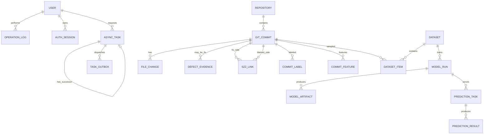

# DefectGuard API 与数据库规格

## 1 API 通用约定

- 基础路径为 `/api/v1`，JSON 字段使用 `snake_case`。
- 所有业务 ID 使用 UUID；时间使用 UTC ISO-8601。
- 同步创建资源返回 `201 Created`；创建异步任务或接受运行中任务的取消请求返回 `202 Accepted`；任务已取消且无响应体返回 `204 No Content`。
- 错误结构为 `{code, message, request_id, details?}`。生产响应不包含堆栈、SQL、本机路径、命令行或依赖版本。
- 写接口接受 `Idempotency-Key`；同一作用域重复请求返回原资源或明确冲突。
- 分页参数统一为 `page`、`page_size`，`page_size` 最大为 100。
- OpenAPI 由代码生成并由 CI 检查漂移。本文定义产品级契约，最终字段以评审后的 OpenAPI 为准。

## 2 权限模型

| 权限标识 | 含义 |
|---|---|
| Public | 无需登录，仅允许必要的认证和最小健康状态接口 |
| Viewer | 只读查询 |
| Member | Viewer 权限，加发起数据、训练和预测任务 |
| Admin | Member 权限，加发布模型、管理用户和查看审计 |

## 3 接口清单

| ID | 方法与路径 | 用途 | 权限 |
|---|---|---|---|
| A01 | `POST /auth/login` | 登录并创建会话 | Public |
| A02 | `POST /auth/logout` | 撤销当前 refresh/session | Public，按会话 cookie 与 CSRF 校验 |
| A03 | `POST /auth/refresh` | 刷新 access token | Public，按 refresh cookie 与 CSRF 校验 |
| A04 | `GET /users/me` | 当前用户信息 | Viewer |
| A05 | `GET /admin/users` | 用户列表 | Admin |
| A06 | `PATCH /admin/users/{id}` | 修改角色或禁用状态 | Admin |
| A07 | `POST /repositories` | 添加仓库并返回采集任务 | Member |
| A08 | `GET /repositories` | 仓库列表 | Viewer |
| A09 | `GET /repositories/{id}` | 仓库详情、进度和质量摘要 | Viewer |
| A10 | `POST /repositories/{id}/sync` | 增量同步 | Member |
| A11 | `GET /repositories/{id}/commits` | 提交列表 | Viewer |
| A12 | `POST /repositories/{id}/fix-detection` | 运行 Fix 识别 | Member |
| A13 | `POST /repositories/{id}/szz-runs` | 启动 SZZ | Member |
| A14 | `GET /szz-runs/{id}/links` | 查询 SZZ 行级证据 | Viewer |
| A15 | `POST /repositories/{id}/feature-runs` | 启动特征提取 | Member |
| A16 | `GET /repositories/{id}/feature-quality` | 特征质量摘要 | Viewer |
| A17 | `POST /datasets` | 创建不可变数据集 | Member |
| A18 | `GET /datasets` | 数据集列表 | Viewer |
| A19 | `GET /datasets/{id}` | 数据集详情与审计结果 | Viewer |
| A20 | `POST /model-runs` | 发起训练 | Member |
| A21 | `GET /model-runs/{id}` | 训练状态、配置和指标 | Viewer |
| A22 | `POST /model-runs/{id}/publish` | 发布模型 | Admin |
| A23 | `GET /models` | 已发布模型和插件注册表 | Viewer |
| A24 | `POST /predictions/candidate` | 候选 ref 或 diff 预测 | Member |
| A25 | `POST /prediction-tasks` | 创建批量预测 | Member |
| A26 | `GET /prediction-tasks/{id}/results` | 查询风险队列 | Viewer |
| A27 | `GET /predictions/{id}/explanation` | 预测解释详情 | Viewer |
| A28 | `GET /dashboards/trends` | 标签和预测趋势 | Viewer |
| A29 | `GET /tasks` | 任务列表 | Viewer |
| A30 | `GET /tasks/{id}` | 任务详情 | Viewer |
| A31 | `POST /tasks/{id}/retry` | 创建重试任务 | Member |
| A32 | `POST /tasks/{id}/cancel` | 请求取消任务 | Member |
| A33 | `GET /operations` | 操作审计 | Admin |
| A34 | `GET /health` | 最小存活状态 | Public |
| A35 | `POST /tasks/diagnostic` | 开发环境受限诊断任务 | Member，仅 development/test |

## 4 关键请求与响应

### 4.1 添加仓库

`POST /api/v1/repositories`

```json
{
  "url": "https://github.com/example/project.git"
}
```

返回 `202`：

```json
{
  "repository_id": "uuid",
  "task_id": "uuid",
  "status": "queued"
}
```

当前A07保持url-only，未知字段（包括commit_limit）返回422；URL先通过SSRF/TLS/smart HTTP。第七阶段窗口在独立parse请求启用，见第12节，不给克隆任务传无效参数。

### 4.2 创建数据集

`POST /api/v1/datasets`

```json
{
  "repository_id": "uuid",
  "label_version": "szz-baseline-v1",
  "feature_version": "kamei-v1",
  "snapshot_at": "2026-09-26T00:00:00Z",
  "split": {"train": 0.70, "validation": 0.15, "test": 0.15},
  "imbalance_strategy": {"kind": "class_weight"}
}
```

没有足够成熟标签、版本不兼容或时间边界无效时返回稳定错误码，不创建部分数据集。

### 4.3 候选预测

`POST /api/v1/predictions/candidate`

```json
{
  "repository_id": "uuid",
  "model_run_id": "uuid",
  "base_ref": "main",
  "candidate_ref": "feature/example"
}
```

也可使用受限的 `diff` 代替 `candidate_ref`，两者必须且只能提供一个。

成功响应：

```json
{
  "prediction_id": "uuid",
  "model_run_id": "uuid",
  "probability": 0.82,
  "calibration": "isotonic-v1",
  "risk_level": "high",
  "effort": 126,
  "risk_density": 0.0065,
  "top_factors": [
    {"feature": "la", "value": 92, "contribution": 0.18, "direction": "increase"}
  ],
  "limitations": ["因素贡献不代表缺陷的因果根因"]
}
```

当计算超过同步时限时返回 `202 + task_id`，由任务接口查询结果。

## 5 错误码分组

| 范围 | 类别 | 示例 |
|---|---|---|
| `AUTH_*` | 认证和权限 | token 失效、角色不足、用户禁用 |
| `REPO_*` | 仓库输入和状态 | URL 被拒绝、克隆失败、强推待确认 |
| `DATA_*` | 标签、特征和数据集 | 成熟样本不足、版本不一致、泄漏审计失败 |
| `MODEL_*` | 训练和模型 | 参数非法、工件校验失败、特征 schema 不兼容 |
| `PRED_*` | 预测 | ref 不存在、diff 超限、base 不可达 |
| `TASK_*` | 异步任务 | 状态不允许、任务 stale、取消冲突 |
| `SYSTEM_*` | 基础设施 | 依赖暂不可用、内部错误 |

错误码使用稳定字符串，不让前端依赖自然语言消息。

## 6 数据关系



表名使用 `git_commit`，避免与 SQL 语义和代码中的提交操作混淆。

## 7 表结构摘要

| 表 | 关键字段与约束 | 用途 |
|---|---|---|
| `user` | `id`, `username UNIQUE`, `email_hash`, `password_hash`, `role`, `is_active` | 系统用户；普通查询不返回密码哈希 |
| `auth_session` | `id`, `user_id`, `refresh_hash UNIQUE`, `csrf_hash`, `expires_at`, `revoked_at`, `generation` | 可撤销、轮转的登录会话 |
| `repository` | `id`, `url`, `canonical_url UNIQUE`, `default_branch`, `head_sha`, `status`, `checkpoint_sha` | 仓库及采集状态 |
| `author_identity` | `id`, `name_alias`, `email_hash`, `identity_version` | 版本化作者归并 |
| `git_commit` | `id`, `repository_id`, `sha`, `author_identity_id`, `author_time`, `committer_time`, `message`, `parent_count`; `UNIQUE(repository_id,sha)` | 提交元数据 |
| `file_change` | `id`, `commit_id`, `old_path`, `new_path`, `change_type`, `insertions`, `deletions`, `old_loc`, `is_binary` | 文件变更 |
| `defect_evidence` | `id`, `fix_commit_id`, `type`, `value`, `confidence`, `rule_version`, `review_status` | Fix 证据 |
| `szz_link` | `id`, `fix_commit_id`, `blamed_commit_id`, `path`, `fixed_line`, `blamed_line`, `confidence`, `label_version`; 唯一证据键 | SZZ 行级追溯 |
| `commit_label` | `commit_id`, `label_version`, `state`, `snapshot_at`, `maturity_days`, `reason`; `PK(commit_id,label_version)` | buggy/clean/unknown 标签 |
| `commit_feature` | `commit_id`, `feature_version`, 14 个原始值, `semantic_artifact_uri`, `computed_at`; `PK(commit_id,feature_version)` | 多版本特征 |
| `dataset` | `id`, `repository_id`, `label_version`, `feature_version`, `snapshot_at`, split 边界, `config_json`, `content_hash` | 不可变数据集 |
| `dataset_item` | `dataset_id`, `commit_id`, `split`, `label`, `feature_version`, `label_version`; `PK(dataset_id,commit_id)` | 数据集成员 |
| `model_run` | `id`, `dataset_id`, `plugin`, `family`, `code_sha`, `dependency_digest`, `params_json`, `seed`, `status`, `metrics_json`, `threshold`, `calibration`, `source_run_id` | 一次训练运行 |
| `model_artifact` | `id`, `model_run_id`, `kind`, `uri`, `sha256`, `size` | 模型、预处理器、校准器、词表 |
| `prediction_task` | `id`, `model_run_id`, `repository_id`, `base_ref`, `candidate_ref`, `input_hash`, `status` | 单次或批量预测任务 |
| `prediction_result` | `id`, `prediction_task_id`, `commit_sha`, `candidate_key`, `probability`, `risk_level`, `effort`, `risk_density`, `explanation_json` | 一任务多结果 |
| `async_task` | `id`, `type`, `scope_key`, `idempotency_key`, `payload_hash`, `actor_id`, `status`, `progress`, `heartbeat_at`, `lease_until`, `execution_token`, `retry_of UNIQUE`, `error_code`; 唯一任务键 | 通用长任务状态，细则见第 10 节 |
| `task_outbox` | `id`, `task_id`, `event_type`, `status`, `attempts`, `next_attempt_at`, `lease_until`, `delivery_token`; `UNIQUE(task_id,event_type)` | 事务内创建、至少一次投递 |
| `operation_log` | `id`, `actor_id`, `action`, `object_type`, `object_id`, `result`, `request_id`, `created_at`, `detail_json` | 操作审计 |

## 8 索引和一致性

至少建立以下索引：

- `git_commit(repository_id, committer_time, sha)`；
- `file_change(commit_id)`；
- `commit_label(label_version, state)`；
- `commit_feature(feature_version)`；
- `dataset_item(dataset_id, split)`；
- `async_task(status, heartbeat_at)`；
- `prediction_result(prediction_task_id, probability)`。

外键按业务生命周期选择限制或级联，不能依赖应用代码模拟唯一性。批量写入使用事务和 upsert；checkpoint 只能在对应批次成功提交后推进。

## 9 保留与删除策略

- 数据集和已发布模型引用的工件不可由普通清理任务删除。
- 任务详细日志按配置保留，错误摘要长期保留但必须脱敏。
- 删除仓库仅允许 Admin 执行；先生成影响清单并二次确认。
- 默认采用软删除或归档状态保留审计关系，实际文件清理与元数据状态在同一受控任务中协调。

## 10 框架首批实施契约（bootstrap-application）

第三批已实现 A01～A04 与认证迁移 `0001_auth`；第四阶段通过 `0002_tasks` 实现任务表/outbox、A29～A32/A35、实际权限和可靠执行。A34 `/health` 仅表示进程存活，`/health/ready` 检查 MySQL/Redis 和当前精确迁移版本 `0003_repositories`；不可用返回 503 `SYSTEM_DEPENDENCY_UNAVAILABLE`。API 启动时版本缺失/不兼容即拒绝启动。响应带 UUID X-Request-ID，细则见 [认证与迁移](development/认证与数据库迁移.md) 和 [可靠任务与验收](development/可靠任务与运行验收.md)。

本节在 `wang` 个人开发分支生效，定义认证和可靠任务的接口及迁移约束。第四阶段完成任务后端，第五阶段完成操作页面。已实现接口导出至 `docs/contracts/bootstrap-openapi.json`，CI 检查实际代码与基线是否漂移；变更须同步规格。

### 10.1 认证 A01～A04

预置账号仅由显式配置创建；username 限 1～64 个 ASCII 字母/数字/下划线/点/短横线，统一小写保存。密码不做隐式 trim，预置密码至少 12 字符且不提供默认值；Argon2id 仅保存哈希。登录请求 `{"username":"...","password":"..."}`，错误用户/密码/禁用状态统一返回 `401 AUTH_INVALID_CREDENTIALS`；单用户/IP 登录尝试默认 5 次/分钟，超限 `429 AUTH_RATE_LIMITED`，限流不依赖单进程内存。

登录创建会话返回 201；刷新返回 200，结构如下（值为类型示例）：

```json
{
  "access_token": "jwt",
  "token_type": "bearer",
  "expires_in": 900,
  "csrf_token": "random_token",
  "user": {"id": "uuid", "username": "member", "role": "Member"}
}
```

refresh 不放入 JSON，使用 cookie `dg_refresh`：HttpOnly、SameSite=Strict、Path=/api/v1/auth，HTTPS 使用 Secure；仅 development/test loopback 本地 HTTP 允许关闭 Secure，production HTTP 返回 400 AUTH_HTTPS_REQUIRED。refresh 随机强度至少 256 bit，只在 DB 保存 SHA-256。会话固定有效期默认 7 天，刷新不延长绝对到期；cookie Max-Age 和 access 的 expires_in 不超过剩余会话寿命（access 最长 900 秒）。用行锁及 generation 轮转 refresh/CSRF 值，旧 refresh 返回 401，不允许两个并发刷新都成功。

JWT 包含 `sub/sid/iat/exp/iss/aud`，允许的签名算法由服务端固定，禁止信任输入 alg；生产配置禁止默认密钥。受保护请求检查用户活动状态和 session 未撤销/未过期。禁用、退出后现有 access 也立即失效。

刷新和退出须在 `X-CSRF-Token` 中提供登录/刷新响应获得的 token，比较 session 内的 csrf_hash；浏览器 Origin 必须与显式前端允许列表一致，非浏览器无 Origin 仍必须有 cookie 和 CSRF。登录只接受 application/json，浏览器 Origin 也执行相同允许列表检查；带凭据 CORS 不使用通配符。无效 CSRF/Origin 返回 `403 AUTH_CSRF_REJECTED`。前端 access 和 CSRF 仅保存在内存，刷新页面时重新登录可接受；数据库任务不会因重新登录丢失。后续若要求无感恢复，再评审恢复协议，不能把 refresh 明文放 localStorage。

退出成功返回 204 并清 cookie，已到期/撤销但凭据匹配的会话重复退出同样 204；无有效身份且不能匹配会话的请求返回 401。刷新失效返回 `401 AUTH_SESSION_INVALID`。`GET /users/me` 返回当前 user，不返回邮箱、密码/令牌哈希。角色不足 `403 AUTH_FORBIDDEN`；未登录/无效 access `401 AUTH_REQUIRED`。

### 10.2 任务创建、幂等与查询 A29/A30/A35

A35 只接受 `{"duration_seconds":1}`；时长为整数 0～30，默认 1，未知字段及空/超长 Idempotency-Key 返回 `422 TASK_INVALID_INPUT`。禁止 URL、路径、脚本等额外输入。production 不挂载该路由（404）。任务 payload 最多 16KiB，诊断结果最多 4KiB。

创建返回 202：`{"task_id":"uuid","status":"queued"}`。所有任务创建/重试请求要求 1～128 个可见 ASCII 的 Idempotency-Key；`scope_key` 包含操作者 ID 与资源范围，`payload_hash` 对接口版本、规范化类型化输入（JSON 键排序，无 NaN）、作用域计算 SHA-256，不包含令牌。唯一键 `(type,scope_key,idempotency_key)` 在事务中裁决，同键同载荷返回原 task_id，同键异载荷 `409 TASK_IDEMPOTENCY_CONFLICT`。框架阶段保留键记录，不自动过期复用。

`GET /tasks?type=&status=&page=1&page_size=20` 返回 `{items,total,page,page_size}`，默认 `created_at desc,id asc`；页码最小 1，page_size 为 1～100；非法过滤返回 422。任意角色可查询当前部署的共享任务，不引入未声明多租户能力。Member 仅能取消/重试自己发起的任务，Admin 可操作全部。

任务详情和列表 items 的公共字段：

| 字段 | 类型与规则 |
|---|---|
| id、type、status、stage | UUID、字符串、状态枚举、有限阶段名称 |
| progress、processed、total | progress 为 0～100 数值；计数非负或 total=null |
| heartbeat_at、created_at、started_at、finished_at | UTC ISO-8601，可为空 |
| health | healthy/stale；stale 派生于 running/cancel_requested 的过期租约 |
| retry_of、result | 原任务 UUID 或 null；受限、安全化结果或 null |
| error | null 或 `{code,message,request_id}`，不含本机路径/SQL/命令/secret |

不存在任务返回 `404 TASK_NOT_FOUND`。租约内部 token、payload_hash、用户秘密和原始日志不进入响应。刷新页面通过 A30 获取真实 DB 结果。

### 10.3 取消与重试 A31/A32

queued 取消原子转 cancelled，204；重复 cancelled 取消 204。running 首次取消转 cancel_requested，202 返回 task_id/status；重复请求仍返回 202。已 succeeded/failed 取消 `409 TASK_STATE_CONFLICT`。cancel_requested 后 Worker 的成功提交必须失败并走取消检查点；若完成先提交，则取消返回 409。

failed/cancelled 可手动 retry；新任务初始 queued，202 返回新 task_id 和 retry_of。succeeded/running/queued/cancel_requested 不可 retry，返回 409。原任务最多一个直接 successor：同作用域同幂等键重放返回原 successor 的当前状态，不同 key 并发重试已有 successor 返回 `409 TASK_RETRY_EXISTS`，如要再次重试应请求失败的 successor。当前自动恢复只针对 running 租约过期 `TASK_LEASE_EXPIRED`，原请求链默认最多 3 次；取消、队列超时和投递超限不自动创建后继。业务任务、outbox 和 audit 在同一 MySQL 事务保存。

### 10.4 首批 MySQL 字段、外键和约束

所有表使用 InnoDB；UUID 用 `CHAR(36) CHARACTER SET ascii COLLATE ascii_bin`，哈希用 ascii_bin CHAR(64)，枚举用有 CHECK 的 VARCHAR，不依赖 MySQL ENUM 的隐式排序。时间为 UTC `DATETIME(6)`；所有表含 created_at，适用表含 updated_at。业务字符串 utf8mb4。以下字段为首批 migration 的明确约束，后续不得用 SQLite 验证代替 MySQL 约束验收。

| 表 | 字段与首批约束 |
|---|---|
| user | id PK；username VARCHAR(64) ascii_bin NOT NULL UNIQUE；password_hash VARCHAR(255) NOT NULL；role VARCHAR(16) CHECK Viewer/Member/Admin；is_active BOOLEAN NOT NULL；email_hash CHAR(64) NULL |
| auth_session | id PK；user_id NOT NULL FK user RESTRICT；refresh_hash NOT NULL UNIQUE；csrf_hash NOT NULL；generation BIGINT NOT NULL DEFAULT 0；expires_at NOT NULL；revoked_at NULL；INDEX(user_id,revoked_at)、INDEX(expires_at) |
| async_task | id PK；actor_id NOT NULL FK user RESTRICT；type VARCHAR(64) ascii_bin；scope_key VARCHAR(192) ascii_bin；idempotency_key VARCHAR(128) ascii_bin；payload_hash NOT NULL；payload JSON NOT NULL；status VARCHAR(24) CHECK queued/running/cancel_requested/succeeded/failed/cancelled；stage VARCHAR(64)；progress DECIMAL(5,2) CHECK 0～100；processed BIGINT DEFAULT 0 CHECK >=0；total BIGINT NULL CHECK >=0；heartbeat_at/lease_until/execution_token/started_at/finished_at NULL；retry_of NULL UNIQUE FK async_task RESTRICT；root_task_id NOT NULL；retry_count INT DEFAULT 0 CHECK >=0；queued_deadline NOT NULL；result_json JSON NULL；error_code VARCHAR(64) NULL；error_message VARCHAR(512) NULL；request_id UUID；version BIGINT DEFAULT 0；UNIQUE(type,scope_key,idempotency_key) |
| task_outbox | id PK；task_id NOT NULL FK async_task RESTRICT；event_type VARCHAR(32) DEFAULT execute；status VARCHAR(16) CHECK pending/dispatching/sent/dead；attempts INT DEFAULT 0 CHECK >=0；next_attempt_at NOT NULL；lease_until/delivery_token/sent_at NULL；last_error_code VARCHAR(64) NULL；UNIQUE(task_id,event_type)；INDEX(status,next_attempt_at)、INDEX(status,lease_until) |
| operation_log | id PK；actor_id NOT NULL FK user RESTRICT；action VARCHAR(64)；object_type VARCHAR(64)；object_id UUID；result VARCHAR(32)；request_id UUID；detail_json JSON（脱敏且限 4KiB）；INDEX(actor_id,created_at)、INDEX(object_type,object_id) |

上述所有表字段均 NOT NULL，除表中显式 NULL 的字段；stage 初始 queued，progress/processed 初始 0，version 为乐观条件更新版本。execution_token/delivery_token 为随机 UUID。root_task_id 用最初请求任务 ID，设置自引用 FK async_task RESTRICT；根任务插入时指向自己的 ID，应用校验同一 retry 链并在集成测试断言，不允许孤立 root。增加 `INDEX(status,queued_deadline)`、`INDEX(status,lease_until)`、`INDEX(created_at,id)`。request_id 是观测标识，使用 CHAR(36)；错误摘要必须安全化。

### 10.5 投递、领取与事务边界

outbox 与 task 同事务插入。投递器以短事务锁/租约领取到期 pending 或过期 dispatching，设置随机 delivery_token，释放 DB 锁后发送；成功/失败写回必须检查 token，不能覆盖另一个投递器的领取结果。delivery 租约默认 30 秒，尝试上限 8，延迟 `min(5*2^(n-1),60)` 秒。到上限设置 dead，并只对仍 queued 任务写 failed/TASK_DISPATCH_FAILED；实际已经 running/succeeded 的任务由自身状态决定。

Worker 按 `status=queued` 原子领取、设置随机 execution_token 与 lease_until；重复消息领取失败即安全结束。心跳间隔 10 秒，执行租约 45 秒，扫描间隔 15 秒。任何业务写入、checkpoint 和成功/失败写回须在检查当前 status、execution_token、lease_until 尚有效的同一事务中完成；不能仅在进程内检查后无条件写入。

协调器确认 running lease 过期后写 failed/TASK_LEASE_EXPIRED，再按恢复上限创建 successor；cancel_requested 的过期执行收敛为 cancelled，不自动重试。自动 successor 当前只针对 TASK_LEASE_EXPIRED，投递/排队超限保留明确失败，用户可手动重试。queued 等待默认 10 分钟超时写 failed/TASK_QUEUE_TIMEOUT，明确涵盖 Redis 丢消息。租约过期、用户取消、投递未知结果和进程 kill 的验证不得只用单元 mock 或 Celery eager mode 替代实际故障注入。


## 11 第六阶段仓库契约及第七阶段扩展（个人 wang）

A07～A09已接入登录权限，第七阶段初次解析已实现；整个采集change仍待Fix。A07要求Member/Admin、Idempotency-Key与{url}，202返回repository_id/task_id/status；同用户同键/规范URL重放不联网，同键异URL409 TASK_IDEMPOTENCY_CONFLICT，不同键/已有规范URL409 REPOSITORY_ALREADY_EXISTS。接收前检查预计增长/公开smart HTTP，重定向拒绝。网络检查在事务外，最终同事务创建repository/task/outbox/audit。

A08 GET `/repositories?page=1&page_size=20` 返回 `{items,total,page,page_size}`（最大100），按created_at desc/id asc。A09返回仓库元数据、最新task、commits_imported和parse_status；第七阶段详情额外返回parse_window（HEAD/commit_limit/parser_version/processed/total/checkpoint_sha或null）。commits_imported仅完整解析窗口成功为true。不存在404 REPOSITORY_NOT_FOUND。所有已认证角色查看共享目录，不返回storage_key/命令输出。

迁移0003创建repository基本字段；0004增加parse_status（pending/queued/parsing/parsed/failed/cancelled）和parse_root_task_id FK task。产品级raw url字段不创建；checkpoint_sha实际在parse_checkpoint中。降级前检查整条受影响路径非空及已建立解析窗口，MySQL隐式提交前即拒绝，保留认证/任务/采集数据。

repository.clone仍表示bare克隆成功，第八阶段A10和第九阶段A12已实现。repository.parse/fix计数单位为提交，total在扫描完成前为null；最后批次与100%/成功同事务。取消/重试遵循既有归属权限，公开task不返回payload/token。

## 第九阶段A12与0006实际契约

A12 POST fix-detection接受rule_version（当前fix-evidence-v1）及严格include_medium布尔，默认true，Idempotency-Key/202；Member/Admin写入，Viewer只读。关联GET fix-runs及fix-runs/{run_id}/evidence有界分页；PATCH fix-evidence/{assessment_id}/review要求status、expected_revision、非空理由，冲突409，同用户相同已接受决策可重放。不接受路径、任意regex、Issue URL或confirmed_bug。A09增加fix_status和安全fix_run；任务类型repository.fix，解析/同步/Fix互斥。详细路径/返回与错误见 [Fix指导](development/Fix证据与验收.md) 和 [实际OpenAPI](contracts/bootstrap-openapi.json)。

0006冻结DDL新增repository.fix_status/root，fix_run（根任务/仓库/接受HEAD及私有存储/解析及规则版本、摘要、政策、覆盖度、计划/计数）、fix_assessment（轮次+commit唯一、规则判定、内容覆盖、复核revision/actor/note/time）、defect_evidence（判定+ordinal唯一、fix_commit_id/type/value/confidence/rule_version/source）及issue_observation（轮次+Issue编号唯一/冻结snapshot）。逻辑证据的review_status由所属assessment关联返回，原证据不随复核改写；OperationLog保存完整复核历史，公开查询最近20条。FK RESTRICT、计数/状态/等级CHECK和索引实际MySQL验证；旧0005数据保留，非空降级第一条DDL前检查整个受影响路径和已建根任务。

拒绝/失败码包括 REPOSITORY_UNSAFE_URL、UNSAFE_ADDRESS、REDIRECT_REJECTED、NOT_PUBLIC_GIT（422），DNS_UNAVAILABLE、NETWORK_UNAVAILABLE、STORAGE_UNAVAILABLE、STORAGE_UNSAFE、GIT_UNAVAILABLE（503），STORAGE_LOW（507），ALREADY_EXISTS（409），以及 Worker CLONE_FAILED、CLONE_TIMEOUT、SIZE_LIMIT、TRANSFER_LIMIT、OUTPUT_LIMIT、HEAD_UNAVAILABLE、INVALID_METADATA。上述缩写均带 REPOSITORY_ 前缀；响应始终带 request_id，错误不回显用户 URL、凭据或路径。

详细启动、安全边界及排障见 [安全仓库克隆](development/安全仓库克隆与验收.md)。

## 12 第七阶段解析契约

`POST /repositories/{id}/parse`（A09关联操作）要求Member/Admin、Idempotency-Key与body `{commit_limit:null}`或正整数（最多10000000），未知字段/布尔/字符串拒绝。null为HEAD全部可达历史，N为时间/SHA排序后最近N；成功202 `{task_id,status}`。同用户/仓库/键重放，不同载荷409 TASK_IDEMPOTENCY_CONFLICT。仓库未cloned、已建立窗口而非原键重放返回409 REPOSITORY_PARSE_STATE_CONFLICT；另键不能静默重算，使用当前失败/取消任务retry。受理/每批次需要512MiB增长预算+2GiB余量。

A11 `GET /repositories/{id}/commits` 返回稳定committer_time/SHA升序分页：id、sha、author{id,name_alias}、UTC双时间、message（列表最多4096字符及truncated标记）、parents/parent_count、parse_status/parser_version、file_count。数据库保留完整受限消息。`GET /repositories/{id}/commits/{sha}/files`为A11只读子资源，按ordinal稳定分页返回双路径、change_type、LA/LD/old_loc、is_binary/content_status/parser_version；不存在404 REPOSITORY_COMMIT_NOT_FOUND。普通查询不导出邮箱或大patch。全部沿用page>=1/page_size<=100及真实Viewer读权限。

0004固定DDL：author_identity UUID、identity_key+identity_version UNIQUE、name_alias<=256、email_hash NULL；git_commit唯一(repository_id,sha)，author/repository外键RESTRICT、双UTC时间/分钟偏移、message MEDIUMTEXT、parents JSON/计数、状态/版本，事件索引(repository_id,committer_time,sha)；file_change外键commit RESTRICT、唯一(commit_id,ordinal)、双路径MEDIUMTEXT/路径bytes哈希、blob SHA、类型、非负可空计数、binary标志、内容状态、受限diff/行号JSON/版本；parse_checkpoint root_task_id PK FK task、repository_id UNIQUE FK repository、固定HEAD/窗口/版本/plan_hash、processed/total/last_sha，约束0<=processed<=total、窗口>0。

状态与资源策略详见 [解析指导](development/提交解析与验收.md)。稳定码还包括PARSE_TIMEOUT/PARSE_FAILED/PARSE_RESOURCE_LIMIT及PARSE_PLAN_CONFLICT/PARSE_VERSION_CONFLICT（均REPOSITORY_前缀），只返回安全摘要和request_id。成功分批写与checkpoint/终态原子，回执未知保留数据；强推/多快照同步下批交付，不能由初次解析冒称完成。


## 13 第八阶段增量同步契约

A10 POST `/repositories/{id}/sync`：Member/Admin、Idempotency-Key、严格空对象{}，先完成初次解析；202返回task_id/status。同用户/仓库/键重放；另键已有活动/失败/取消/待复核窗口409 REPOSITORY_SYNC_STATE_CONFLICT，失败/取消走A31同根重试。不接收URL/ref/路径/窗口重选。受理及候选不存在时预算2*repository_max_bytes+512MiB及2GiB余量。

A09增加sync_status、sync_window及history_coverage；GET `/repositories/{id}/sync-windows`是A10只读子资源，Viewer，created_at desc/root_task_id asc，page/page_size最大100。窗口返回root_task_id、base_head_sha/head_sha/default_branch、relation、parser_version、processed/total/checkpoint_sha和created_at，不返回存储路径/token/邮箱。A11仍可读已提交批次并集，不代表已完成同步的HEAD。

0005冻结DDL：repository.sync_status CHECK pending/queued/syncing/synced/requires_review/failed/cancelled，sync_root_task_id FK async_task RESTRICT；sync_window root_task_id PK FK task、repository_id FK RESTRICT、base/head SHA、两份存储引用/分支、非负size、relation CHECK pending/initial/unchanged/fast_forward/requires_review、parser_version/plan_hash/processed/total/last_sha、计数CHECK、repository/created/root索引。首次checkpoint UNIQUE不变，升迁保留现存数据；降级前整路径及已建窗口检查，在任何DDL前拒绝非空。

repository.sync复用租约/取消/重试/outbox；克隆期processed单位字节，parsing后单位新提交。无变化0/0成功；强推/分支变化/历史消失task succeeded且result.disposition=requires_review，repository.sync_status=requires_review，保存候选但正式HEAD/数据不变；没有自动解除/重新基线。成功导入最后一批、checkpoint和HEAD/引用在同事务。SYNC_BASE_CONFLICT、SYNC_STATE_CONFLICT、PARSE_VERSION_CONFLICT均REPOSITORY_前缀；外网安全错误继续复用克隆契约。详见 [同步指导](development/增量同步与验收.md)。

## 第十阶段A13/A14实际扩展

A13要求fix_run_id，algorithm_version固定baseline-szz-v1，as_of可null或带时区UTC截止且未来拒绝；202/幂等/Member+。A14分页行证据，另有仓库szz-runs历史及/szz-runs/{id}/results提交状态；均认证只读/page_size最大100。0007增加szz_run固定Fix/HEAD/私有快照/解析/算法/Git/覆盖/cutoff/输入及标签摘要，szz_item冻结assessment/review输入与批次结果，szz_link按(item,ordinal)唯一保存行证据JSON；repository.szz_status/root/latest随任务变化。规划ER图中的blamed_commit引用以SHA证据保存，有限历史来源无本地commit行时必须保留Unknown，不能伪造FK。完整契约见 [SZZ指导](development/SZZ追溯与验收.md) 及生成OpenAPI。
