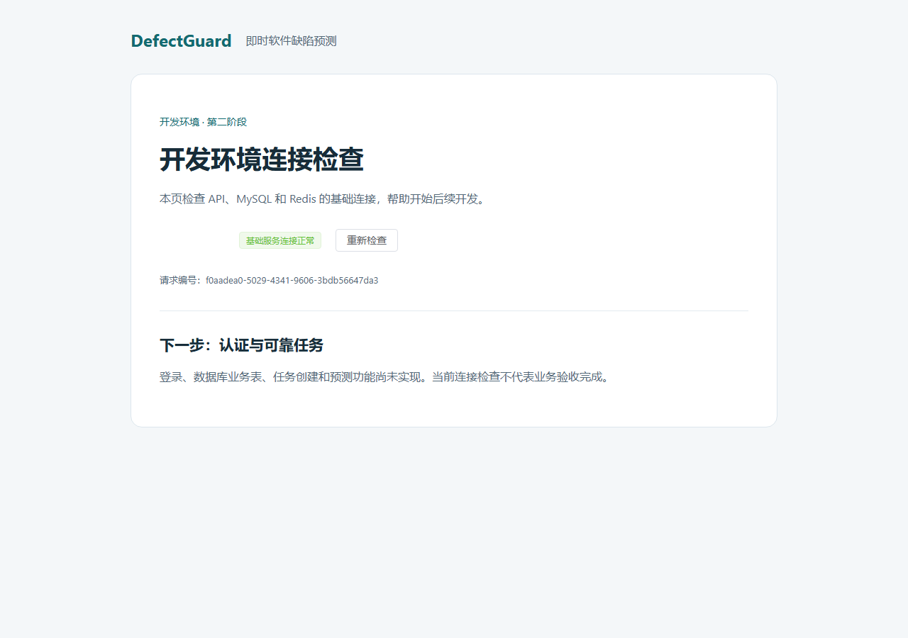
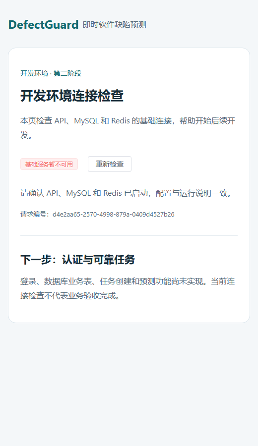

# 第二阶段工程基础报告

- 日期：2026-10-09（Asia/Shanghai）
- 范围：`bootstrap-application` 第 1 组，个人 `wang`，前置提交 `ec91784`。
- 结论：工程基础验收通过；可进入最小认证实现。认证、业务迁移、可靠任务和 E2E-BOOT 未完成，change 不归档、User Story 不标记 Done。

## 实施结果

建立共享 Python 工程和 `uv.lock`、Vue 3/Element Plus/Vite 前端及 npm 锁文件。当前宿主机项目 Python 3.11.16，固定 digest 的 Linux 应用镜像为 Python 3.11.17，均符合工程声明的 3.11 系列；不宣称补丁版本完全一致。锁定核心版本 FastAPI 0.143.0、SQLAlchemy 2.1.4、Celery 5.6.3、Redis client 6.4.0，前端 Vue 3.5.43/Vite 7.3.7。版本及完整依赖以锁文件为准，使用官方 PyPI/npm。

API 增加最小存活/基础连接检查、UUID request_id、统一安全错误、显式配置校验和受限 CORS。缺失秘密拒绝启动；本机四个秘密独立随机生成，仅保存在忽略的 `.env`，生成脚本拒绝覆盖已有配置。签名密钥当前只完成配置校验，尚无认证接口。

Compose 提供 MySQL/Redis 基础模式和 Web/API/MySQL/Redis/真实 Celery Worker 完整模式。端口只绑定 127.0.0.1，MySQL 13306、Redis 16379、API 18000、Web 18080。基础镜像固定 digest，API/Worker 共用镜像并以非 root 运行；MySQL/Redis 各自具名卷，容器日志 10 MiB × 3。Windows Worker 使用 Linux 容器，未宣称原生 Windows 支持。

提供 [启动与验收说明](../development/工程启动与验收.md)、存储保护启动入口、后续计划和追踪更新。当前前端是连接检查页面，明确标注尚未实现的功能。

## 验收证据

| 检查 | 结果 |
|---|---|
| uv frozen 安装与 `uv lock --check` | 项目 Python 3.11，锁文件有效，未更改系统默认 Python |
| 前端 `npm ci` 和 `npm run build` | 锁文件重装/生产构建通过；约 121 kB JS、35 kB CSS（未 gzip）；npm 审计 0 已知漏洞 |
| `ruff check .` / format check | 通过 |
| pytest（显式启用 runtime） | **11 passed**；包括配置/秘密、编码、404/422/500 安全错误、request_id、生产文档/CORS、真实 MySQL/Redis、HTTP 代理链、Worker ping、故障恢复、卷持久化、真实配置失败进程 |
| 完整 Compose 启动 | 五组件均 running/healthy；基础模式和启动包装脚本验证通过 |
| 实际故障 | Redis 停止时 ready 返回 503/稳定错误，health 保持 200；恢复后 ready 200；重启 MySQL/Redis 后唯一测试标记仍可读取 |
| 浏览器 | 使用既有 Edge 无头浏览器实际加载 Vue；正常状态和窄屏故障状态均渲染，见下图 |
| 存储与本地配置 | 五组存储保护检查通过；配置生成独立秘密及拒绝覆盖检查通过；缓存/临时文件均指向 D 项目目录 |
| OpenSpec、文档与提交范围 | 两个 change 严格校验；相对文件链接、秘密模式及实际本机 secret 值泄漏检查；Git diff 检查通过 |

测试中遇到本机 HTTP 代理将 loopback 请求错误转发，已让 runtime 本地探针显式直连（trust_env=False），未修改系统代理。官方镜像构建的一次 token 网络超时通过预拉取同一官方镜像后重试解决，未修改 DNS 或 SSH。界面检查发现 Element Plus 全局样式未导入，补齐后重新构建并核验。

pytest 有一个上游 Starlette 提示未来迁移 TestClient 到 httpx2 的弃用警告；当前 11 项均通过，未屏蔽警告。后续升级依赖时重新核查兼容性。runtime 测试创建的是专用开发库中的 `platform_*probe` 小标记，不是业务迁移。

正常连接（1280 × 900）：

窄屏连接失败（520 × 900）：

## 空间实测

| 磁盘 | 开始可用 | 结束附近可用 | 观察到的占用增长 |
|---|---:|---:|---:|
| C | 48.238 GiB | 48.172 GiB | 约 0.066 GiB |
| D | 12.122 GiB | 9.461 GiB | 约 2.661 GiB |

全盘差值可能包含其他程序/系统活动，不能将 C 的变化全部归因于本项目，也不宣称 C 零写入。项目文件逻辑长度约 429 MiB：虚拟环境约 112 MiB，runtime 含缓存/浏览器探针约 227 MiB，其余主要为 node_modules、源码和锁文件。数据位于 D；既有 Node 在 C，不新增另一套安装。

Docker `system df` 显示镜像约 1.793 GB、卷 218.6 MB、构建缓存 571.8 MB（Docker 此处为十进制单位，存在共享层，不能简单相加作为独占使用量）。两个卷挂载在 Docker 数据根，WSL 数据磁盘文件位于 `D:\Develop\DockerData\disk\docker_data.vhdx`；文件逻辑长度约 4.149 GB，不等于真实分配量或硬配额。

本批仍满足第一轮新增目标 4 GiB 和 D 保留 6 GiB。未安装模型依赖、CUDA、模型权重、实验仓库或大型数据。认证和任务可继续小步推进；完整模型阶段前建议 D 或非 C 开发盘扩至 20～30 GiB 可用，见 [整体规划与空间预算](../development/后续整体规划与空间预算.md)。

## 交付及后续

只正常推送 `refs/heads/wang:refs/heads/wang`，不 force、不推 tags、不合并 main；推送前后核对其他远程 heads。最终提交号和远程验证记录在聊天交付消息。

验收后停止本项目五个容器，保留数据卷、镜像和缓存，以免占用后台运行资源；启动方式见工程说明。没有删除、prune 或迁移用户文件。下一批优先实现 user/auth_session/operation_log 迁移、预置账号和 A01～A04，然后进入任务 outbox/租约及登录任务页面；实际业务验收后才归档框架 change。
