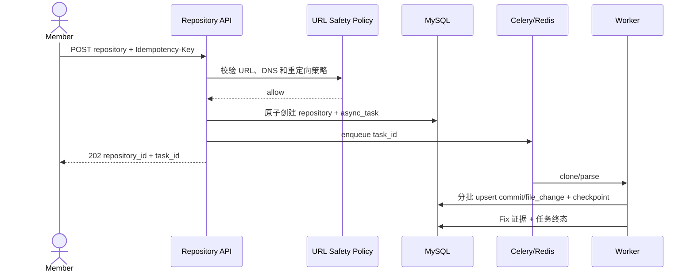

# Design: add-data-collection

## 1 目标与边界

本 change 建立安全、可恢复、可审计的数据入口，为 SZZ 和特征工程提供确定性输入。范围包括公开 HTTPS 仓库接入、提交与文件变更解析、Fix 证据以及通用异步任务基础。

不包含 SZZ 回溯、Kamei 特征、数据集和模型训练。

## 2 组件

| 组件 | 职责 |
|---|---|
| Repository API | 输入校验、幂等创建、状态查询和增量同步入口 |
| URL Safety Policy | 协议、凭据、端口、DNS、IP 与重定向校验 |
| Repository Service | 规范化 URL、生命周期和强推状态判断 |
| Git Adapter | 隔离目录克隆、ref/祖先查询和资源限制 |
| Commit Parser | 使用 PyDriller 和原生 Git 补充信息，生成确定性记录 |
| Fix Evidence Service | 关键词和 Issue 证据分级、版本化和复核状态 |
| Task Service | 幂等、心跳、checkpoint、重试、取消和错误摘要 |

## 3 关键流程

## 4 幂等与事务

- `repository.canonical_url` 唯一。
- `git_commit(repository_id, sha)` 唯一。
- `async_task(task_type, scope_key, idempotency_key)` 唯一。
- 一个解析批次的提交、文件变更和 checkpoint 在同一事务中提交。
- 重试读取 checkpoint 并执行 upsert，不先删除已成功数据。

## 5 安全设计

- 首期只允许 HTTPS，不执行仓库 hook 或脚本。
- DNS 校验覆盖全部 A/AAAA，并在重定向和连接前复核。
- 拒绝 loopback、私网、链路本地、保留地址、内嵌凭据和异常端口。
- 克隆运行在隔离目录，限制时间、大小、并发和输出日志。
- 凭据不进入 URL、数据库、命令行或日志。

## 6 Fix 证据

关键词规则只产生版本化证据，不直接把所有匹配视为无条件真值。Issue 只有在外部适配器确认其为 bug 并存在关联关系时才产生 high 证据；普通 Issue ID 只产生 low 线索。

## 7 失败与恢复

可重试失败包括暂时网络错误、Worker 中断和部分依赖不可用；输入拒绝、资源超限和不安全 URL 不自动重试。Worker 心跳过期后任务标记 stale，由协调器创建 successor 或进入人工处理。

## 8 验证

- 使用本地临时 Git 仓库进行确定性集成测试。
- 使用参数化地址集合验证 SSRF 防护。
- 注入批次中断验证 checkpoint 和幂等。
- 使用 Fix 正反例 fixture 验证证据等级和排除语境。
