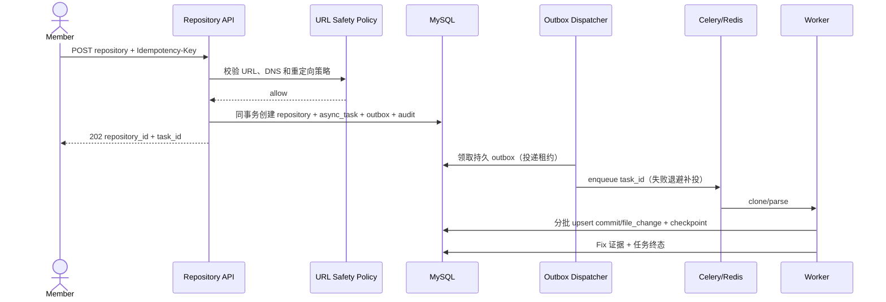

# Design: add-data-collection

## 1 目标与边界

本 change 建立安全、可恢复、可审计的数据入口，为 SZZ 和特征工程提供确定性输入。范围包括公开 HTTPS 仓库接入、提交与文件变更解析和 Fix 证据。依赖先验收 `bootstrap-application` 的认证、通用任务/outbox、A29～A32；本 change 只扩展采集 payload、checkpoint 和业务页面，不重复拥有框架实现任务。

不包含 SZZ 回溯、Kamei 特征、数据集和模型训练。

## 2 组件

| 组件 | 职责 |
|---|---|
| Repository API | 输入校验、幂等创建、状态查询和增量同步入口 |
| URL Safety Policy | 协议、凭据、端口、DNS、IP 与重定向校验 |
| Repository Service | 规范化 URL、生命周期和强推状态判断 |
| Git Adapter | 隔离目录克隆、ref/祖先查询和资源限制 |
| Commit Parser | 使用 PyDriller 和原生 Git 补充信息，生成确定性记录 |
| Fix Evidence Service | 关键词和 Issue 证据分级、版本化和复核状态 |
| Task Service | 幂等、心跳、checkpoint、重试、取消和错误摘要 |

## 3 关键流程

## 4 幂等与事务

- `repository.canonical_url` 唯一。
- `git_commit(repository_id, sha)` 唯一。
- `async_task(type, scope_key, idempotency_key)` 唯一；同键异载荷返回 409，复用框架契约。
- 一个解析批次的提交、文件变更和 checkpoint 在同一事务中提交。
- 重试读取 checkpoint 并执行 upsert，不先删除已成功数据。

## 5 安全设计

- 首期只允许 HTTPS，不执行仓库 hook 或脚本。
- DNS 校验覆盖全部 A/AAAA，并在重定向和连接前复核。
- 拒绝 loopback、私网、链路本地、保留地址、内嵌凭据和异常端口。
- 克隆运行在隔离目录，限制时间、大小、并发和输出日志。
- 凭据不进入 URL、数据库、命令行或日志。

## 6 Fix 证据

关键词规则只产生版本化证据，不直接把所有匹配视为无条件真值。Issue 只有在外部适配器确认其为 bug 并存在关联关系时才产生 high 证据；普通 Issue ID 只产生 low 线索。

## 7 失败与恢复

可重试失败包括暂时网络错误、Worker 中断和部分依赖不可用；输入拒绝、资源超限和不安全 URL 不自动重试。Worker 心跳过期后任务标记 stale，由协调器创建 successor 或进入人工处理。

stale 是健康标记；协调器条件写 failed 后才创建 successor，原终态保留。所有业务批次和 checkpoint 必须在同一事务检查有效 execution_token、状态和租约，旧 Worker 无权提交。投递补偿、queued 超时及恢复上限复用框架契约，采集阶段另外验证批次幂等。

## 8 验证

第五阶段框架页与运行入口完成后，采集入口自身的磁盘检查由本 change 任务 1.5 负责。沿用质量优先容量提示和 2GiB 紧急写入保护，采集前/批次检查、仓库工作目录和资源限制随真实采集实现，不为框架验收预建空入口。

- 使用本地临时 Git 仓库进行确定性集成测试。
- 使用参数化地址集合验证 SSRF 防护。
- 注入批次中断验证 checkpoint 和幂等。
- 使用 Fix 正反例 fixture 验证证据等级和排除语境。

## 9 第六阶段实施切片

首批为安全克隆闭环（A07～A09）。Repository 记录 canonical_url、owner_id、latest_task_id、status、默认分支、HEAD、字节数及不对外公开的 storage_key；作者表、提交表和 checkpoint 留到解析阶段。A07 body 仅 url；同用户同键同规范 URL 重放已有结果，无需重新联网；同键异 URL 返回 409。不同键提交已存在 canonical_url 返回 REPOSITORY_ALREADY_EXISTS，不再创建任务。仓库目录当前供所有已认证角色查看，创建要求 Member/Admin。

URL 限公开 HTTPS、443、ASCII DNS 名或 IPv4，拒绝凭据/查询/片段/编码/异常路径；IPv6 字面 URL 暂不支持，但 DNS AAAA 支持。GitHub owner/repo 不区分大小写，其余服务保留路径大小写。DNS A/AAAA 查询有超时，任一不安全地址或解析失败均拒绝。API 先验证 smart HTTP advertisement，拒绝所有重定向；Worker 每次 CONNECT 再解析，直接连接批准的数值 IP 并核对实际 peer，TLS 仍校验原始域名。CONNECT 仅原 authority:443，禁止替换主机、HTTP/SSH/file/ext、bundle/pack URI；不设置 TLS 绕过选项。Git 禁用全局/系统配置、凭据助手、模板 hook、递归子模块、自动 GC，只有 bare 克隆，原始输出不进日志/API。

每执行租约使用独立 UUID 路径。元数据、storage_key 和任务成功在同一带有效 token/租约的事务中发布；取消/失败只删除本次未发布目录。提交结果不确定时保留目录，不冒险删除可能被成功事务引用的数据；后续人工核对后回收孤立尝试。重试创建 successor 并更新 latest_task_id，旧 Worker 不能覆盖新结果。

默认每仓库 2GiB、900 秒，网络传输最多两倍仓库预算、输出 64KiB；Worker 并发为 1。接收与执行前要求预计增长（两倍仓库预算）+2GiB 可用，运行期间检查目录大小及磁盘余量。仓库存放 D 盘 runtime/repositories 的共享 bind mount，API/Worker 使用同一位置，初始化只修改专用根和 objects 所有权，不递归改已有文件。fresh 验收使用独立路径。容器视图与实际宿主 D 盘余量需验收核对，失败不得改用 C。

测试使用临时 HTTPS Git smart HTTP 服务和独立测试 CA，通过构造器注入 resolver/connector；生产无关闭 SSRF/TLS 的配置。真实原生 Git 克隆结果与源 HEAD 对照，另验 TLS 拒绝、DNS rebinding、取消/租约/数据库约束/提交不确定性。

参考：[Git 配置](https://git-scm.com/docs/git-config)、[bare clone](https://git-scm.com/docs/git-clone)、[DNS 查询超时](https://dnspython.readthedocs.io/en/stable/resolver-class.html)。
