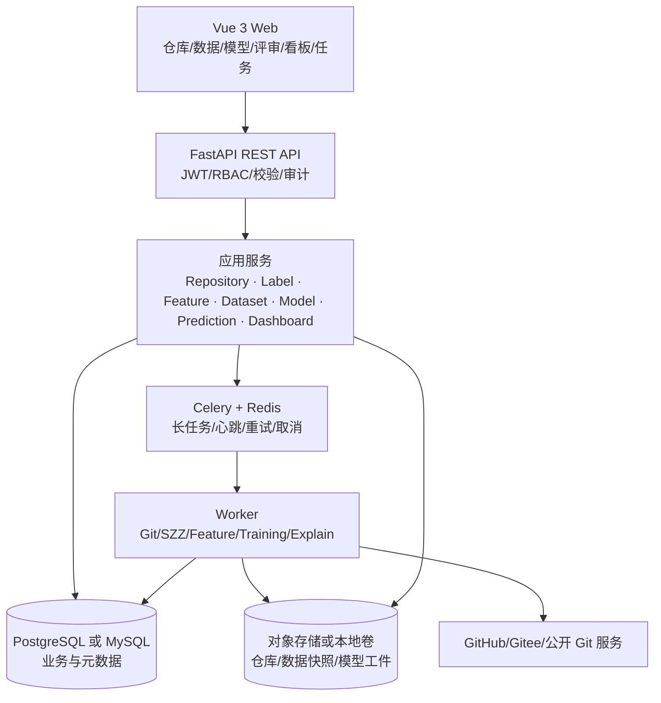
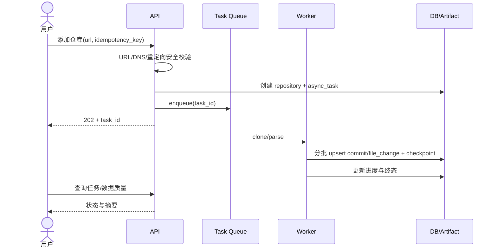
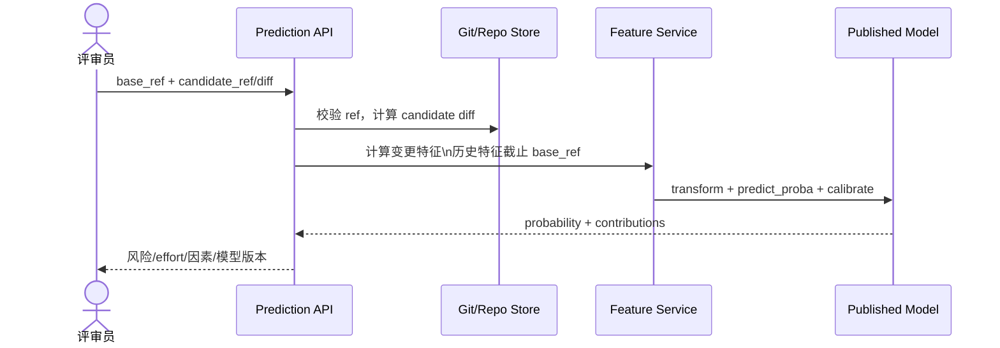
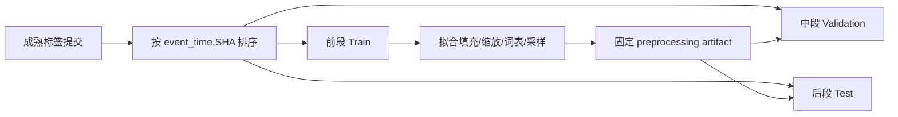
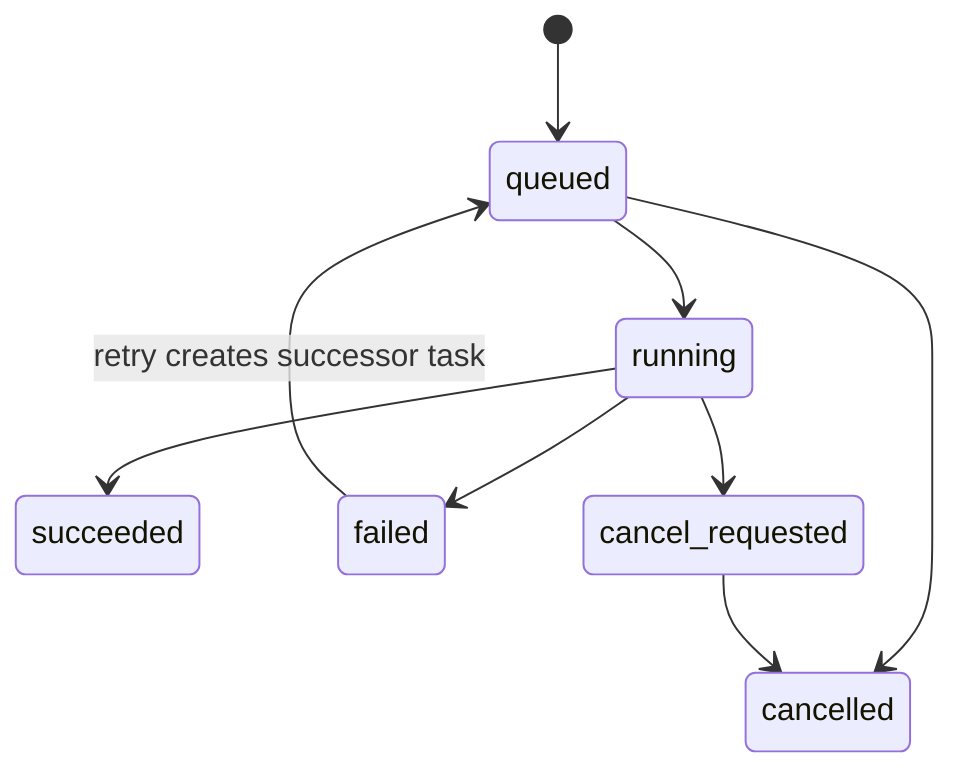
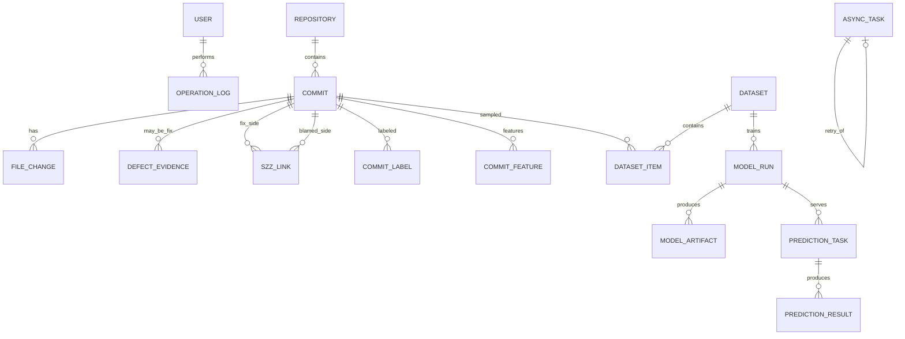

# 即时软件缺陷预测系统（DefectGuard）产品设计文档

> 设计目标：以可复现的数据与模型流水线支撑历史分析，并向候选分支/PR diff 提供合入前风险预测；所有结论可追溯到版本、证据和测试。

---

## 一、版本信息

| 项目 | 内容 |
|---|---|
| 版本号 | **V2.0** |
| 发布日期 | 2026-09-23 |
| 文档状态 | 待团队评审（Sprint 0 修订版） |
| 变更人 | 待团队补充 |
| 审核人 | 待定（组长 + 全体组员） |
| 关联文档 | 《03-产品需求文档-V2.0.md》《04-需求设计追踪矩阵-V2.0.md》 |
| 仓库基线 | `https://github.com/sherlockz122/softwaretest`，`main@52b409a5daf4ae3425f964a75c2011496d41ca60` |

## 二、变更日志

| 时间 | 版本 | 主要变更 |
|---|---|---|
| 2026-09-18 | V1.0 | 初版架构、模块、接口与数据库设计 |
| 2026-09-23 | V2.0 | 增加候选变更预测；修正 SZZ、Kamei 14、effort-aware 指标；引入 Unknown/观察窗口和防泄漏约束；调整模型组合、数据表、API、权限、安全及 Sprint 边界 |

## 三、文档说明

### 1. 设计原则

1. **时间因果优先**：任何提交的特征只能使用该提交时点之前的信息；训练、校准和评估严格按时间顺序。
2. **版本优先**：标签、特征、数据集、训练运行、模型工件和预测均显式记录版本。
3. **证据优先**：fix 识别和 SZZ 结果保存来源与链路，指标保存计算口径。
4. **先纵切再扩展**：Sprint 1 先交付小范围端到端链路，Sprint 2 扩展模型和评审前入口。
5. **模型辅助人**：风险结果用于排序，不自动替代合并决策；SHAP 是因素解释而非因果根因。

### 2. 关键术语与口径

- `event_time`：提交的 committer time，配合 SHA 稳定排序；原始 author/committer time 均保留。
- `label_version`：fix 规则、SZZ 变体、观察窗口和过滤策略的组合版本。
- `feature_version`：十四维公式、别名归并、预处理与语义 tokenizer 的组合版本。
- `effort = LA + LD`：所有 effort-aware 指标统一使用的审查成本近似。
- `candidate`：未合入默认分支的 ref 或用户提交的 diff；候选特征的历史部分截至 base ref。

## 四、概要设计

### 1. 系统边界与架构

采用模块化单体 + 异步 Worker，便于 3～4 人团队开发和部署；通过清晰模块接口保留日后拆分能力，不在实训期引入不必要的微服务复杂度。



**技术选择待团队锁定项**：数据库在 PostgreSQL/MySQL 中二选一，工件存储在本地卷/MinIO 中二选一。选择后写入 ADR；V2 不同时承诺多套生产实现。

### 2. 运行链路





### 3. 模块划分

| 模块 | 职责 | 输入/输出 | 主要 US |
|---|---|---|---|
| M1 Auth/Audit | 登录、登出、RBAC、操作审计 | token、角色、operation log | US-22～23 |
| M2 Repository | URL 校验、克隆、解析、增量同步 | repository/commit/file_change | US-01～03 |
| M3 Label | fix 证据、SZZ、成熟度与抽检 | defect_evidence/szz_link/label | US-04～05 |
| M4 Feature | Kamei 14、语义 token、质量统计 | commit_feature/artifact | US-06～07、10 |
| M5 Dataset | 时间划分、快照、不平衡策略 | dataset/dataset_item | US-08～09 |
| M6 Model | 插件注册、训练、评估、校准、发布 | model_run/model_artifact | US-11～15 |
| M7 Prediction | 候选 diff、历史/批量预测、解释 | prediction_task/result | US-16～19 |
| M8 Dashboard | 趋势、风险队列、下钻 | 聚合查询 | US-18、20 |
| M9 Task | 幂等、心跳、重试、取消 | async_task | US-02、12、19、21 |

### 4. 部署与目录建议

```text
softwaretest/
├─ apps/
│  ├─ api/                  # FastAPI
│  ├─ worker/               # Celery tasks
│  └─ web/                  # Vue 3
├─ packages/
│  ├─ domain/               # 领域模型与服务接口
│  ├─ mining/               # Git/fix/SZZ
│  ├─ features/             # Kamei/semantic
│  ├─ ml/                   # plugins/metrics/calibration/explain
│  └─ persistence/          # ORM/repository
├─ tests/{unit,integration,e2e,performance,security}/
├─ openspec/{specs,changes}/
├─ docs/
├─ deploy/
└─ pyproject.toml / package-lock.json
```

## 五、数据与算法详细设计

### 1. 仓库采集

#### 1.1 URL 安全

允许的协议默认为 HTTPS；若允许 SSH，必须由管理员配置受信主机和独立 deploy key。服务端校验：

1. 解析 URL，拒绝凭据嵌入、非允许协议和异常端口；
2. DNS 解析所有 A/AAAA，拒绝 loopback、私网、链路本地、保留地址；
3. 每次 HTTP 重定向后重新执行 URL 与 DNS 校验；
4. 连接时防 DNS rebinding（固定已校验地址或再次比对）；
5. 限制响应、仓库大小、克隆时间和并发数；
6. 向前端返回安全化错误，不泄露本机路径和依赖版本。

#### 1.2 解析与断点

- 首次采集记录默认分支 head；提交按拓扑/时间稳定顺序处理；
- 每批 upsert 后写 `checkpoint_sha`，任务重试从检查点继续；
- `repository_id + commit_sha` 唯一；`commit_id + old_path + new_path` 标识文件变更；
- 合并提交默认记录但不参与 baseline SZZ/训练，策略可版本化；
- 强推导致祖先关系破坏时，仓库进入 `requires_review`，不静默删除历史。

### 2. Fix 识别与 SZZ

#### 2.1 Fix 证据

证据等级：

| 等级 | 规则 | 默认是否纳入 |
|---|---|---|
| high | 关联托管平台 Issue 且类型/标签明确为 bug，并出现关闭/修复关系 | 是 |
| medium | message 命中带边界的缺陷修复关键字并可人工复核 | 是，可配置 |
| low | 仅出现普通 Issue ID、模糊词或回滚 | 否 |

规则输出必须保存 `evidence_type`、`evidence_value`、`rule_version` 和人工复核状态。任意 Issue ID 不等于 bug。

#### 2.2 Baseline SZZ

```text
for each confirmed fix_commit F:
  for each non-binary file changed by F:
    derive lines deleted or replaced relative to each selected parent
    remove whitespace-only/comment-only lines according to filter_version
    blame the parent revision for each remaining line
    persist (fix_sha, file, fixed_line, blamed_sha, blamed_line, confidence)
aggregate blamed_sha as candidate bug-introducing commits
```

关键约束：

- 对普通提交选唯一父提交；合并提交默认跳过，或将父策略写入 `label_version`；
- blame 的目标本来就是 fix 的父版本，结果等于父提交是合法的，不能排除；
- 重命名跟踪、忽略 whitespace/comment 是 baseline 的过滤能力；
- **RA-SZZ** 只有在实现并验证 refactoring detection 后才能使用该名称，不能把“排除注释”称为 RA-SZZ；
- 保存一行级证据而非只保存最终布尔标签。

#### 2.3 标签成熟度

在数据快照截止时点 `T`，提交 `c` 的标签：

- `buggy`：在 `T` 前存在通过规则确认的 SZZ 证据；
- `clean`：提交年龄达到观察窗口 `W` 且在 `T` 前无缺陷证据；
- `unknown`：年龄不足 `W`、证据冲突、解析失败或人工待复核。

`unknown` 不进入监督训练。`W` 通过数据探索确定并写入 `label_version`，可从修复延迟分布分位数选择，不能事后用测试结果调参。

### 3. Kamei 14 特征

所有历史统计只使用当前提交之前的数据。作者先通过规范化邮箱/姓名别名表映射为 `author_identity_id`；原始邮箱默认哈希保存。

| 维度 | 特征 | V2 计算口径 |
|---|---|---|
| Diffusion | NS | 变更涉及的子系统数；子系统映射规则版本化 |
|  | ND | 变更涉及的目录数 |
|  | NF | 变更文件数 |
|  | Entropy | 对每文件变更量 `churn_i=LA_i+LD_i`，`p_i=churn_i/sum(churn)`，`H=-Σp_i log2 p_i`；文件数 >1 时用 `H/log2(NF)` 归一化，否则为 0 |
| Size | LA | 新增行数；二进制文件不计 |
|  | LD | 删除行数 |
|  | LT | 变更前文件 LOC 的总和（或论文复现所选聚合口径）；一经确认固定并写入 feature_version |
| Purpose | FIX | 当前提交是否为已确认 fix commit；用于历史实验，候选预测时通常为 0/unknown 并记录策略 |
| History | NDEV | 当前提交前曾修改这些文件的不同开发者数 |
|  | AGE | 各文件距上次修改的时间（天），按该文件 churn 加权平均；首次出现文件按约定缺失值处理 |
|  | NUC | 当前提交前这些文件的历史变更次数 |
| Experience | EXP | 作者在当前提交前的提交总数 |
|  | REXP | 作者历史提交按 `1/(age_years+1)` 加权求和；若使用 90 日指数衰减，应另命名并声明为自定义变体 |
|  | SEXP | 作者在当前提交前对相关子系统的提交数 |

对偏态数值的 `log1p`、标准化、缺失值填充属于模型预处理，只能在训练集拟合，并随模型工件持久化。特征原始值与变换后输入分开保存。

### 4. 语义输入

Sprint 2 的最小语义管线：规范化 commit message；从 unified diff 提取 added/deleted token；删除二进制与超大文件；在 train 上构建词表；固定最大文件/行/token 数并生成 mask。TextCNN/DeepJIT-inspired 使用 message 与 diff 两路编码；若未复现原论文架构和输入，不命名为“DeepJIT 复现”。CodeBERT 仅为 P2。

### 5. 数据集构建与防泄漏



- 默认按 70%/15%/15% 时间段，具体边界保存在 dataset，不把比例写死在代码；
- 同一提交只属于一个 split；数据集创建后不可变，重建生成新版本；
- SMOTE 或下采样仅作用于 train，valid/test 保持真实分布；
- 阈值与校准器只用 train/valid 拟合，test 仅做最终评估；
- 跨项目实验需单独定义，不能与单项目时间切分结果混报。

### 6. 模型插件、训练与校准

统一插件接口：

```python
class ModelPlugin(Protocol):
    name: str
    family: Literal["classic", "deep"]
    input_schema: str
    def validate_params(self, params: dict) -> None: ...
    def fit(self, train, valid, seed: int): ...
    def predict_proba(self, data): ...
    def explain(self, data): ...
    def save(self, path): ...
    @classmethod
    def load(cls, path): ...
```

达标组合为 6 个经典模型（LR、NB、SVM、RF、XGBoost、LightGBM）+ 2 个深度模型（MLP、TextCNN/DeepJIT-inspired）。SVM 必须开启概率估计或外置校准；树模型可使用 Platt/Isotonic 在 validation 上校准。每个 run 保存：代码 SHA、镜像/依赖摘要、dataset id、feature/label version、参数、seed、预处理器、校准器、阈值、指标与工件哈希。

### 7. 评估指标

#### 7.1 Effort-unaware

Precision、Recall、F1、ROC-AUC、PR-AUC、MCC、混淆矩阵。类别不平衡时不以 Accuracy 作为主指标；单类测试集时 AUC 等不可计算，接口返回 `null + reason`，不得伪造为 0。

#### 7.2 Effort-aware

对 test 样本按预测概率降序排序，工作量 `e_i=LA_i+LD_i`：

- **PofB20**：累计 effort 首次达到总 effort 20% 时，已捕获 buggy 数 / 总 buggy 数；
- **IFA**：遇到第一个 buggy 前检查的 clean 提交数；
- **Popt**：模型排序曲线相对最优/最差曲线的归一化面积，报告公式、积分离散方式和是否截断 20%。

V2 不并列展示与 PofB20 同义的 Recall@20%Effort。并列概率按 `probability desc, event_time asc, sha asc` 稳定排序。Bootstrap 以时间块为单位给出主要指标区间，避免把相邻提交当完全独立样本。

### 8. 预测与解释

候选预测输入 `repository_id, base_ref, candidate_ref | diff`。系统在隔离工作区解析 diff，使用 base ref 之前的历史计算 NDEV/AGE/NUC/EXP/REXP/SEXP，再组合候选变更的即时特征。返回：

```json
{
  "prediction_id": "uuid",
  "model_run_id": "uuid",
  "probability": 0.82,
  "calibration": "isotonic-v1",
  "risk_level": "high",
  "effort": 126,
  "risk_density": 0.0065,
  "top_factors": [
    {"feature": "la", "value": 92, "contribution": 0.18, "direction": "increase"}
  ],
  "limitations": ["因素贡献不代表缺陷因果根因"]
}
```

默认队列按校准概率排序；风险密度 `p/max(1, LA+LD)` 只作辅助列，分母取 1 避免纯重命名等零 churn 变更除零。对超大变更设置显著标识，避免其因密度较低而被忽略。概率阈值从 validation 确定并版本化，不在测试集上选择。

## 六、API 设计

### 1. 约定

- 前缀 `/api/v1`，JSON 使用 snake_case；创建异步任务返回 `202 Accepted`；同步创建资源返回 `201`；删除/取消成功且无 body 返回 `204`；
- 错误结构：`{code, message, request_id, details?}`，生产环境不返回堆栈、SQL、本机路径和依赖版本；
- 写接口支持 `Idempotency-Key`；分页统一 `page, page_size`，最大 100；
- 所有 ID 为 UUID；时间为 UTC ISO-8601；API 文档由代码导出并在 CI 检查漂移。

### 2. 接口清单

| ID | 方法与路径 | 说明 | 权限 |
|---|---|---|---|
| A01 | `POST /auth/login` | 登录 | Public |
| A02 | `POST /auth/logout` | 撤销当前 refresh/session | User |
| A03 | `POST /auth/refresh` | 刷新 token | User |
| A04 | `GET /users/me` | 当前用户 | User |
| A05 | `GET /admin/users` | 用户列表 | Admin |
| A06 | `PATCH /admin/users/{id}` | 修改角色/禁用状态 | Admin |
| A07 | `POST /repositories` | 添加仓库并返回任务 | Member |
| A08 | `GET /repositories` | 仓库列表 | Viewer |
| A09 | `GET /repositories/{id}` | 仓库详情 | Viewer |
| A10 | `POST /repositories/{id}/sync` | 增量同步 | Member |
| A11 | `GET /repositories/{id}/commits` | 提交列表 | Viewer |
| A12 | `POST /repositories/{id}/fix-detection` | Fix 识别 | Member |
| A13 | `POST /repositories/{id}/szz-runs` | 启动 SZZ | Member |
| A14 | `GET /szz-runs/{id}/links` | 查询证据链 | Viewer |
| A15 | `POST /repositories/{id}/feature-runs` | 特征提取 | Member |
| A16 | `GET /repositories/{id}/feature-quality` | 特征质量 | Viewer |
| A17 | `POST /datasets` | 创建不可变数据集 | Member |
| A18 | `GET /datasets` | 数据集列表 | Viewer |
| A19 | `GET /datasets/{id}` | 数据集详情 | Viewer |
| A20 | `POST /model-runs` | 发起训练 | Member |
| A21 | `GET /model-runs/{id}` | 状态/指标 | Viewer |
| A22 | `POST /model-runs/{id}/publish` | 发布模型 | Admin |
| A23 | `GET /models` | 已发布模型/注册表 | Viewer |
| A24 | `POST /predictions/candidate` | 候选 ref/diff 同步或异步预测 | Member |
| A25 | `POST /prediction-tasks` | 批量预测 | Member |
| A26 | `GET /prediction-tasks/{id}/results` | 风险队列 | Viewer |
| A27 | `GET /predictions/{id}/explanation` | 解释详情 | Viewer |
| A28 | `GET /dashboards/trends` | 标签/预测趋势 | Viewer |
| A29 | `GET /tasks` | 任务列表 | Viewer |
| A30 | `GET /tasks/{id}` | 任务详情 | Viewer |
| A31 | `POST /tasks/{id}/retry` | 从失败任务重试 | Member |
| A32 | `POST /tasks/{id}/cancel` | 取消 queued/running | Member |
| A33 | `GET /operations` | 操作审计 | Admin |

### 3. 状态机与并发



创建任务时用数据库唯一约束 `(task_type, scope_key, idempotency_key)` 防止并发重复；不采用“先查再插”的竞态实现。Worker 使用租约/心跳，超过阈值标记 stale 后由协调器决定重投。取消为协作式取消，关键批次边界检查标志并保证事务一致。

## 七、数据库设计

### 1. 核心关系



### 2. 表结构摘要

| 表 | 关键字段/约束 | 说明 |
|---|---|---|
| `user` | `id`, `username UNIQUE`, `email_hash`, `password_hash`, `role`, `is_active` | 不在普通查询返回密码哈希 |
| `repository` | `id`, `url`, `canonical_url UNIQUE`, `default_branch`, `head_sha`, `status`, `checkpoint_sha` | URL 规范化后唯一 |
| `commit` | `id`, `repository_id`, `sha`, `author_identity_id`, `author_time`, `committer_time`, `message`, `parent_count`; `UNIQUE(repository_id,sha)` | 原始邮箱不明文存储 |
| `file_change` | `id`, `commit_id`, `old_path`, `new_path`, `change_type`, `insertions`, `deletions`, `old_loc`, `is_binary` | insertions/deletions 独立字段 |
| `defect_evidence` | `id`, `fix_commit_id`, `type`, `value`, `confidence`, `rule_version`, `review_status` | Fix 证据 |
| `szz_link` | `id`, `fix_commit_id`, `blamed_commit_id`, `path`, `fixed_line`, `blamed_line`, `confidence`, `label_version`; unique evidence key | 行级追溯 |
| `commit_label` | `commit_id`, `label_version`, `state`, `snapshot_at`, `maturity_days`, `reason`; `PK(commit_id,label_version)` | state 为 buggy/clean/unknown |
| `commit_feature` | `commit_id`, `feature_version`, 14 原始值, `semantic_artifact_uri`, `computed_at`; `PK(commit_id,feature_version)` | 支持多特征版本 |
| `dataset` | `id`, `repository_id`, `label_version`, `feature_version`, `snapshot_at`, split 边界, `config_json`, `content_hash` | 创建后不可变 |
| `dataset_item` | `dataset_id`, `commit_id`, `split`, `label`, `feature_version`, `label_version`; `PK(dataset_id,commit_id)` | 冗余版本用于审计一致性 |
| `model_run` | `id`, `dataset_id`, `plugin`, `family`, `code_sha`, `dependency_digest`, `params_json`, `seed`, `status`, `metrics_json`, `threshold`, `calibration`, `source_run_id` | 一次训练实例 |
| `model_artifact` | `id`, `model_run_id`, `kind`, `uri`, `sha256`, `size` | 模型/预处理/校准/词表 |
| `prediction_task` | `id`, `model_run_id`, `repository_id`, `base_ref`, `candidate_ref`, `input_hash`, `status` | 单次和批量统一为任务 |
| `prediction_result` | `id`, `prediction_task_id`, `commit_sha/candidate_key`, `probability`, `risk_level`, `effort`, `risk_density`, `explanation_json` | 一任务多结果 |
| `async_task` | `id`, `type`, `scope_key`, `idempotency_key`, `status`, `progress`, `heartbeat_at`, `retry_of`, `error_code`; unique task key | 通用任务状态 |
| `operation_log` | `id`, `actor_id`, `action`, `object_type`, `object_id`, `result`, `request_id`, `created_at`, `detail_json` | 敏感值脱敏 |

### 3. 索引与保留策略

- `commit(repository_id, committer_time, sha)`、`commit_label(label_version,state)`、`async_task(status,heartbeat_at)`、`prediction_result(prediction_task_id,probability)` 建索引；
- 数据集和已发布模型引用的工件不可被普通清理任务删除；
- 任务日志按保留期清理，错误摘要永久记录但去除令牌/路径；
- 删除仓库为管理员的显式级联操作，先生成影响清单并二次确认。

## 八、安全、可靠性与可观测性

### 1. 认证与权限

默认关闭公开自注册；首次管理员通过部署配置创建。Access token 短时有效，refresh/session 可撤销；登出使当前 session 失效。角色：Viewer（只读）、Member（发起任务）、Admin（发布模型、用户与审计管理）。A22 明确为 Admin，避免普通用户发布模型。

### 2. 隐私与供应链

- 作者邮箱归并后保存哈希/别名；导出默认不含邮箱；
- Git 凭据通过 secret 注入，不写数据库明文、命令行或日志；
- 锁定 Python/Node 依赖并生成 SBOM/漏洞扫描报告；
- 加载模型工件前验证 SHA-256，不反序列化不受信来源；
- 限制上传 diff 大小、文件数和单文件行数，防止资源耗尽。

### 3. 可观测性

统一 `request_id/task_id/run_id`；结构化日志不含敏感信息；指标包含任务队列长度、耗时、失败率、stale 数、预测延迟和模型缓存命中率。健康检查区分 API、DB、Redis、Worker 和工件存储。

## 九、测试设计

| 层级 | 重点 | 示例证据 |
|---|---|---|
| 单元 | URL/IP 校验、fix 规则、SZZ 行过滤、14 特征公式、指标公式、状态机 | 参数化测试、golden fixture |
| 集成 | 临时 Git 仓库→解析→SZZ；DB 唯一约束；任务重试；模型工件加载 | 测试日志与数据库断言 |
| E2E | 添加仓库→历史风险；候选分支→预测→解释 | 自动化脚本/录像 |
| 数据测试 | 时间顺序、Unknown 排除、train-only 预处理、版本一致性 | dataset audit report |
| 模型测试 | 固定 seed 可复现、概率范围、校准、单类指标异常 | model report |
| 安全 | SSRF 重定向/DNS rebinding、越权、令牌与日志泄漏 | 安全用例报告 |
| 可靠性 | Worker kill、网络中断、重复请求、stale 恢复 | 故障注入报告 |
| 性能 | 固定硬件/数据/模型下 API 与候选预测 P95 | 原始压测结果 |

**SZZ golden fixture** 必须包含：普通修改、文件重命名、空白/注释行、首次新增、删除文件、二进制、合并提交、blame 到直接父提交。**特征 fixture** 用手算小仓库验证 Entropy、AGE、REXP 等，不只断言“非空”。

## 十、CI/CD 与协作

### 1. 分支与 PR

- `main` 保持可演示；短生命周期 `feature/<us-id>-<slug>`；是否保留 `develop` 由团队决定，避免为了流程而增加长期合并分支；
- PR 标题包含 US 与 OpenSpec change，例如 `feat(US-05): implement baseline SZZ`；
- 至少 1 名非作者审阅；PR 模板要求链接 spec/task、测试证据、数据/接口迁移说明；
- 禁止直接向受保护 `main` 推送。

### 2. 流水线

PR：格式检查 → 单元/集成测试 → OpenAPI 漂移检查 → OpenSpec 校验 → 前端构建 → 依赖安全扫描。合并 main：构建带代码 SHA 的镜像/工件 → 部署演示环境（若配置）→ 冒烟测试。模型训练不放在普通 PR 阻塞链路中，使用固定小 fixture 做算法测试。

### 3. OpenSpec 现状与拆分

远程仓库已有 `add-data-collection` proposal/spec/tasks，当前覆盖仓库、提交、文件变更与 fix 识别。合入实现前应将“任意 Issue ID 即 fix”修订为证据分级，并补充失败、断点和幂等场景。随后按 PRD 第十一章逐个创建 change；每个 change 只在实现和验收证据齐备后归档。

## 十一、关键设计决策（ADR 待落盘）

| ADR | 决策 | 原因/代价 |
|---|---|---|
| ADR-001 | 模块化单体 + Worker | 团队规模合适、易部署；需守住模块边界 |
| ADR-002 | 时间切分 + Unknown 标签 | 降低未来信息泄漏和右截尾偏差；减少可训练样本 |
| ADR-003 | baseline SZZ 名称 | 诚实对应实际能力；若做重构感知再升级为 RA-SZZ |
| ADR-004 | 默认概率排序，密度辅助 | 概率含义清晰；同时防止大变更被风险密度隐藏 |
| ADR-005 | 数据集不可变、模型 run 全追溯 | 支持复现和公平对比；增加存储与元数据管理 |

## 十二、评审与实施清单

- [ ] 团队锁定数据库、任务队列、工件存储和部署环境
- [ ] 修订现有 OpenSpec `add-data-collection`
- [ ] 用小型 Git fixture 通过采集、SZZ 和 Kamei 14 手算测试
- [ ] 决定观察窗口 W 与 fix 证据规则并形成 label_version
- [ ] 确认 8 模型清单及 TextCNN 输入规格
- [ ] 确认性能测试硬件、数据规模、模型与请求定义
- [ ] 从代码导出 OpenAPI 并回填与 A01～A33 的差异
- [ ] 将所有验收证据链接回《04-需求设计追踪矩阵-V2.0.md》

## 附录：V2 对 V1 的重要纠偏

1. “剔除注释行”不再称为 RA-SZZ；RA-SZZ 保留给真正的重构感知实现。
2. SZZ 不再排除 blame 到 fix 父提交的合法结果。
3. Entropy 使用每文件 churn 并按文件数归一化；REXP 使用论文口径，90 日指数衰减只能作为自定义特征。
4. 新增 `unknown` 与观察窗口，避免把尚未来得及暴露缺陷的新提交当 clean。
5. 预处理、采样、词表、校准与阈值选择均限制在 train/validation，test 仅评估。
6. PofB20 不再与同义 Recall@20 重复；Popt 写明归一化；Effort 统一为 LA+LD。
7. `probability × LA` 不再称为风险密度；默认按校准概率排序，密度为 `p/max(1, LA+LD)` 的辅助信号。
8. 补齐登出、管理员用户管理、任务取消/重试、候选变更预测和审计接口。
9. 修正邮箱、insertions/deletions、特征复合主键、数据集版本和预测任务一对多等表设计。
10. 将不可验证的性能、仓库规模和实验数字改为待测试目标或假设。
