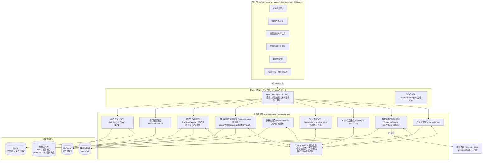
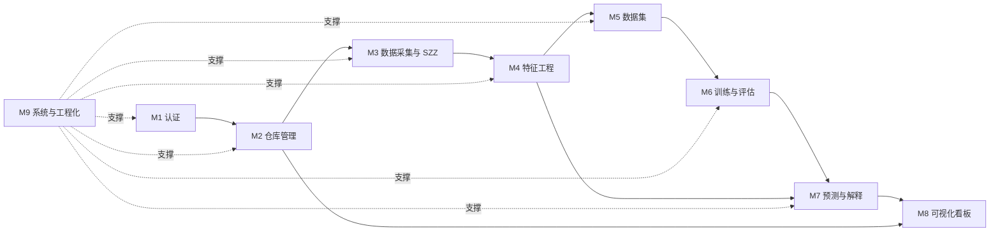
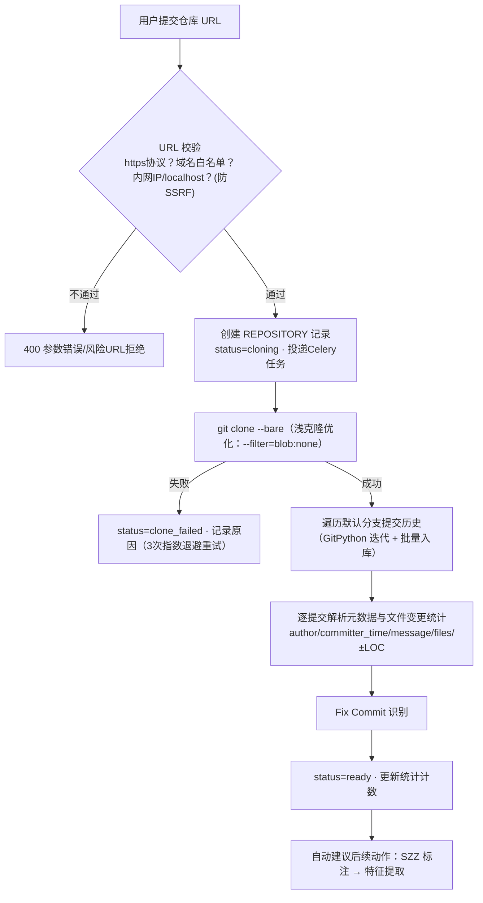
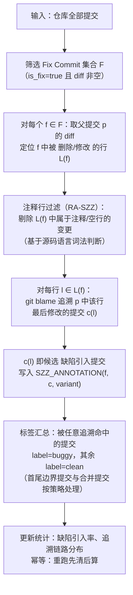
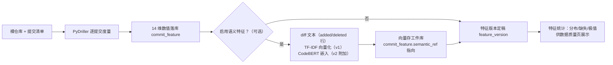
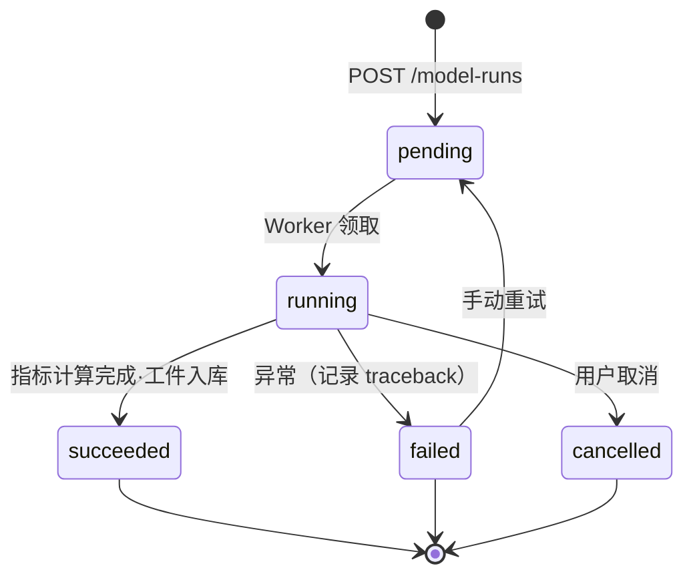
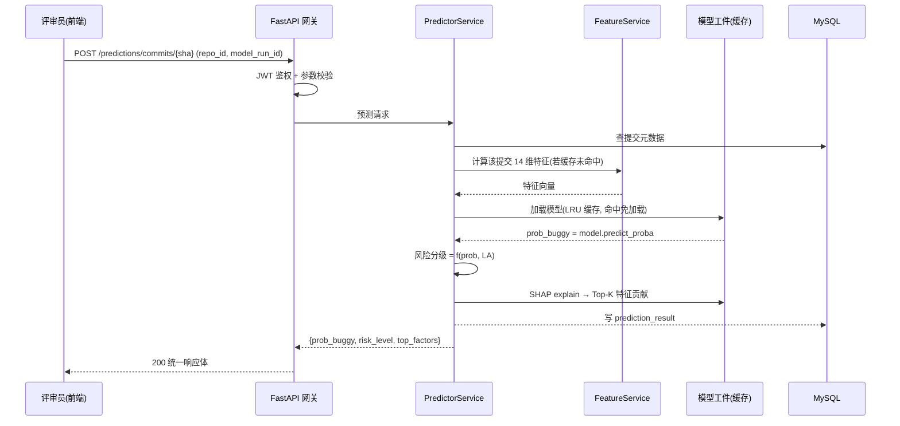
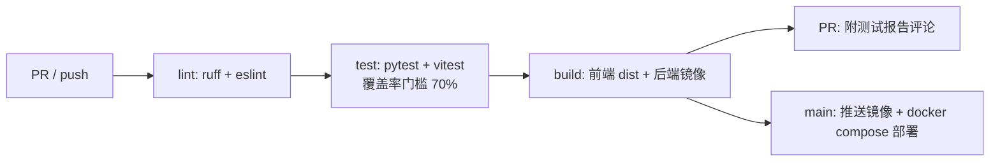
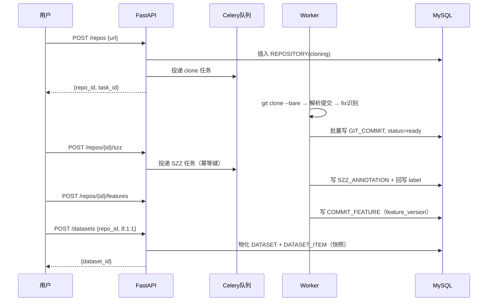
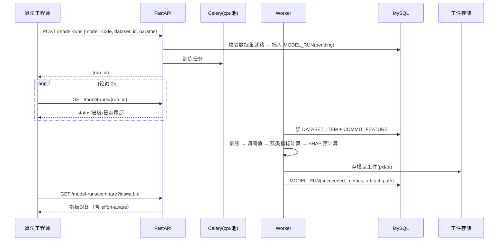

# 即时软件缺陷预测系统（DefectGuard）产品设计文档

> 产品代号：DefectGuard（缺陷哨兵）—— 在缺陷进入主干之前发出预警

---

## 一、版本信息

| 项目 | 内容 |
|------|------|
| 版本号 | V1.0 |
| 创建日期 | 2026-09-18 |
| 审核人 | 待定（组长 + 全体组员评审） |
| 文档状态 | 初稿（Sprint 0 交付物） |
| 关联文档 | 《01-项目要求分析.md》《产品需求文档》（另行编写）、OpenSpec specs |

## 二、变更日志

> 一个版本对应一个文档，旧版本不删除，修改后及时发布新版本。

| 时间 | 版本号 | 变更人 | 主要变更内容 |
|------|--------|--------|-------------|
| 2026-09-18 | V1.0 | 待填 | 初稿：系统架构、模块划分、API 设计、数据库设计、核心流程与时序图 |

## 三、文档说明

### 1. 名词解释

| 术语/缩略词 | 说明 |
|------------|------|
| JIT | Just-in-Time Defect Prediction，即时（提交级）软件缺陷预测，本系统的核心业务概念 |
| DefectGuard | 本系统产品代号 |
| Commit（提交） | Git 版本库中一次原子变更，本系统的预测粒度 |
| Fix Commit | 缺陷修复提交，通过提交信息关键字或 Issue 关联识别（如 `fix #123`） |
| SZZ | Śliwerski–Zimmermann–Zeller 算法：对 fix commit 中被修复的行做 git blame 回溯，定位**缺陷引入提交**，从而产生 buggy/clean 监督标签 |
| Kamei 14 | Kamei et al.(IEEE TSE 2013) 提出的 14 维代码变更度量元（Diffusion/Size/Purpose/History/Experience 五组），JIT 预测的经典特征集 |
| Buggy / Clean | 提交标签：引入缺陷（正样本）/ 未引入缺陷（负样本） |
| Effort-unaware 指标 | 不考虑审查成本的分类指标：Accuracy、Precision、Recall、F1、AUC、MCC 等 |
| Effort-aware 指标 | 以"审查工作量（LOC）"为成本的性能指标：Popt、Popt20、PofB20、Recall@20%Effort 等，更贴近代码评审实际收益 |
| Popt20 | 按 20% 工作量（累计新增代码行）审查时，相对最优排序的缺陷捕获率（曲线下面积法） |
| PofB20 | 审查 20% 工作量时实际捕获的缺陷比例 |
| SHAP | SHapley Additive exPlanations，模型归因解释方法，用于缺陷归因 |
| DeepJIT | Fan et al.(2019) 提出的基于 CNN 的 JIT 深度学习模型（变更分布式表示 + 卷积） |
| MVP | Minimum Viable Product，最小可行产品 |
| SDD / OpenSpec | 规范驱动开发（Specification-Driven Development）及其实施框架 OpenSpec（proposal→specs→design→tasks） |
| SSRF | Server-Side Request Forgery，服务端请求伪造；仓库 URL 抓取场景需防护的安全风险 |
| Worker | 异步任务执行进程（Celery），承担克隆、SZZ、特征提取、训练、批量预测等长耗时任务 |

### 2. 参考基线

- 理论基线：Yasutaka Kamei, Emad Shihab, Bram Adams, Ahmed E. Hassan, et al. *A Large-Scale Empirical Study of Just-in-Time Quality Assurance*, IEEE TSE 39(6):757–773, 2013.
- SZZ 基线：J. Śliwerski, T. Zimmermann, A. Zeller, "When Do Changes Induce Fixes?", MSR 2005；工程实现参考 RA-SZZ（排除注释行）等改进变体。
- 深度模型基线：X. Fan et al., "The Utility of Textual Information in Bug Prediction", ICSE-NIER 2019（DeepJIT）。

---

## 四、概要设计

### 1. 系统架构

系统采用经典**分层架构**（上层依赖下层，禁止跨层调用与反向依赖），自上而下分为四层：**展示层 → 接口层 → 业务服务层（含 ML 引擎与异步任务）→ 数据存储层**，外部依赖为 Git 托管平台（GitHub/Gitee）。



**分层职责与规约**

| 层 | 职责 | 关键规约 |
|----|------|---------|
| 展示层 | 页面交互、图表可视化、状态管理（Pinia） | 只通过接口层访问服务；不直接持有数据库连接 |
| 接口层 | 路由、鉴权（JWT）、参数校验（Pydantic）、统一响应与错误码、限流 | 业务逻辑不下沉到路由函数；自动产出 OpenAPI 文档 |
| 业务服务层 | 领域服务 + 异步任务；ML 训练/推理；Git 解析 | 长耗时操作一律投递 Celery；服务间通过接口组合，不循环依赖 |
| 数据存储层 | 持久化与缓存 | 访问统一走 SQLAlchemy ORM；模型工件不入 MySQL |

**关键技术选型理由**

| 决策 | 选择 | 理由 |
|------|------|------|
| 后端语言/框架 | Python 3.11 + FastAPI | ML 生态（sklearn/XGBoost/PyTorch）原生支持；FastAPI 异步高性能、**原生产出 OpenAPI/Swagger**（直接满足文档模板"优先以 OpenAPI 为载体"） |
| 异步任务 | Celery + Redis | 克隆、SZZ、训练均为分钟级长任务，必须异步化并支持进度查询、重试 |
| Git 解析 | GitPython + PyDriller | PyDriller 内建 commit 变更统计与 blame 能力，与 Kamei 度量高度对口 |
| 前端 | Vue 3 + TS + Element Plus + ECharts | 组件生态成熟；ECharts 适配趋势/风险看板与自定义图表 |
| 数据库 | MySQL 8 | 关系型数据（提交/特征/指标/结果）适合关系模型；事务保障 |
| 模型工件 | MinIO/本地卷 + DB 存元数据 | 二进制大对象不进 MySQL，路径入库 |

### 2. 系统模块划分

系统—模块—功能点三级结构（括号内为对应的核心用户故事编号，详见 PRD）：

```text
DefectGuard 即时软件缺陷预测系统
├── M1 用户与认证模块（AuthService）
│   ├── F1.1 用户注册/登录/登出（US-22）
│   ├── F1.2 JWT 会话与角色权限（管理员/普通用户）（US-22）
│   └── F1.3 个人信息与操作审计日志
├── M2 仓库管理模块（RepoService）
│   ├── F2.1 添加仓库（URL 校验 + SSRF 防护）（US-01）
│   ├── F2.2 异步克隆/解析与进度查询（US-02）
│   ├── F2.3 增量同步（git fetch）（US-03）
│   ├── F2.4 提交列表查询（分页/过滤）（US-02）
│   └── F2.5 仓库删除与数据级联清理
├── M3 数据采集与解析模块（CollectorService）
│   ├── F3.1 提交元数据与 diff 解析入库
│   ├── F3.2 Fix Commit 识别（关键字正则 + Issue 关联）（US-04）
│   ├── F3.3 SZZ 标注（RA-SZZ：blame 回溯，产出 buggy/clean）（US-05）
│   └── F3.4 标注质量统计（缺陷率、追溯明细查询）
├── M4 特征工程模块（FeatureService）
│   ├── F4.1 Kamei 14 维度量提取（US-06）
│   ├── F4.2 特征质量统计（分布/缺失）（US-07）
│   ├── F4.3 语义特征（可选增强：diff TF-IDF/CodeBERT 向量）（US-10）
│   └── F4.4 特征版本管理（feature_version）
├── M5 数据集模块（DatasetService）
│   ├── F5.1 时间序列划分（train/valid/test）（US-08）
│   ├── F5.2 类别不平衡处理（类权重/SMOTE，可配置）（US-09）
│   └── F5.3 数据集版本与统计摘要（US-09）
├── M6 模型训练与评估模块（TrainerService）
│   ├── F6.1 模型插件注册表（≥8 种、2 类）（US-11）
│   ├── F6.2 异步训练任务与超参配置（US-11、US-12）
│   ├── F6.3 Effort-unaware 指标计算（US-13）
│   ├── F6.4 Effort-aware 指标计算（US-14）
│   ├── F6.5 多模型对比与选型（US-15）
│   └── F6.6 模型工件与版本管理
├── M7 预测与解释模块（PredictorService）
│   ├── F7.1 单提交在线预测（含即时特征计算）（US-16）
│   ├── F7.2 风险分级（概率 × 工作量）（US-17）
│   ├── F7.3 SHAP 缺陷归因与审查建议（US-18）
│   └── F7.4 批量风险扫描（最近 N 条提交）（US-19）
├── M8 可视化看板模块（DashboardService）
│   ├── F8.1 缺陷引入趋势看板（周/月）（US-20）
│   ├── F8.2 仓库风险概览与 Top 风险排行（US-21）
│   └── F8.3 模型效果图表（ROC/累计收益曲线）（US-15）
└── M9 系统与工程化模块（Platform）
    ├── F9.1 任务中心（全局异步任务状态）（US-23）
    ├── F9.2 健康检查与监控
    ├── F9.3 CI/CD 流水线（GitHub Actions：lint→test→build→deploy）
    └── F9.4 插件化机制（模型插件 / 特征插件）
```

**模块间依赖关系**（箭头表示"依赖于"）：



> 主数据流：M2→M3→M4→M5→M6→M7 构成系统的**核心业务闭环**（与 OpenSpec 核心能力一一对应）；M1、M8、M9 为横向支撑模块。

### 3. API 清单

统一约定：前缀 `/api/v1`；鉴权 JWT（Bearer Token）；响应统一 `{code, message, data}`；分页参数 `page`/`page_size`。完整 OpenAPI 规范由 FastAPI 自动生成（`/docs`），此处为清单索引，详见"五、2. API 详细设计"。

| ID | 接口名 | 所属模块 | URL 路径 | 方法 | 入参（摘要） | 出参（摘要） | 鉴权 |
|----|--------|---------|----------|------|-------------|-------------|------|
| A01 | 用户注册 | M1 | /auth/register | POST | username, password, email | user_id | 匿名 |
| A02 | 用户登录 | M1 | /auth/login | POST | username, password | access_token | 匿名 |
| A03 | 当前用户信息 | M1 | /auth/me | GET | — | 用户资料 | JWT |
| A04 | 仓库列表 | M2 | /repos | GET | 分页、状态过滤 | 仓库数组+状态 | JWT |
| A05 | 添加仓库 | M2 | /repos | POST | url, name?, branch? | repo_id（异步克隆任务） | JWT |
| A06 | 仓库详情 | M2 | /repos/{repoId} | GET | — | 仓库详情+统计 | JWT |
| A07 | 删除仓库 | M2 | /repos/{repoId} | DELETE | — | 204 | JWT/Admin |
| A08 | 增量同步 | M2 | /repos/{repoId}/sync | POST | — | task_id | JWT |
| A09 | 提交列表 | M2 | /repos/{repoId}/commits | GET | 分页、is_fix/label 过滤、时间范围 | 提交数组（sha/作者/时间/标签） | JWT |
| A10 | 提交详情 | M2 | /repos/{repoId}/commits/{sha} | GET | — | 元数据+标签+特征概览 | JWT |
| A11 | 触发 SZZ 标注 | M3 | /repos/{repoId}/szz | POST | 算法参数（variant 等） | task_id | JWT |
| A12 | SZZ 状态与统计 | M3 | /repos/{repoId}/szz/status | GET | — | 进度、buggy/clean 统计 | JWT |
| A13 | SZZ 追溯明细 | M3 | /repos/{repoId}/szz/annotations | GET | fix_sha 过滤、分页 | fix→引入提交明细 | JWT |
| A14 | 触发特征提取 | M4 | /repos/{repoId}/features | POST | 是否含语义特征 | task_id | JWT |
| A15 | 特征状态与统计 | M4 | /repos/{repoId}/features/status | GET | feature_version | 进度、特征分布摘要 | JWT |
| A16 | 创建数据集 | M5 | /datasets | POST | repo_id、划分策略、比例 | dataset_id | JWT |
| A17 | 数据集列表/详情 | M5 | /datasets[/{id}] | GET | — | 数据集摘要（规模/缺陷率/划分统计） | JWT |
| A18 | 模型注册表 | M6 | /models | GET | — | 可用模型插件列表（类别/描述/超参模式） | JWT |
| A19 | 发起训练 | M6 | /model-runs | POST | model_code, dataset_id, params, metrics 集 | run_id（异步训练任务） | JWT |
| A20 | 训练实例列表 | M6 | /model-runs | GET | 状态/模型过滤、分页 | run 数组（状态/指标摘要） | JWT |
| A21 | 训练详情与指标 | M6 | /model-runs/{id} | GET | — | 状态、日志、unaware+effort-aware 指标 | JWT |
| A22 | 删除训练实例 | M6 | /model-runs/{id} | DELETE | — | 204 | JWT |
| A23 | 模型对比 | M6 | /model-runs/compare | GET | ids=1,2,3 | 指标对比表 | JWT |
| A24 | 单提交预测 | M7 | /predictions/commits/{sha} | POST | repo_id, model_run_id | 概率、风险级、Top 归因 | JWT |
| A25 | 创建批量扫描 | M7 | /predictions/tasks | POST | repo_id, model_run_id, range(N 条/时间窗) | task_id | JWT |
| A26 | 扫描任务状态 | M7 | /predictions/tasks/{id} | GET | — | 状态/进度 | JWT |
| A27 | 风险列表 | M7 | /predictions/tasks/{id}/results | GET | 分页、risk_level 排序 | 结果数组（sha/概率/等级/LOC/Top因子） | JWT |
| A28 | 归因详情 | M7 | /predictions/results/{id}/explanation | GET | — | SHAP 全量贡献明细 | JWT |
| A29 | 看板总览 | M8 | /dashboard/overview | GET | repo_id | 高风险占比、缺陷率、Top 风险提交/开发者 | JWT |
| A30 | 缺陷趋势 | M8 | /dashboard/trend | GET | repo_id, period(week/month) | 时间序列（实际引入 vs 预测命中） | JWT |
| A31 | 任务中心 | M9 | /system/tasks | GET | 类型/状态过滤 | 全局异步任务列表 | JWT |
| A32 | 健康检查 | M9 | /system/health | GET | — | 组件健康状态 | 匿名 |

### 4. 数据库概要设计

**核心实体关系（ER 图，鸦爪法语义）**：

```mermaid
erDiagram
    USER ||--o{ REPOSITORY : "创建"
    USER ||--o{ MODEL_RUN : "发起"
    USER ||--o{ PREDICTION_TASK : "发起"

    REPOSITORY ||--o{ GIT_COMMIT : "包含"
    REPOSITORY ||--o{ DEFECT_ISSUE : "关联"
    GIT_COMMIT ||--|| COMMIT_FEATURE : "拥有"
    GIT_COMMIT ||--o{ SZZ_ANNOTATION : "作为fix提交回溯"
    GIT_COMMIT ||--o{ DATASET_ITEM : "被划分"
    GIT_COMMIT ||--o{ PREDICTION_RESULT : "被预测"

    DATASET ||--o{ DATASET_ITEM : "包含"
    DATASET }o--|| REPOSITORY : "来源于"
    MODEL_INFO ||--o{ MODEL_RUN : "实例化"
    DATASET ||--o{ MODEL_RUN : "训练于"

    MODEL_RUN ||--o{ PREDICTION_TASK : "被调用"
    PREDICTION_TASK ||--o{ PREDICTION_RESULT : "产出"
    MODEL_RUN ||--o{ PREDICTION_RESULT : "评分"

    USER {
        bigint id PK
        string username UK
        string password_hash
        enum role
        datetime created_at
    }
    REPOSITORY {
        bigint id PK
        string url UK
        string name
        string clone_status
        string local_path
        bigint created_by FK
    }
    GIT_COMMIT {
        bigint id PK
        bigint repo_id FK
        string sha UK
        string author_email
        datetime commit_time
        text message
        bool is_fix
        enum label
    }
    SZZ_ANNOTATION {
        bigint id PK
        bigint fix_commit_id FK
        bigint introduced_commit_id FK
        string variant
    }
    COMMIT_FEATURE {
        bigint commit_id PK_FK
        int ns
        int nd
        int nf
        float entropy
        int la
        int ld
        int lt
        bool fix
        int ndev
        float age
        int nuc
        int exp
        float rexp
        float sexp
        string feature_version
    }
    DEFECT_ISSUE {
        bigint id PK
        bigint repo_id FK
        string issue_no
        bool is_bug
    }
    DATASET {
        bigint id PK
        bigint repo_id FK
        string split_strategy
        date split_date
        json stats
    }
    DATASET_ITEM {
        bigint id PK
        bigint dataset_id FK
        bigint commit_id FK
        enum split
        bool label
    }
    MODEL_INFO {
        bigint id PK
        string code UK
        enum family
        json hyperparam_schema
    }
    MODEL_RUN {
        bigint id PK
        bigint model_info_id FK
        bigint dataset_id FK
        enum status
        json metrics
        string artifact_path
        bigint trained_by FK
    }
    PREDICTION_TASK {
        bigint id PK
        bigint repo_id FK
        bigint model_run_id FK
        enum task_type
        enum status
        int progress
        bigint created_by FK
    }
    PREDICTION_RESULT {
        bigint id PK
        bigint task_id FK
        bigint commit_id FK
        bigint model_run_id FK
        float prob_buggy
        enum risk_level
        int la
        json top_factors
    }
```

**实体职责速览**

| 实体 | 职责 | 生命周期要点 |
|------|------|-------------|
| USER | 平台用户与角色 | 注册创建，逻辑删除 |
| REPOSITORY | 接入的目标 Git 仓库及克隆状态 | 添加创建；删除触发级联清理（裸仓库、提交、特征、数据集、结果） |
| GIT_COMMIT | 提交元数据 + 监督标签（label 由 SZZ 写回） | 随克隆/同步写入；label 可被重标注覆盖 |
| SZZ_ANNOTATION | SZZ 追溯明细（fix → 引入提交，多对多明细） | 标注任务幂等重建 |
| COMMIT_FEATURE | Kamei 14 维特征（+语义特征外置） | 与 commit 一对一；feature_version 支持算法升级后重算 |
| DEFECT_ISSUE | Issue 元数据，辅助 fix 识别 | 可选（取决于仓库托管平台 API） |
| DATASET / DATASET_ITEM | 数据集定义与 train/valid/test 划分明细 | 版本化，不可变（重建即新版本） |
| MODEL_INFO | 模型插件静态注册信息 | 部署时由插件注册表同步 |
| MODEL_RUN | 一次训练实例（状态机 + 双类指标 + 工件路径） | 终态保留，可删除（连带工件） |
| PREDICTION_TASK / PREDICTION_RESULT | 批量预测任务与逐提交结果（概率/等级/归因） | 结果保留供看板回溯 |

---

## 五、详细设计

### 1. 各模块的详细设计

#### 1.1 M2/M3 数据采集与仓库解析模块

**（a）仓库接入流程**



**（b）Fix Commit 识别规则**（结果写入 `git_commit.is_fix`，可配置）：

1. 提交信息正则（默认关键字集，大小写不敏感）：`\b(fix|bug|patch|defect|resolve|close)s?\b|#(\d+)`；
2. Issue 关联强化：若命中 `#N` 且 `defect_issue` 中该 Issue `is_bug=true`，置信度提升；
3. 双通道结果：`is_fix`（识别为修复）与 `fix_evidence`（命中证据），供 SZZ 与人工核查。

**（c）SZZ 标注流程（核心算法，RA-SZZ 变体）**



伪代码（Worker 内实现）：

```python
def szz_label(repo, fix_commits, variant="RA-SZZ"):
    """产出提交级 buggy/clean 标签。幂等：以 (repo_id) 为单位先删后算。"""
    introduced = set()
    for f in fix_commits:                      # 只处理 fix 提交
        parent = f.parent()
        removed_lines = diff_removed_lines(parent_tree, f)   # 被删/被改行
        removed_lines = filter_comments_and_blank(removed_lines, lang="java")
        for line in removed_lines:
            blame = git_blame(parent, line.file, line.no)    # 最后修改该行的提交
            if blame.commit != parent.sha:
                introduced.add((blame.commit, f.id))
                save_annotation(fix=f, introduced=blame.commit)
    write_labels(repo, buggy=introduced)       # 命中者 buggy，其余 clean
```

**（d）数据同步**：`POST /repos/{id}/sync` 执行 `git fetch` + 增量遍历新提交，重复 上述 H→I 步骤；已存在提交按 sha 幂等跳过。

**（e）异常与边界场景**

| 场景 | 处理 |
|------|------|
| 仓库不存在/私有无权限 | clone_failed，错误信息回显，允许重试 |
| 超大仓库（>50 万提交） | 浅克隆 + 提交数上限配置（默认全量，演示仓库规模可控） |
| 合并提交 | 默认跳过 diff 解析（或采用 first-parent 策略，可配置） |
| fix 提交无对应可追溯行 | 该 fix 不产生标注，计入统计 |
| SZZ 回溯到边界（根提交） | 标注为 buggy 并打 `boundary=true` 标记 |

#### 1.2 M4 特征工程模块

**（a）Kamei 14 维度量定义**（`commit_feature` 表逐一对应；计算基于 PyDriller 变更统计）：

| 组别 | # | 名称 | 含义 | 计算方法（工程实现口径） |
|------|---|------|------|------------------------|
| Diffusion 扩散 | 1 | NS | 触及的子系统数 | 提交内修改文件的一级目录去重数 |
| | 2 | ND | 触及的目录数 | 修改文件路径目录去重数 |
| | 3 | NF | 触及的文件数 | 修改文件计数 |
| | 4 | ENTROPY | 变更分布熵 | H = −Σ (la_i/LA)·log(la_i/LA)，la_i 为文件 i 的新增行 |
| Size 规模 | 5 | LA | 新增行数 | Σ 新增行 |
| | 6 | LD | 删除行数 | Σ 删除行 |
| | 7 | LT | 变更前文件规模 | 涉及文件变更前行数之和/文件数（平均） |
| Purpose 目的 | 8 | FIX | 是否缺陷修复提交 | fix 识别结果（0/1） |
| History 历史 | 9 | NDEV | 文件历史开发者数 | 涉及文件过往修改者去重数 |
| | 10 | AGE | 文件平均闲置时长 | 自涉及文件上次被修改以来的平均天数 |
| | 11 | NUC | 文件历史变更次数 | 涉及文件被修改的唯一提交数 |
| Experience 经验 | 12 | EXP | 开发者总经验 | 开发者历史提交总数 |
| | 13 | REXP | 近期经验 | 按时间指数衰减加权的提交数（窗口 90 天，可配置） |
| | 14 | SEXP | 提交经验 | 对当前涉及子系统的经验（同子系统历史提交加权） |

> 口径说明：EXP/REXP/SEXP 的精确公式以 Kamei et al. 2013 Table I 及开源实现（PyDriller 度量集）为准，上述为工程实现口径；`feature_version` 字段保证口径升级后可追溯、可重算。

**（b）计算流水线**：



**（c）性能设计**：14 维计算为 O(提交数) 且可分片，Worker 多进程并行（按提交区间分片）；已计算提交按 `(sha, feature_version)` 幂等跳过；语义特征单独版本化，失败不阻塞 14 维主流程。

#### 1.3 M5 数据集模块

**（a）时间序列划分（默认策略，防泄漏）**：按 `commit_time` 升序，前 80% → train，后 20% 中再对半分 valid/test（可配置 8:1:1）。**禁止随机打乱划分**（时间泄漏会虚高指标，这是 JIT 实证的规范做法）。

**（b）类别不平衡处理**（可配置，默认 scale_pos_weight 类权重）：
- 方案一：类权重（LR/树模型 `scale_pos_weight`/`class_weight`）——默认；
- 方案二：SMOTE 过采样（仅作用于训练折）——可选；
- 方案三：阈值移动（按 valid 集 Youden's J 选阈值）——训练后处理，记录入 run 元数据。

**（c）数据集不可变**：创建时物化 `dataset_item` 明细（快照），之后特征重算或重标注不影响已创建数据集，保证模型指标可复现。

#### 1.4 M6 模型训练与评估模块

**（a）模型插件注册表（9 种 ≥ 8，覆盖 2 类）**：

| 模型代码 | 名称 | 类别 | 库 | 说明 |
|---------|------|------|-----|------|
| lr | 逻辑回归 | 经典 ML | sklearn | Kamei 论文基线，可解释性强 |
| nb | 朴素贝叶斯 | 经典 ML | sklearn | 概率基线 |
| svm | 支持向量机 | 经典 ML | sklearn | RBF 核，概率输出（Platt） |
| rf | 随机森林 | 经典 ML | sklearn | 非线性集成 |
| xgb | XGBoost | 经典 ML | xgboost | 梯度提升，JIT 常用强基线 |
| lgbm | LightGBM | 经典 ML | lightgbm | 高效梯度提升 |
| mlp | 多层感知机 | 深度学习 | PyTorch | 3 层全连接基线 |
| deepjit | DeepJIT(CNN) | 深度学习 | PyTorch(自实现) | 变更分布式表示 + 卷积（论文复现） |
| bilstm | BiLSTM | 深度学习 | PyTorch | diff token 序列建模 |

**（b）插件接口（插件化设计，对应工程化要求）**：

```python
class BaseModelPlugin(ABC):
    code: str; family: str                       # lr / deep_learning
    hyperparam_schema: dict                      # 供前端渲染超参表单
    def fit(self, X_train, y_train, X_valid, y_valid, params) -> None: ...
    def predict_proba(self, X) -> np.ndarray: ...
    def explain(self, X) -> list[dict]: ...      # SHAP 封装，输出特征贡献

REGISTRY = {}
def register(cls):                              # @register 装饰器即插件注册
    REGISTRY[cls.code] = cls; return cls
```

新增模型 = 新增一个实现 `BaseModelPlugin` 的文件并注册，**零侵入**扩展（对应"插件化"工程要求；特征插件 `BaseFeatureExtractor` 同理）。

**（c）训练任务状态机**：



**（d）评估指标体系（两类，硬性要求）**：

*Effort-unaware（分类视角）*：Accuracy、Precision、Recall、F1、**AUC**、MCC（阈值取 valid 最优或 0.5，口径写入 run）。

*Effort-aware（评审收益视角，以 LA 为工作量）*：

| 指标 | 定义 | 业务含义 |
|------|------|---------|
| Recall@20%Effort | 按风险概率降序审查累计 LA 达 20% 时的缺陷召回率 | "只看 20% 的代码能抓到多少缺陷" |
| PofB20 | 同上口径下捕获缺陷比例（标准实现） | 评审左移收益 |
| Popt / Popt20 | 实际排序缺陷累积曲线下面积 / 最优排序对应面积（归一） | 1.0=完美排序，0.5≈随机 |

计算实现：按 `predict_proba` 降序排列测试集，累积 LA 为 x 轴、累积 buggy 命中为 y 轴，与最优排序（先 buggy 且 LA 小）和最差排序围成面积（`popt = 1 − (A_worst − A_model)/(A_worst − A_opt)`）。

**（e）训练流水线**：加载数据集 → 特征矩阵（14 维 [+ 语义向量拼接]）→ 标准化（仅线性/距离模型）→ 交叉配置类权重 → fit → valid 调阈值 → test 评估双类指标 → SHAP 预计算样本 → 工件（pkl/pt + 元数据 JSON）落 MinIO → 指标入库。全程写 run 日志（前端可轮询）。

#### 1.5 M7 预测与解释模块

**（a）单提交在线预测时序图**：



**（b）风险分级规则**（概率 × 工作量二维分诊，初版阈值可配置）：

| 风险等级 | 判定 | 前端呈现 |
|---------|------|---------|
| 高 High | prob ≥ 0.6 | 红，置顶，建议"必须细审" |
| 中 Medium | 0.3 ≤ prob < 0.6 | 橙，建议"重点抽查" |
| 低 Low | prob < 0.3 | 绿，"可快速通过" |

> 附加维度：`prob × LA`（预期缺陷密度）作为"高风险大改动"二级排序键，呼应 effort-aware 思想。

**（c）SHAP 归因输出**：`top_factors = [{name: "la", value: 842, shap: +0.21, direction: "↑ 提高风险"}, …]`；深度模型用 DeepSHAP/GradientSHAP，线性与树模型用 Linear/TreeExplainer。前端以条形图 + 文案呈现审查建议（如"新增行数(842)显著高于历史分布，建议优先关注新增代码路径"）。

**（d）批量扫描**：`POST /predictions/tasks` 创建任务（范围 = 最近 N 条 / 时间窗 / 指定分支），Worker 分批推理写结果；支持进度条、取消、失败重试（单条失败不终止整体）。

#### 1.6 M8 可视化前端模块

**（a）页面清单与路由**（Vue Router，懒加载）：

| 路由 | 页面 | 核心组件/图表 |
|------|------|--------------|
| /login | 登录/注册 | 表单 |
| /repos | 仓库管理 | 列表 + 状态标签 + 新增对话框 + 进度条 |
| /repos/:id/data | 数据与特征 | 提交表格（过滤 fix/buggy）、SZZ 统计卡、特征分布直方图 |
| /datasets | 数据集 | 划分统计（堆叠条形）、缺陷率、创建向导 |
| /models | 模型训练 | 模型选择 + 超参动态表单（读 hyperparam_schema）、运行列表 |
| /models/compare | 模型对比 | 指标雷达图/条形图、ROC 曲线、effort-aware 累积收益曲线 |
| /predictions | 风险列表 | 表格（概率/等级/作者/时间）+ 行内"查看归因"抽屉 |
| /predictions/:taskId | 扫描任务详情 | 进度条 + 结果分页 |
| /dashboard | 趋势看板 | 折线（周/月缺陷引入趋势）、饼图（风险分布）、Top 榜 |
| /system | 任务中心/系统 | 全局任务表、健康状态灯 |

**（b）交互要点**：所有长任务（克隆/SZZ/特征/训练/扫描）统一走"任务模型"——提交后返回 task_id，前端轮询（2s 间隔）刷新进度；风险列表默认按 prob 降序、支持等级过滤与排序切换；看板全部图表支持下钻到提交详情。

#### 1.7 M1/M9 用户认证与系统工程化

**（a）认证与权限**：JWT（access token 2h，Redis 黑名单登出）；密码 bcrypt；角色 RBAC（admin：删仓库/删模型/用户管理；user：全功能使用）。

**（b）异步任务框架**：Celery 队列按负载分池（`io`：克隆/同步；`cpu`：SZZ/特征/训练/扫描）；任务幂等键 `task_key = (repo_id, kind, params_hash)` 防重复提交；失败指数退避重试 3 次；统一任务表 async_task（见数据库设计）登记克隆/同步/SZZ/特征/训练/扫描六类任务，供任务中心（A31）查询。

**（c）CI/CD（GitHub Actions）**：



**（d）分支规范**：`main`（可发布）← `develop`（集成）← `feature/<module>-<us-id>`；`release/*`、`hotfix/*`；PR 必须关联 Issue/User Story 编号，≥1 名非作者评审通过方可合并（squash merge，保留评审记录）。

**（e）仓库结构（monorepo）**：

```text
defectguard/
├── backend/            # FastAPI + Celery
│   ├── app/{api,services,models,core}
│   ├── ml/{features,models,metrics}   # 特征/模型插件/指标
│   └── tests/
├── frontend/           # Vue3 + Vite
├── deploy/             # docker-compose.yml, nginx.conf
├── docs/               # 产品与设计文档
├── openspec/           # SDD：proposal/specs/design/tasks.md
└── .github/workflows/  # CI/CD
```

**（f）非功能需求落实设计**（选 3 项，其中 2 项以上为验收必测）：

| 需求 | 设计落实 | 验证方式（Sprint 3 证据） |
|------|---------|--------------------------|
| 性能 | 模型 LRU 缓存；单提交预测 P95 < 500ms（不含冷启动）；看板接口 P95 < 1s；长任务全部异步；分页查询走索引 | JMeter/Locust 压测报告 |
| 可靠性 | 任务幂等 + 3 次指数退避重试；服务无状态可水平扩展；DB 事务与唯一约束防脏数据；健康检查 | 故障注入（杀 Worker/断网）演练记录 |
| 安全 | JWT + bcrypt；ORM 参数化防注入；仓库 URL SSRF 校验（禁内网/非 https）；接口限流（登录 5次/分钟）；前端 XSS 转义 | OWASP 清单检查 + 限流/越权用例测试 |

### 2. API 详细设计

> 载体：FastAPI 自动生成的 **OpenAPI 3.1**（`/docs` Swagger UI、`/redoc`），规格 JSON 随 CI 导出至 `docs/openapi.json` 入库。此处手写核心接口与全局约定；时序图补充 OpenAPI 覆盖不到的交互。

**（a）全局约定**

- 响应体：`{"code": 0, "message": "ok", "data": {...}}`；`code=0` 成功，非 0 见错误码表；
- 分页：入参 `page`(1 起)/`page_size`(默认 20，max 100)；出参 `data.list / data.total`；
- 长任务接口：同步部分仅校验+落库+入队，返回 `data.task_id`；
- 鉴权：除 A01/A02/A32 外全部 `Authorization: Bearer <JWT>`；限流按用户 + IP 维度（Redis 令牌桶）。

**（b）全局错误码表（独立维护，接口不重复定义）**

| code | HTTP | 含义 | 典型场景 |
|------|------|------|---------|
| 0 | 200 | 成功 | — |
| 1001 | 401 | 未认证/Token 过期 | 未带 JWT 访问受保护接口 |
| 1002 | 403 | 无权限 | 普通用户执行 admin 操作 |
| 1003 | 429 | 请求过于频繁 | 登录暴力尝试触发限流 |
| 1004 | 409 | 用户名或邮箱已存在 | 注册时唯一约束冲突 |
| 2001 | 400 | 仓库 URL 非法 | 非 https / 内网地址（SSRF 拦截） |
| 2002 | 404 | 仓库不存在 | repoId 无效 |
| 2003 | 409 | 仓库已存在 | URL 唯一约束冲突 |
| 2004 | 409 | 仓库状态不允许 | 克隆中重复触发克隆/SZZ |
| 3001 | 404 | 提交不存在 | sha 错误 |
| 3002 | 409 | 数据未就绪 | 未完成 SZZ/特征即建数据集或训练 |
| 3003 | 400 | 请求参数校验失败 | 缺少必填参数/参数格式非法 |
| 4001 | 400 | 超参不合法 | 不符合 hyperparam_schema |
| 4002 | 404 | 模型/训练实例不存在 | — |
| 5001 | 409 | 任务运行中不可删 | 训练运行中删除仓库 |
| 9999 | 500 | 服务器内部错误 | 未捕获异常（traceback 记日志） |

**（c）核心接口 OpenAPI 片段（示例载体）**

```yaml
# 完整规格见 /docs 与 CI 导出的 openapi.json（节选）
/predictions/commits/{sha}:
  post:
    operationId: predictSingleCommit
    tags: [prediction]
    security: [{bearerAuth: []}]
    parameters:
      - {name: sha, in: path, required: true, schema: {type: string, pattern: '^[0-9a-f]{7,40}$'}}
    requestBody:
      required: true
      content:
        application/json:
          schema:
            type: object
            required: [repo_id, model_run_id]
            properties:
              repo_id: {type: integer}
              model_run_id: {type: integer}
    responses:
      "200":
        description: 预测结果
        content:
          application/json:
            schema:
              type: object
              properties:
                code: {type: integer, example: 0}
                data:
                  type: object
                  properties:
                    prob_buggy: {type: number, example: 0.73}
                    risk_level: {type: string, enum: [high, medium, low]}
                    la: {type: integer, example: 842}
                    top_factors:
                      type: array
                      items:
                        type: object
                        properties:
                          name: {type: string, example: la}
                          value: {type: number}
                          shap: {type: number}
                          direction: {type: string}
      "404": {description: "3001 提交不存在"}
      "409": {description: "3002 数据未就绪"}
```

**（d）关键链路时序图（OpenAPI 之外的业务交互）**

① 仓库接入 → SZZ → 特征 → 数据集（数据准备主链路）：



② 模型训练（异步任务 + 状态轮询）：



**（e）校验规则汇总**：sha 正则 `^[0-9a-f]{7,40}$`；URL 必须 https 且域名解析非内网；超参由 `hyperparam_schema`（JSON Schema）服务端二次校验；时间范围参数 `start ≤ end`；删除仓库前检查无运行中任务（否则 5001）。

### 3. 数据库表的设计

通用规约：主键 `id BIGINT AUTO_INCREMENT`；所有表含 `created_at/updated_at`；InnoDB + utf8mb4；下表仅列业务字段。

**user 用户表**

| 字段 | 类型 | 约束 | 说明 |
|------|------|------|------|
| username | varchar(64) | UK, not null | 登录名 |
| password_hash | varchar(128) | not null | bcrypt |
| varchar(128) | UK | 邮箱 | |
| role | tinyint | not null, default 0 | 0=user, 1=admin |
| status | tinyint | not null, default 1 | 1=正常, 0=禁用 |

**repository 仓库表**

| 字段 | 类型 | 约束 | 说明 |
|------|------|------|------|
| name | varchar(128) | not null | 显示名 |
| url | varchar(512) | UK | https 仓库地址 |
| platform | varchar(16) | | github/gitee/other |
| default_branch | varchar(64) | default 'main' | 解析分支 |
| clone_status | varchar(16) | not null | cloning/ready/clone_failed |
| fail_reason | varchar(512) | | 失败原因 |
| local_path | varchar(256) | | 裸仓库路径 |
| commit_count | int | default 0 | 统计冗余 |
| last_synced_at | datetime | | 最近同步 |
| created_by | bigint | FK→user.id | |

索引：`idx_status(clone_status)`。

**git_commit 提交表**

| 字段 | 类型 | 约束 | 说明 |
|------|------|------|------|
| repo_id | bigint | FK, not null | 所属仓库 |
| sha | char(40) | not null | 提交哈希 |
| parent_sha | char(40) | | 父提交（单父） |
| author_name | varchar(128) | | 作者 |
| author_email | varchar(128) | idx | 作者邮箱（经验特征关联键） |
| commit_time | datetime | not null, idx | 作者时间（划分与趋势基准） |
| message | text | | 提交信息 |
| files_changed | int | | 变更文件数 |
| insertions | int / deletions | int | ±行数（冗余统计） |
| is_fix | tinyint(1) | default 0, idx | fix 识别结果 |
| fix_evidence | varchar(256) | | 命中证据（正则/#issue） |
| label | tinyint | default -1 | -1=未知, 1=buggy, 0=clean（SZZ 写回） |
| label_source | varchar(16) | | SZZ 变体/手工 |

约束/索引：`UK(repo_id, sha)`；`idx(repo_id, commit_time)`；`idx(repo_id, label)`。

**szz_annotation SZZ 追溯明细表**

| 字段 | 类型 | 约束 | 说明 |
|------|------|------|------|
| repo_id | bigint | FK, idx | |
| fix_commit_id | bigint | FK→git_commit.id | 修复提交 |
| introduced_commit_id | bigint | FK→git_commit.id | 缺陷引入提交 |
| file_path | varchar(512) | | 追溯行所在文件 |
| variant | varchar(16) | | RA-SZZ 等 |
| is_boundary | tinyint(1) | | 是否回溯至根 |

索引：`idx(repo_id, fix_commit_id)`；`idx(introduced_commit_id)`。

**commit_feature 特征表（与 commit 一对一）**

| 字段 | 类型 | 说明 |
|------|------|------|
| commit_id | bigint PK, FK | |
| ns/nd/nf | smallint | 扩散组 |
| entropy | float | 分布熵 |
| la/ld/lt | int | 规模组 |
| fix | tinyint(1) | 目的组（冗余 is_fix 便于单查询） |
| ndev/nuc | int | 历史组 |
| age | float | 平均闲置天数 |
| exp/rexp/sexp | float | 经验组 |
| semantic_ref | varchar(256) | 语义向量外置引用（可选） |
| feature_version | varchar(16), idx | 特征口径版本 |

**defect_issue Issue 表（可选增强）**：`repo_id FK、issue_no varchar(32)、title varchar(256)、is_bug tinyint、url varchar(512)、UK(repo_id, issue_no)`。

**dataset / dataset_item 数据集表**

| dataset 字段 | 类型 | 说明 |
|------|------|------|
| repo_id | bigint FK | 来源 |
| name | varchar(128) | 名称 |
| split_strategy | varchar(32) | time_ordered（默认） |
| ratio | varchar(16) | "8:1:1" |
| split_date | datetime | train/valid+test 分界时间 |
| stats | json | 规模/缺陷率/各折统计快照 |
| created_by | bigint FK | |

| dataset_item 字段 | 类型 | 说明 |
|------|------|------|
| dataset_id | bigint FK, idx | |
| commit_id | bigint FK | |
| split | tinyint, idx | 0=train/1=valid/2=test |
| label | tinyint | 快照标签（创建时固化） |

索引：`UK(dataset_id, commit_id)`。

**model_info 模型注册表**：`code varchar(32) UK、name varchar(64)、family varchar(16)（classic_ml/deep_learning）、hyperparam_schema json、description varchar(512)、plugin_version varchar(16)`。

**model_run 训练实例表**

| 字段 | 类型 | 说明 |
|------|------|------|
| model_info_id | bigint FK | 模型 |
| dataset_id | bigint FK | 数据集 |
| status | varchar(16), idx | pending/running/succeeded/failed/cancelled |
| progress | tinyint | 0–100，Worker 心跳更新（与 prediction_task.progress 同口径） |
| params | json | 本次超参（含阈值与不平衡策略） |
| metrics | json | effort-unaware 六项 |
| ea_metrics | json | effort-aware 三项 |
| log_path | varchar(256) | 运行日志 |
| artifact_path | varchar(256) | 工件路径 |
| fail_reason | varchar(512) | |
| trained_by | bigint FK | 发起人 |

**prediction_task / prediction_result 预测表**

| prediction_task 字段 | 类型 | 说明 |
|------|------|------|
| repo_id | bigint FK | |
| model_run_id | bigint FK | 使用模型 |
| task_type | tinyint | 1=批量扫描, 2=单次(留痕) |
| range_config | json | 最近 N 条/时间窗 |
| status | varchar(16) | 同任务状态机 |
| progress | tinyint | 0–100 |
| created_by | bigint FK | |

| prediction_result 字段 | 类型 | 说明 |
|------|------|------|
| task_id | bigint FK, idx | |
| commit_id | bigint FK | |
| model_run_id | bigint FK | 冗余，便于跨任务查询 |
| prob_buggy | float | 缺陷概率 |
| pred_label | tinyint | 分类结果 |
| risk_level | tinyint, idx | 2=高/1=中/0=低 |
| la | int | 工作量（effort 排序键） |
| top_factors | json | SHAP Top-K 因子 |

索引：`UK(task_id, commit_id)`；`idx(model_run_id, prob_buggy desc)`。

**async_task 统一异步任务表**（任务中心 A31 数据源，六类长任务统一登记）

| 字段 | 类型 | 说明 |
|------|------|------|
| kind | varchar(16), idx | clone/sync/szz/feature/train/scan |
| repo_id | bigint FK | 关联仓库 |
| ref_id | bigint | 业务主键（如 model_run.id、prediction_task.id，克隆类可空） |
| status | varchar(16) | 同任务状态机 |
| progress | tinyint | 0–100 |
| params_hash | varchar(64) | 幂等键 `(repo_id, kind, params_hash)` 组成部分 |
| fail_reason | varchar(512) | |
| created_by | bigint FK | 发起人 |

索引：`idx(repo_id, kind, params_hash)`（应用层据幂等键拦截重复提交）；`idx(kind, status)`。

**operation_log 审计表**（US-22 AC4 依赖，必建）：`user_id FK、action varchar(64)、target varchar(128)、detail json、ip varchar(64)、created_at idx`。

**容量估算（演示规模）**：以 ActiveMQ（约 5 万提交）为例，git_commit 5 万行、commit_feature 5 万行、prediction_result 单次全量扫描 5 万行——MySQL 单机轻松承载；中型仓库（Lucene ~ 数万提交）亦在同等量级。

---

## 附录

### 附录 A：图表生成说明

本文档所有架构图/ER图/时序图/流程图/状态图均以 **Mermaid** 文本生成，生成工具：**Claude Code（VSCode 扩展，底层模型 GLM）**。

主要提示词（节选）：

> 1. 架构图："用 mermaid flowchart TB 画 DefectGuard 即时缺陷缺陷预测系统的分层架构图，分展示层（Vue3 前端页面）、接口层（Nginx+FastAPI 网关）、业务服务层（9 个领域服务 + Celery 任务队列）、数据存储层（MySQL/Redis/MinIO/裸仓库），外部依赖 GitHub/Gitee，标注各层技术栈。"
> 2. ER 图："用 mermaid erDiagram 画出 user/repository/git_commit/szz_annotation/commit_feature/dataset/dataset_item/model_info/model_run/prediction_task/prediction_result 实体关系，标注主外键与关键属性。"
> 3. 时序图："画单提交在线预测时序图，参与方：前端、FastAPI 网关、PredictorService、FeatureService、模型工件缓存(LRU)、MySQL，包含 JWT 鉴权、特征缓存命中、SHAP 归因、结果落库。"

### 附录 B：与项目要求的对照检查

| 项目硬指标 | 本设计对应 |
|-----------|-----------|
| SZZ 算法实现 | M3/F3.3（RA-SZZ + 追溯明细表） |
| Kamei 14 维度量 | M4/F4.1（14 维全量 + 分组口径表） |
| ≥2 类 ≥8 种模型 | M6 模型注册表（经典 ML 6 + 深度学习 3 = 9 种） |
| Effort-aware + unaware 两类指标 | M6/F6.3、F6.4（六项 + 三项，含计算方法） |
| 训练/测试集划分 | M5（时间序列 8:1:1，防泄漏说明） |
| 缺陷概率 + 归因解释 | M7/F7.1–F7.3（概率、风险分级、SHAP） |
| 风险列表 + 趋势看板 | M7/F7.4 + M8 |
| 分支规范/评审/CI/CD/插件化 | M9（分支模型、GitHub Actions 流水线、模型插件接口） |
| ≥2 项非功能需求 | 性能/可靠性/安全 三项（设计落实 + 验证方式） |

### 附录 C：待评审确认事项

1. 产品名 DefectGuard 是否采纳（可换）；
2. 演示仓库首选（建议 ActiveMQ，备选 Lucene）；
3. 已决议：非功能需求圈定 3 项（性能、可靠性、安全），以《03-产品需求文档》第七章为准，全部作为 Sprint 3 必测项；
4. CodeArts/飞书/禅道 项目管理工具选型；
5. 已决议：语义特征（US-10）定为 P2、Sprint 3 附加项。
