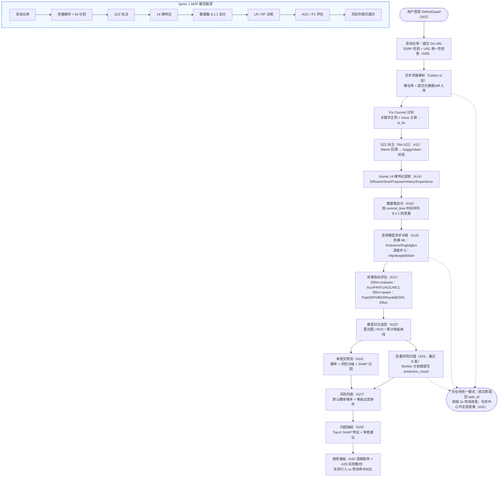

# 即时软件缺陷预测系统（DefectGuard）产品需求文档

> 产品代号：DefectGuard（缺陷哨兵）—— 在缺陷进入主干之前发出预警

---

## 一、版本信息

| 项目 | 内容 |
|------|------|
| 版本号 | V1.0 |
| 创建日期 | 2026-09-18 |
| 审核人 | 待定（组长 + 全体组员评审） |
| 文档状态 | 初稿（Sprint 0 交付物） |
| 关联文档 | 《01-项目要求分析.md》《02-产品设计文档.md》、OpenSpec specs（openspec/ 目录） |

## 二、变更日志

> 一个版本对应一个文档，旧版本不删除，修改后及时发布新版本。

| 时间 | 版本号 | 变更人 | 主要变更内容 |
|------|--------|--------|-------------|
| 2026-09-18 | V1.0 | 待填（全体组员共同起草，定稿时署名） | 初稿：需求背景与竞品分析、需求范围与信息架构、23 个用户故事（含验收标准与正/异常场景）、非功能需求 3 项、项目规划（Sprint/Backlog/OpenSpec 变更） |

## 三、文档说明

### 1. 名词解释

| 术语/缩略词 | 说明 |
|------------|------|
| JIT | Just-in-Time Defect Prediction，即时（提交级）软件缺陷预测，本产品核心业务概念 |
| DefectGuard | 本系统产品代号 |
| Commit（提交） | Git 版本库中一次原子变更，本系统的预测粒度 |
| Fix Commit | 缺陷修复提交，通过提交信息关键字或 Issue 关联识别（如 fix #123） |
| SZZ / RA-SZZ | 从 fix commit 回溯定位缺陷引入提交的打标算法；RA-SZZ 为剔除注释行干扰的改进变体 |
| Kamei 14 | Kamei et al.(IEEE TSE 2013) 的 14 维代码变更度量元（Diffusion/Size/Purpose/History/Experience 五组） |
| Buggy / Clean | 提交标签：引入缺陷（正样本）/ 未引入缺陷（负样本） |
| Effort-unaware 指标 | 不考虑审查成本的分类指标：Accuracy、Precision、Recall、F1、AUC、MCC |
| Effort-aware 指标 | 以审查工作量（LOC）为成本的指标：Recall@20%Effort、PofB20、Popt20 |
| SHAP | 模型归因解释方法，用于缺陷归因（Top 影响特征及方向） |
| Epic / User Story / AC | 业务目标层级 / 用户需求单元 / 验收标准（Acceptance Criteria） |
| 故事点 | 相对工作量估算单位，本团队 1 故事点 ≈ 1 名成员 1 个有效工作日 |
| P0 / P1 / P2 | 优先级：核心闭环与课程硬指标 / 产品完整度必需 / 附加增强（对应 MoSCoW 的 Must/Should/Could） |
| MVP | 最小可行产品，本产品 MVP 边界见"五、需求范围" |
| Sprint / Backlog | Scrum 迭代周期 / 需求待办列表 |
| OpenSpec / SDD | 规范驱动开发框架及实践方法（proposal→specs→design→tasks） |
| Persona | 目标用户画像 |

### 2. 文档目的与读者

本文档定义 DefectGuard 的需求范围与验收口径，读者为：本团队成员（开发/测试依据）、任课教师（Sprint 0 交付物评审）。技术实现方案见《02-产品设计文档》，两文档通过统一的编号体系关联（用户故事 US-XX、模块 M1~M9、接口 A01~A32）。

---

## 四、需求背景
### 1. 现状与痛点（产品/数据现状）

**缺陷发现越晚，修复成本越高。** 软件工程界长期共识（Boehm 缺陷成本曲线）表明：缺陷在编码与评审阶段被拦截的修复成本最低，逃逸到系统测试后期与线上生产环境后，定位与修复成本会放大数倍到数十倍，且尚不计故障止损、回滚与声誉损失。因此质量保障的核心命题不是"测得更多"，而是"拦得更早"——在缺陷合入主干之前将其截住。

**代码评审资源有限且平均分配，导致高风险提交漏审。** 代码评审是缺陷进入主干前的最后一道人工关卡，但评审工时是稀缺资源。一个中型迭代合入主干的提交可达数十到上百次，评审员只能在有限时间内近似平均地分配注意力：大体量新增（LA 高）、跨子系统扩散（NS 高）、触及久未改动遗留文件（AGE 高）的高风险提交，与文案、配置微调类低风险提交获得几乎相同的审查深度。结果是"该细看的没看细，不必细看的反复看"。评审环节普遍缺少一个可信、可解释的**优先级排序依据**。

**传统缺陷预测粒度过粗，无法指导单次评审。** 经典缺陷预测研究多停留在模块/文件粒度（基于 CK 等静态代码度量），回答的是"哪个文件历史上缺陷较多"，无法回答"眼前这次提交是否会引入缺陷"，因而无法嵌入评审决策的当下时刻；对评审员而言，文件级风险结论对"这次 PR 要不要细看"指导价值有限。

**数据现状：缺陷线索可机器挖掘，自标注闭环可行。** 与此同时，高质量监督数据并非遥不可及。GitHub 上的知名开源 Java 项目保留了完整可机器挖掘的 git 历史——ActiveMQ 约 5 万提交、Lucene 数万提交、Hadoop 规模更大；缺陷线索藏在 fix commit（提交信息含 fix/bug/resolve/close 关键字或关联 `#Issue`）之中。借助 SZZ 算法（对 fix commit 中被修复的行做 blame 回溯，定位缺陷引入提交；本产品采用剔除注释行干扰的 RA-SZZ 变体），可自动产出**提交级 buggy/clean 监督标签**，无需人工标注。此类仓库的缺陷引入率通常约为 5%~15%，天然存在类别不平衡，需要在训练侧配套处理策略。

**产品机会：质量保障左移。** 综合以上四点，"提交级（Just-in-Time）缺陷预测"具备明确落地条件：在评审发生前，基于项目自身历史训练的模型对每次提交给出缺陷概率、风险分级与归因解释，把有限的评审工时投向收益最高的提交——用 20% 的审查工作量覆盖大部分潜在缺陷（即 PofB20 所度量的评审收益）。这正是 DefectGuard 的切入点。

### 2. 用户调研

调研采用三种方法互补，交叉验证痛点真实性：

- **文献调研**：以 Kamei et al. 2013（IEEE TSE 39(6)）JIT 大规模实证研究为主线，辅以 SZZ（Śliwerski et al., MSR 2005）与 DeepJIT（Fan et al., 2019），确认提交级预测的可行性、Kamei 14 维特征集的有效性以及 Effort-aware 评估的业界惯例；
- **目标角色轻量访谈**：面向四类目标角色共 5 人，采用半结构化访谈（每人约 30 分钟，教学/团队模拟场景），聚焦"评审怎么排优先级""敢不敢信模型输出"等具体问题；
- **开发者社区痛点扫描**：扫描 Stack Overflow、Reddit、InfoQ 中关于 code review 负担、漏审事故与静态工具误报的典型讨论。

**访谈样本概况**：

| 编号 | 角色 | 背景 | 形式 |
|------|------|------|------|
| P1 | 代码评审员/开发负责人 | 3 年 Java 后端，担任迭代评审负责人 | 半结构化，30 分钟 |
| P2 | 代码评审员 | 2 年后端，参与开源项目 PR 审查 | 半结构化，30 分钟 |
| P3 | 算法工程师 | 熟悉 sklearn/XGBoost/PyTorch 工作流 | 半结构化，30 分钟 |
| P4 | 团队/质量负责人 | 关注缺陷密度、趋势与迭代复盘 | 半结构化，30 分钟 |
| P5 | 平台管理员 | 维护团队 CI 流水线与研发工具链 | 半结构化，30 分钟 |

**关键结论**：

1. **评审优先级排序是刚需（5/5 提及）**：受访者一致表示"不是不想细审，是不知道先看哪个"；对应 US-19 批量风险扫描与 US-17 风险分级（按概率与工作量输出高/中/低）。
2. **概率之外必须给出归因解释才敢采信（4/5 提及）**：黑盒分数无法转化为评审动作，评审员需要知道"为什么高风险"（如新增行数显著偏高、涉及文件久未改动）才能聚焦审查，对应 US-18 SHAP 缺陷归因。
3. **管理者需要趋势视角（P4）**：单点预警不足以支撑复盘与汇报，需要按周/月的缺陷引入趋势、高风险占比与 Top 风险提交/开发者统计，对应 US-20、US-21。
4. **标签可信且可追溯是采信前提（P3、P4）**：用户关心 buggy/clean 标签从何而来、fix→引入提交的追溯链路是否可查证，对应 M3 的 SZZ 追溯明细（A13）。
5. **必须产品化而非 notebook（P3、P5）**：从仓库接入到在线预测需一站式完成、长任务异步可观测（US-23），否则工具在实际流程中用不起来。

详细过程记录与原始笔记见【附录：用户调研详细报告】（占位，Sprint 0 结束前补充）。

### 3. 竞品分析

| 产品 | 定位/方法 | 分析粒度 | 解释性 | 数据闭环 | 可否本地部署 |
|------|-----------|----------|--------|----------|--------------|
| CodeScene【截图待补，Sprint 0 结束前，见附录 B】 | 行为代码分析：基于 git 历史的变更频率 × 复杂度识别热点 | 文件/热点区域 | 中：热点分数可解释，但不输出缺陷概率 | 无缺陷标签闭环，不做 SZZ 自标注 | 企业版可部署，以云端为主 |
| SonarQube【截图待补，Sprint 0 结束前，见附录 B】 | 静态规则扫描（代码异味/漏洞/重复度） | 行/规则级 | 强：规则命中即给出依据 | 无：不利用项目缺陷历史训练，不产出缺陷概率 | 开源版可自建 |
| Amazon CodeGuru Reviewer【截图待补，Sprint 0 结束前，见附录 B】 | ML 自动生成 PR 评审建议 | PR/行级建议 | 弱：建议不带缺陷概率与量化归因 | 云端黑盒训练，无法审计 | 否（AWS 托管云服务） |
| JITLine / DeepJIT【截图待补，Sprint 0 结束前，见附录 B】 | 学术界 JIT 预测开源实现 | 提交级 | 弱/无：以指标评估为主，无解释界面 | 需自行离线准备数据，无 SZZ 产品化 | 代码可本地运行，但属研究原型 |

**关键结论**：现有工具呈两极分化。工业工具要么基于静态规则或热点统计（SonarQube、CodeScene），解释性好但不输出"本次提交引入缺陷的概率"，也无法从项目自身的缺陷历史中学习；要么是黑盒 ML 建议类（CodeGuru），不可本地部署、不可审计。学术原型（JITLine、DeepJIT）验证了提交级缺陷预测的技术可行性，但停留在脚本与实验层面：无 SZZ 自标注的数据闭环、无可视化界面与任务化工程、无归因解释能力。市场上缺乏 **"SZZ 自标注数据闭环 + 提交级缺陷概率 + SHAP 归因解释"三位一体且可本地部署** 的产品——DefectGuard 的差异化定位即在于此，并以 Effort-aware 指标（Popt20/PofB20/Recall@20%Effort）直接度量"排序建议能替评审省多少力"，这是上述竞品均未覆盖的视角。

### 4. 目标用户与价值主张

**目标用户画像（Persona）**：

| Persona | 典型场景 | 核心诉求 | 使用频率 |
|---------|----------|----------|----------|
| 代码评审员/开发负责人 | 评审窗口期打开风险列表（US-19），按概率降序处理高风险提交，点开归因抽屉（US-18）决定细审范围 | 可信的优先级排序；"为什么高风险"的可解释归因；误报率可控 | 每天（评审高频场景） |
| 算法工程师 | 创建数据集（时间序列 8:1:1 划分，US-08）、从 9 种模型（经典 ML：lr/nb/svm/rf/xgb/lgbm；深度学习：mlp/deepjit/bilstm）发起异步训练（US-11～US-12）、横向对比双类指标选型（US-15） | 实验可复现（数据集快照、特征版本化）；防数据泄漏的规范划分；插件化扩展新模型 | 每周/每迭代 |
| 团队/质量负责人 | 周会前查看趋势看板（US-20）与仓库风险概览（US-21），复盘缺陷引入趋势与 Top 风险分布 | 周期趋势与风险占比一目了然；支持下钻到具体提交取证；可对外汇报 | 每周（复盘节点） |
| 平台管理员 | 管理用户与角色权限（US-22）、在任务中心巡检克隆/SZZ/训练/扫描任务健康状态（US-23） | 长任务可观测、失败可重试；权限与安全合规；部署运维简单 | 每天巡检，低频操作 |

**一句话价值主张**：在缺陷进入主干之前，DefectGuard 基于 git 历史自动标注、自监督学习，为每一次代码提交给出缺陷概率、风险分级与归因解释，让有限的评审工时精准投向最可能出问题的代码。

**三大价值支柱**：

1. **提交级预警**：以单次 commit 为预测粒度，输出缺陷概率与高/中/低风险分级，支持单提交即时预测（US-16）与最近 N 条提交的批量风险扫描排序（US-19），直接回答"先审哪一个"；
2. **可解释归因**：基于 SHAP 输出 Top 影响特征（如 la、age、ndev）及其方向，把"高风险"翻译成"新增行数 842 显著高于历史分布，建议优先审查新增代码路径"式的具体审查建议（US-18），让预测结果可验证、敢采信；
3. **全流程数据-模型-服务闭环**：从仓库接入（M2）→ SZZ 自标注（M3）→ Kamei 14 维特征（M4）→ 数据集构建（M5）→ 9 种模型训练与双类指标评估（M6）→ 在线预测与解释（M7）→ 趋势看板（M8）一条链路全覆盖，依托 Vue3 + FastAPI + Celery + MySQL + Redis 技术栈实现长任务异步化与服务化，而非一次性的分析脚本。
## 五、需求范围

### 1. 信息架构（Epic → Feature → User Story）

> 完整满足课程对 Sprint 0 的要求：形成 Epic（业务目标）→ Feature（功能模块）→ User Story（用户需求）层级。模块编号 M1~M9 与《02-产品设计文档》一致。

```text
DefectGuard 即时软件缺陷预测系统
│
├── Epic 1：仓库与数据接入（业务目标：让缺陷预测有据可依）
│   ├── Feature：仓库接入管理（模块 M2）
│   │   ├── US-01 添加仓库（P0）
│   │   ├── US-02 数据准备可视化（P0）
│   │   └── US-03 增量同步（P1）
│   └── Feature：缺陷提交识别与 SZZ 标注（模块 M3）
│       ├── US-04 缺陷修复提交识别（P0）
│       └── US-05 SZZ 标注（P0）
│
├── Epic 2：特征工程与数据集构建（业务目标：把提交变成可训练的样本）
│   ├── Feature：特征工程（模块 M4）
│   │   ├── US-06 Kamei 14 维特征提取（P0）
│   │   └── US-07 特征质量统计（P1）
│   └── Feature：数据集构建（模块 M5）
│       ├── US-08 数据集时间序列划分（P0）
│       ├── US-09 类别不平衡分析（P1）
│       └── US-10 语义特征·可选增强（P2）
│
├── Epic 3：模型训练与评估（业务目标：≥8 种模型、双类指标、可比可选）
│   ├── Feature：训练执行（模块 M6）
│   │   ├── US-11 发起模型训练（P0）
│   │   └── US-12 训练监控（P1）
│   └── Feature：评估与选型（模块 M6）
│       ├── US-13 Effort-unaware 指标（P0）
│       ├── US-14 Effort-aware 指标（P1）
│       └── US-15 多模型对比（P1）
│
├── Epic 4：在线预测与解释（业务目标：风险可查、可解释、可排序）
│   ├── Feature：单提交预测与解释（模块 M7）
│   │   ├── US-16 单提交预测（P1）
│   │   ├── US-17 风险分级（P1）
│   │   └── US-18 SHAP 缺陷归因（P1）
│   └── Feature：批量风险扫描（模块 M7）
│       └── US-19 批量风险扫描（P0）
│
└── Epic 5：看板与系统管理（业务目标：价值呈现与平台可运行）
    ├── Feature：可视化看板（模块 M8）
    │   ├── US-20 缺陷引入趋势看板（P1）
    │   └── US-21 仓库风险概览（P2）
    └── Feature：平台管理（模块 M1/M9）
        ├── US-22 用户与权限管理（P1）
        └── US-23 任务中心与健康检查（P1）
```

**范围统计**：23 个用户故事，合计 100 故事点；P0×9（45 点）/ P1×12（47 点）/ P2×2（8 点）。Sprint 1 MVP = P0 全部 + US-09（其基础分布统计属 MVP 链路），合计 48 点。

### 2. MVP 边界界定

**MVP（Sprint 1 交付，48 点）—— 一条从界面到数据层的完整链路**：

添加仓库（US-01/02）→ 克隆解析与 fix 识别（US-04）→ SZZ 标注（US-05）→ Kamei 14 维特征（US-06）→ 时间序列 8:1:1 数据集（US-08，含基础分布统计 US-09）→ LR + RF 训练（US-11 首批模型）→ AUC/F1 评估（US-13）→ 风险列表页展示（US-19）

较《01-项目要求分析.md》第 10 节的初步建议有一处范围决议：批量扫描（US-19）提前纳入 Sprint 1——风险列表页需由批量推理产出展示数据；长任务异步化（Celery 任务模型）亦为 Sprint 1 内建基础设施而非后续增量。

**MVP 内不含（后续 Sprint 或明确不做）**：

| 项 | 处置 |
|----|------|
| 其余 7 种模型（nb/svm/xgb/lgbm/mlp/deepjit/bilstm） | Sprint 2 |
| Effort-aware 指标、SHAP 归因、单提交预测、风险分级 | Sprint 2 |
| 趋势看板、用户权限、任务中心 | Sprint 2 |
| 语义特征（US-10）、仓库风险概览（US-21） | Sprint 3 附加 |
| 公网部署、移动端、多语言界面、代码行级预测 | 明确不做（超出课程范围） |

### 3. 优先级与范围控制原则

- **P0**：直接对应课程硬性指标（SZZ、Kamei 14 维、模型数量与类别、Effort-unaware 指标、风险列表）或核心闭环必需，任何情况下不裁剪；
- **P1**：产品完整度与使用体验必需，Sprint 2 内交付；其中 US-14（Effort-aware 指标）、US-18（SHAP 归因）、US-20（趋势看板）同属课程硬指标，仅因交付节奏排入 Sprint 2，与 P0 同等不参与裁剪；US-09 因 MVP 链路依赖其基础分布统计，提前至 Sprint 1 交付（见范围统计）；
- **P2**：附加增强，时间允许才实施；进度紧张时的裁剪顺序见"八、项目规划"。
- 范围变更一律走 Backlog 重估 + OpenSpec change 记录，不允许"只改代码不更新规格"。
- 课程六大模块中的"工程化"不由独立用户故事承载：Git 分支规范与 PR 评审以"八、4. 协作与过程机制"承载（过程考核证据链）；插件化由 US-11 模型插件注册表及设计文档 F9.4 插件机制承载；CI/CD 流水线（设计文档 F9.3）作为 Sprint 1 可选交付物，若裁剪须在 Sprint 评审会决议并记入周报。

---

## 六、功能详细说明

本章依次给出产品核心流程图、交互原型与功能说明；功能说明按 Epic 组织全部 23 个用户故事，每个故事包含用户故事、优先级与故事点、验收标准（Given/When/Then）、正常场景与异常/边界场景，以及与设计文档的关联（模块/接口/数据表）。
### 1. 产品核心流程图



**主链路说明**：用户提交仓库 URL 后，系统经 SSRF 校验投递 Celery 异步克隆解析，识别 fix 提交并由 RA-SZZ 标注 buggy/clean，再提取 Kamei 14 维特征并按 commit_time 以 8:1:1 划分数据集；随后从 9 种模型中选择并异步训练，产出 Effort-unaware（AUC/F1 等）与 Effort-aware（Popt20 等）双类指标，对比选型后经单提交预测或批量扫描驱动风险列表与 SHAP 归因抽屉，结果沉淀为趋势看板。全程长任务返回 task_id，前端 2 秒轮询进度。流程图描绘产品完整形态（起点为登录，随 US-22 于 Sprint 2 生效）；Sprint 1 MVP 演示自"添加仓库"节点进入（无认证演示模式，见"八、1. Sprint 交付规划"的验收口径）。

### 2. 交互原型

#### （1）页面清单（与 M8 可视化看板模块一致，共 10 页）

| 路由 | 页面 | 核心元素 | 低保真说明 |
|------|------|---------|-----------|
| /login | 登录/注册 | 登录表单、注册表单、错误提示 | 居中单卡片双 Tab；登录失败行内红字（含 1003 限流提示"请求过于频繁"） |
| /repos | 仓库管理 | 仓库列表 + 状态标签 + 新增对话框 + 进度条 | 表格列：名称/URL/状态/提交数/最近同步；cloning 状态行内进度条（2s 轮询）；clone_failed 显示原因与"重试" |
| /repos/:id/data | 数据与特征 | 提交表格（is_fix/label 过滤）、SZZ 统计卡、特征分布直方图 | 顶部 4 张统计卡（提交数/fix 数/buggy 率/特征版本）；中部提交表格（sha/作者/时间/标签色块）；底部 ECharts 直方图，14 维度量可选切换 |
| /datasets | 数据集 | 划分统计堆叠条形图、缺陷率、创建向导 | 数据集卡片列表 + 三步创建向导（选仓库→划分策略 time_ordered 8:1:1→确认）；每卡展示 train/valid/test 三折规模与缺陷率 |
| /models | 模型训练 | 模型选择（9 种）+ 超参动态表单 + 运行列表 | 左侧模型注册表分组列表（经典 ML 6 / 深度学习 3）；右侧超参表单按 hyperparam_schema 动态渲染；下方运行列表含状态/进度/指标摘要，行点击看日志尾部 |
| /models/compare | 模型对比 | 指标雷达图/条形图、ROC 曲线、effort-aware 累积收益曲线 | 顶部多选 run（≥2 个 succeeded）；四象限图表网格；底部明细表：unaware 六项 + effort-aware 三项，最优单元格高亮 |
| /predictions | 风险列表 | 结果表格（sha/概率/等级/作者/时间/LA）+ 行内"查看归因"抽屉 | 默认 prob_buggy 降序；等级色块红/橙/绿；顶部仓库/模型/扫描任务三级下拉联动筛选 |
| /predictions/:taskId | 扫描任务详情 | 进度条 + 结果分页 | 顶部任务元信息（范围/模型/进度，2s 轮询）；完成后切换为与 /predictions 同构的结果分页表 |
| /dashboard | 趋势看板 | 周月趋势折线（双线）、风险分布饼图、Top 风险提交/开发者榜 | 顶部仓库切换器 + 周期切换（周/月）；4 枚 KPI 卡 + 图表网格；全部图表点击可下钻 |
| /system | 任务中心/系统 | 全局任务表、健康状态灯 | 任务表支持类型（克隆/SZZ/特征/训练/扫描）与状态过滤，failed 行含"重试"；侧栏组件健康灯（MySQL/Redis/Celery Worker），异常变红 |

#### （2）关键页面 ASCII 线框示意

**风险列表页（/predictions）**

```
┌────────────────────────────────────────────────────────────────────────────────┐
│ DefectGuard │ 仓库: activemq ▾ │ 模型: run 105(lgbm) ▾ │ 扫描: task#1033 ▾ [导出]│
├────────────────────────────────────────────────────────────────────────────────┤
│ 筛选: [等级: 全部 ▾] [作者: ______] [时间: ____-__-__ ~ ____-__-__]  高危 37 条 │
├──────┬────────────┬───────┬─────┬───────┬────────────┬───────────┬──────────────┤
│ 等级 │ 提交 sha   │ 概率  │ LA  │ 作者   │ 提交时间    │ Top 因子   │ 操作         │
├──────┼────────────┼───────┼─────┼───────┼────────────┼───────────┼──────────────┤
│ ●红  │ 3f9a2c1…  │ 0.87  │ 842 │ dev_A │ 2026-09-12 │ la, ndev   │ [查看归因]   │
│ ●红  │ 8d14bb7…  │ 0.74  │ 356 │ dev_B │ 2026-09-12 │ age, nuc   │ [查看归因]   │
│ ●橙  │ b2e0f93…  │ 0.51  │ 127 │ dev_A │ 2026-09-11 │ sexp, fix  │ [查看归因]   │
│ ●绿  │ 7c55a08…  │ 0.12  │  44 │ dev_C │ 2026-09-11 │ —          │ [查看归因]   │
├──────┴────────────┴───────┴─────┴───────┴────────────┴───────────┴──────────────┤
│ « 1 2 3 … 25 »  每页 20 条，共 497 条                     排序: 概率 ▾ [可切换] │
└────────────────────────────────────────────────────────────────────────────────┘
   点击 [查看归因] → 右侧滑出抽屉（不离开列表上下文）:
   ┌─────────────────────────────────┐
   │ 提交 3f9a2c1… 归因 (SHAP)    ✕ │
   │ prob_buggy = 0.87   [高危]      │
   │ la     ██████████  +0.21 ↑风险  │
   │ ndev   █████       +0.12 ↑风险  │
   │ age    ████        +0.08 ↑风险  │
   │ 建议: 新增 842 行显著高于历史    │
   │ 分布，优先审查新增代码路径       │
   └─────────────────────────────────┘
```

**趋势看板页（/dashboard）**

```
┌────────────────────────────────────────────────────────────────────────────────┐
│ 趋势看板 │ 仓库: activemq ▾ │ 周期: [周 | 月]              刷新于 09-18 09:30    │
├──────────────┬──────────────┬──────────────┬───────────────────────────────────┤
│ 缺陷引入率   │ 高风险占比   │ 提交总数     │ Top 风险开发者                    │
│    8.6%      │    7.4%      │   50,233     │ dev_A（12 条高危 / 占 32%）       │
├──────────────┴──────────────┴──────────────┴───────────────────────────────────┤
│ 缺陷引入趋势（周）  ― 实际 buggy 引入   -- 预测命中           [点击柱体下钻 ▼]  │
│ 45 ┤              ●----○                                             │
│ 30 ┤    ●----○             ●----○                                    │
│ 15 ┤ ●--○          ●--○                                                   │
│  0 └───┬──────┬──────┬──────┬──────┬──                                 │
│      08-24  08-31  09-07  09-14   …                                       │
├─────────────────────────────────┬─────────────────────────────────────────┤
│ 风险分布（环形饼图）             │ Top 风险提交                            │
│ 高 7.4% / 中 24.3% / 低 68.2%   │ 1. 3f9a2c1… 0.87  LA=842  [详情→]      │
│ （点击扇区 → 过滤后的风险列表）  │ 2. 8d14bb7… 0.74  LA=356  [详情→]      │
├─────────────────────────────────┴─────────────────────────────────────────┤
│ 模型效果速览: run 105(lgbm) AUC=0.786 Popt20=0.742           [去模型对比 →]  │
└────────────────────────────────────────────────────────────────────────────────┘
```

#### （3）高保真原型

高保真 Figma 原型：【占位待补】——Sprint 0 结束前补充 DefectGuard 高保真原型链接，覆盖上述 10 页中的核心 6 页（/repos、/repos/:id/data、/models、/predictions、/dashboard、/system），并与本节低保真线框逐页对应。

#### （4）关键交互说明

1. **长任务 2s 轮询**：克隆/SZZ/特征提取/训练/批量扫描统一走"任务模型"——提交后立即返回 task_id，前端以 2 秒间隔轮询状态接口刷新进度条，进入终态（succeeded/failed/cancelled）后停止轮询并提示。
2. **归因抽屉**：风险列表行内点击"查看归因"，右侧滑出 Drawer 展示 SHAP Top-K 特征条形图与审查建议文案（如"新增行数(842)显著高于历史分布"），不跳转、不丢失列表筛选与分页状态。
3. **等级过滤与排序切换**：风险列表默认按 prob_buggy 降序，支持 risk_level（高/中/低）过滤，概率/LA/提交时间列均可切换升降序；"prob × LA"作为"高风险大改动"二级排序键。
4. **图表下钻**：看板全部图表（趋势折线、风险饼图、Top 榜）支持点击下钻——趋势图某周下钻到该时间窗过滤后的风险列表，饼图扇区下钻到对应等级结果，Top 榜条目直达提交详情（A10）。
5. **看板联动切换**：/dashboard 顶部仓库与周期（周/月）切换器全局联动所有 KPI 卡与图表，切换仅重发对应请求（A29/A30），无整页刷新。
### 3. 功能说明

> 以下 23 个用户故事按 Epic 组织，编号与《02-产品设计文档》模块划分一一对应；验收标准中的接口编号（A01~A32）、数据表名均引用设计文档。

#### Epic 1：仓库与数据接入（US-01～US-05）

数据是缺陷预测的地基。本 Epic 打通「提交仓库 URL → 异步克隆解析 → fix 提交识别 → SZZ 标注」的原始数据链路，为每条提交产出 buggy/clean 监督标签，是后续特征工程与模型训练的先决条件。Epic 完成标志：任一 GitHub 公开仓库（如 ActiveMQ，约 5 万提交）可在系统内完成接入并获得全量提交标签。

##### US-01 添加仓库（P0，5 故事点）
**用户故事**：作为开发负责人，我希望提交一个 Git 仓库 URL 后系统自动完成克隆与提交历史解析，以便无需本地环境即可开始缺陷预测的数据准备。
**验收标准**：
- AC1 Given 用户已进入系统（Sprint 1 为无认证演示模式，Sprint 2 起为已登录用户）且输入 `https://github.com/apache/activemq.git`（https 协议、公网域名）When 调用 A05 `POST /repos` Then 返回 `repo_id` 与异步任务 `task_id`，repository 记录 `clone_status=cloning`，裸仓库落盘 `repos/*.git`；
- AC2 Given 用户输入非 https、内网 IP（如 `http://192.168.1.10/x.git`）、`localhost` 或域名解析到内网地址的 URL When 调用 A05 Then 返回错误码 2001（SSRF 拦截），且不创建 repository 记录、不发起任何网络请求；
- AC3 Given 同一 URL 已存在（repository.url 唯一约束）When 再次调用 A05 Then 返回错误码 2003，提示仓库已存在并回显既有 repo_id；
- AC4 Given 克隆过程中远端超时或认证失败 When Worker 执行克隆任务 Then 按指数退避自动重试至多 3 次，全部失败后 `clone_status=clone_failed` 并回显 fail_reason，允许手动重试。
**正常场景**：开发负责人在仓库管理页粘贴 `https://github.com/apache/activemq.git`，系统创建 repository 记录并投递 Celery io 池任务；Worker 执行 `git clone --bare --filter=blob:none`（约 3 分钟），随后遍历默认分支 main 的全部约 50,000 条提交，逐条解析 author/commit_time/message/±LOC 批量写入 git_commit；完成后状态转为 `ready`，commit_count=50,233，页面提示「建议下一步：SZZ 标注」。
**异常/边界场景**：URL 指向私有仓库（无部署凭证），git clone 认证失败，3 次重试均失败后 clone_status=clone_failed，fail_reason 回显「Authentication failed」，列表行显示红色失败标签与「重试」按钮；对超过 50 万提交的超大仓库，启用提交数上限配置（默认全量，演示仓库规模可控）。
**关联**：模块 M2、接口 A05/A06、数据表 repository。

##### US-02 数据准备可视化（P0，3 故事点）
**用户故事**：作为开发负责人，我希望在数据准备页实时查看克隆/解析进度与提交统计，以便掌握长任务状态并核对入库数据质量。
**验收标准**：
- AC1 Given 仓库处于 cloning 状态 When 用户打开仓库详情页（A06）Then 展示解析进度（已解析提交数/总数），前端每 2s 轮询一次直至状态变为 ready 或 clone_failed；
- AC2 Given 仓库 ready When 调用 A09 `GET /repos/{repoId}/commits` Then 返回分页提交列表（sha/作者/时间/is_fix/label），支持 `is_fix`、`label`、时间范围过滤，page_size 默认 20、max 100；
- AC3 Given 仓库解析完成 When 查看详情统计卡 Then 展示总提交数、时间跨度、fix 提交数占比等汇总指标，数值与 git_commit 实际行数一致。
**正常场景**：ActiveMQ 接入完成后，开发负责人打开「数据与特征」页：顶部统计卡显示「提交 50,233 · 时间跨度 2004-02 至 2026-09 · fix 提交 6,812（13.6%）」；提交表格按时间倒序，首行 sha=a3f9c21、作者 tabish121、is_fix=1、label=-1（未标注）；筛选 label=buggy 时表格为空并提示「请先执行 SZZ 标注」。
**异常/边界场景**：克隆进行中用户刷新或关闭页面后重新进入，进度条从「解析提交 32,150/50,233」继续恢复显示（任务状态由后端持久化，不依赖页面会话）；克隆失败时页面展示 fail_reason 而非无限等待。
**关联**：模块 M2、接口 A06/A09、数据表 repository/git_commit。

##### US-03 增量同步（P1，2 故事点）
**用户故事**：作为开发负责人，我希望对已接入仓库执行一键增量同步，以便仓库有新提交后保持数据新鲜而无需重新克隆。
**验收标准**：
- AC1 Given 仓库状态为 ready When 调用 A08 `POST /repos/{repoId}/sync` Then Worker 执行 `git fetch` 并仅遍历新增提交，已存在提交按 `UK(repo_id, sha)` 幂等跳过，完成后更新 last_synced_at 与 commit_count；
- AC2 Given 仓库正在克隆或同参数同步任务已在运行 When 再次触发同步 Then 返回错误码 2004，重复任务被幂等键 `task_key=(repo_id, kind, params_hash)` 拦截；
- AC3 Given 同步引入新提交 When 同步完成 Then 仅新提交参与 fix 识别，原有提交的 is_fix/label 不被覆盖。
**正常场景**：距上次接入 7 天后，开发负责人点击「同步」，Worker fetch 到 86 条新提交（head 由 4be0e7f 推进到 9d2c55a），逐条解析入库并完成 fix 识别，commit_count 由 50,233 更新为 50,319，last_synced_at 刷新，页面提示「新增 86 条提交，其中 fix 9 条」。
**异常/边界场景**：同步时网络中断导致 git fetch 失败，任务按指数退避重试 3 次仍失败则置为 failed 并回显原因；因提交解析发生在 fetch 成功之后，失败时不产生任何半成品 git_commit 行，仓库数据保持同步前一致性。
**关联**：模块 M2、接口 A08/A06、数据表 repository/git_commit。

##### US-04 缺陷修复提交识别（P0，3 故事点）
**用户故事**：作为算法工程师，我希望系统依据提交信息关键字与 Issue 关联自动识别缺陷修复提交（fix commit），以便为 SZZ 标注提供输入集合而无需人工逐条标注。
**验收标准**：
- AC1 Given 仓库克隆解析完成 When 系统执行 fix 识别 Then 对每条提交按默认正则 `\b(fix|bug|patch|defect|resolve|close)s?\b|#(\d+)`（大小写不敏感）匹配 message，命中者 git_commit.is_fix=1 并在 fix_evidence 记录命中证据（如 `keyword:fix` 或 `#123`）；
- AC2 Given 提交命中 `#N` 且 defect_issue 表中该 Issue is_bug=true When 识别完成 Then 该提交置信度提升，fix_evidence 中同时体现关键字与 Issue 双证据；
- AC3 Given 用户在 A09 以 is_fix=1 过滤 When 返回列表 Then 每行可查看 fix_evidence 命中证据，供人工核查正则误报；
- AC4 Given 关键字集可配置 When 管理员调整正则后重新解析 Then is_fix 按新规则全量重算且 fix_evidence 同步更新。
**正常场景**：ActiveMQ 解析完成后自动识别出 6,812 条 fix 提交（约 13.6%）。典型命中：提交 sha=5c1d8a4，message 为「AMQ-1234 fix deadlock in KahaDB store…」，命中 keyword:fix 与 #1234 双证据，且 defect_issue 中 AMQ-1234 的 is_bug=true，is_fix=1 证据链完整。
**异常/边界场景**：正则误报——提交 sha=e77b0c2 message 为「fix typo in README」，实际仅改文档 2 行，被识别为 fix；算法工程师在 A09 过滤 is_fix=1 核对 fix_evidence 后确认误报。因 RA-SZZ 后续仅回溯代码被删行、且注释/文档行会被剔除，该误报最终不产生错误标注；必要时可收紧关键字集（如去掉裸 `fix`）全量重算。
**关联**：模块 M3、接口 A09/A10、数据表 git_commit/defect_issue。

##### US-05 SZZ 标注（P0，8 故事点）
**用户故事**：作为算法工程师，我希望对仓库执行 SZZ 算法得到每个提交的 buggy/clean 标签并查看标注统计，以便为模型训练提供提交级监督标签。
**验收标准**：
- AC1 Given 仓库 ready 且存在 fix 提交 When 调用 A11 `POST /repos/{repoId}/szz`（variant=RA-SZZ）Then 返回 task_id，任务以 repo_id 为单位幂等重建（重跑先清空旧 szz_annotation 与回写 label 再计算）；
- AC2 Given 某 fix 提交相对父提交的 diff 存在被删/被改行 When RA-SZZ 执行 Then 先剔除注释行与空行（按源码语言词法判断），再对剩余行逐一 git blame 回溯，命中的最后修改提交写入 szz_annotation（fix_commit_id、introduced_commit_id、file_path、variant）；
- AC3 Given 标注完成 When 调用 A12 `GET /repos/{repoId}/szz/status` Then 返回进度、buggy/clean 计数与缺陷引入率（ActiveMQ 预期落在约 5%~15% 文献区间）；被任意追溯命中的提交 git_commit.label=1，其余 label=0；
- AC4 Given 需要核查某条标注 When 调用 A13 按 fix_sha 过滤 Then 返回 fix→引入提交追溯明细（文件、是否边界），支持分页。
**正常场景**：算法工程师对 ActiveMQ 触发 RA-SZZ（Celery cpu 池，约 40 分钟）。以 fix 提交 5c1d8a4 为例：其父提交 diff 中 BrokerQueueStore.java 删除 12 行，剔除 3 行注释/空行后对 9 行 blame，其中 6 行最后修改者为 8f3a2b7，写入 szz_annotation(fix=5c1d8a4, introduced=8f3a2b7)；全部处理后 A12 返回 buggy 4,312、clean 45,921、缺陷引入率 8.6%，符合区间。
**异常/边界场景**：其一，blame 回溯到达仓库根提交（初始 import），系统将该提交标注为 buggy 并打 is_boundary=1 边界标记，统计页单独计数；其二，fix 提交 diff 为空（如 merge 提交默认跳过 diff 解析）或无可追溯行，该 fix 不产生标注、计入「未产生标注的 fix 数」；其三，SZZ 运行中重复触发，幂等键拦截并返回 2004。
**关联**：模块 M3、接口 A11/A12/A13、数据表 szz_annotation/git_commit。

#### Epic 2：特征工程与数据集构建（US-06～US-10）

Epic 1 产出的提交与标签尚不能直接供模型使用。本 Epic 将每条提交转化为 Kamei 14 维变更度量向量，按时间序列规范（8:1:1，禁随机打乱）构建可复现、防泄漏的版本化数据集，并量化类别不平衡、给出处理策略。Epic 完成标志：可从任一已完成 SZZ 的仓库一键产出带标签数据集，供 9 种模型插件（经典 ML：lr/nb/svm/rf/xgb/lgbm；深度学习：mlp/deepjit/bilstm）训练使用。

##### US-06 Kamei 14 维特征提取（P0，5 故事点）
**用户故事**：作为算法工程师，我希望一键为全部提交提取 Kamei 14 维代码变更度量，以便构建 JIT 预测的标准特征矩阵。
**验收标准**：
- AC1 Given 仓库 ready When 调用 A14 `POST /repos/{repoId}/features` Then 返回 task_id，Worker 基于 PyDriller 逐提交计算 14 维度量（Diffusion：ns/nd/nf/entropy；Size：la/ld/lt；Purpose：fix；History：ndev/age/nuc；Experience：exp/rexp/sexp）写入 commit_feature，与 git_commit 一对一；
- AC2 Given 特征提取完成 When 调用 A15 `GET /repos/{repoId}/features/status` Then 返回进度与 feature_version，commit_feature 行数等于已解析提交数；
- AC3 Given 重复对同一仓库触发提取 When 任务执行 Then 已有 `(sha, feature_version)` 的提交幂等跳过，仅计算缺失提交；
- AC4 Given 特征口径升级（如 rexp 衰减窗口调整）When 以新 feature_version 重算 Then 新旧版本行并存于 commit_feature，既有数据集与训练记录仍指向旧版本，指标可追溯。
**正常场景**：ActiveMQ SZZ 完成后，算法工程师点击「提取特征」，Worker 多进程按提交区间分片并行计算（约 15 分钟），产出 50,233 行 commit_feature（feature_version="v1"）。抽查提交 8f3a2b7：ns=3、nd=7、nf=11、entropy=1.72、la=842、ld=156、lt=1,204、fix=0、ndev=14、age=63.5、nuc=37、exp=1,205、rexp=48.3、sexp=310.2。
**异常/边界场景**：特征重算版本升级——团队将 REXP 衰减窗口由 90 天调整为 180 天并以 feature_version="v2" 重算，按 v1 创建的数据集不受影响（快照固化），新数据集使用 v2；合并提交默认跳过 diff 解析，其 la/ld 记 0 或按 first-parent 策略计算（可配置）并在统计中单独计数；仓库未 ready 即触发提取，返回 2004。
**关联**：模块 M4、接口 A14/A15、数据表 commit_feature。

##### US-07 特征质量统计（P1，3 故事点）
**用户故事**：作为算法工程师，我希望查看 14 维特征的分布、缺失与极值统计，以便在训练前发现数据质量问题（如大面积缺失、异常大改动）。
**验收标准**：
- AC1 Given 某仓库特征提取完成 When 调用 A15（按 feature_version 查询）Then 返回各维度均值/中位数/分位数/缺失计数摘要，前端在数据与特征页以直方图呈现；
- AC2 Given 存在被跳过计算的提交（如合并提交）When 查看统计 Then 缺失计数与跳过原因分类单独列出，缺失率超过阈值（默认 5%）时页面给出告警；
- AC3 Given 存在极值 When 查看单维分布 Then 提供分位数视图（如 la 的 P50/P90/P99），标记超出 P99 的提交并可下钻至 A09 提交详情核查。
**正常场景**：ActiveMQ v1 特征统计页显示：la 中位数 18、P90=210、P99=1,053、最大值 15,732（一次批量格式化提交）；entropy 无缺失；合并提交跳过 diff 解析 2,141 条（缺失率 4.3%），低于 5% 告警线。算法工程师从系统标记超出 P99（la>1,053）的约 500 条提交中抽查 12 条逐一核对，确认非解析错误。
**异常/边界场景**：某次同步后新增大量合并提交导致缺失率升至 6.8%，统计页触发黄色告警并建议「切换 first-parent 策略重算」；按相同 feature_version 重算覆盖缺失行后告警消除。
**关联**：模块 M4、接口 A15/A09、数据表 commit_feature/git_commit。

##### US-08 数据集时间序列划分（P0，3 故事点）
**用户故事**：作为算法工程师，我希望按提交时间顺序将数据划分为训练/验证/测试集（默认 8:1:1），以便遵循 JIT 实证规范、避免时间泄漏导致指标虚高。
**验收标准**：
- AC1 Given 仓库已完成 SZZ 标注与特征提取 When 调用 A16 `POST /datasets`（repo_id、split_strategy=time_ordered、ratio="8:1:1"）Then 按 commit_time 升序切分：前 80% 为 train、后 20% 对半分为 valid/test，物化 dataset 与 dataset_item（split：0/1/2，label 创建时快照固化）并返回 dataset_id；
- AC2 Given 数据集创建成功 When 调用 A17 查看详情 Then 返回各折规模、缺陷率与 split_date；且满足 max(train.commit_time) < min(valid.commit_time) 与 max(valid.commit_time) < min(test.commit_time)（禁止随机打乱划分）；
- AC3 Given SZZ 或特征提取未完成 When 调用 A16 Then 返回错误码 3002（数据未就绪），并提示缺失的前置步骤；
- AC4 Given 数据集已创建 When 此后发生特征重算或重新标注 Then 该数据集 dataset_item 快照不变（不可变），如需更新须创建新数据集版本。
**正常场景**：ActiveMQ 50,233 条提交创建数据集 activemq-v1：train 40,186 条（2004-02-06 起）、valid 5,023 条、test 5,024 条，split_date=2021-03-14；各折缺陷率 train 8.4%、valid 9.1%、test 9.6%，分布平稳，页面以堆叠条形图展示三折规模与标签构成。
**异常/边界场景**：数据集泄漏防护——部分提交因作者时钟异常导致 commit_time 局部乱序，系统按 commit_time 排序切分而非按遍历序号，保证三折时间区间严格递增，并在 stats 中记录乱序提交条数供核查；对同一仓库重复创建同参数数据集时生成新 dataset_id（版本化），不覆盖旧数据集；label 全为 -1（未 SZZ）时创建被 3002 拦截。
**关联**：模块 M5、接口 A16/A17、数据表 dataset/dataset_item。

##### US-09 类别不平衡分析（P1，3 故事点）
**用户故事**：作为算法工程师，我希望查看数据集正负样本比例并选择不平衡处理策略，以便训练时缓解少数类（buggy）学习不足的问题。
**验收标准**：
- AC1（基础分布统计，属 P0 必交付范围，随 US-08 数据集创建即生效）Given 数据集创建完成 When 调用 A17 查看详情 Then stats 中包含整体与各折 buggy/clean 计数、缺陷率及不平衡比（imbalance ratio = clean/buggy），无需额外操作；
- AC2 Given 不平衡比超过设定区间（如 clean:buggy > 5:1）When 查看数据集页 Then 页面给出不平衡告警与策略建议（默认 scale_pos_weight/class_weight 类权重）；
- AC3 Given 用户选定不平衡策略 When 发起训练（A19）时指定 strategy=class_weight / smote / threshold_moving Then 策略记录入 model_run.params，SMOTE 仅作用于训练折，阈值移动在 valid 折按 Youden's J 选阈值；
- AC4 Given 选择 SMOTE When 训练执行 Then valid/test 折样本不做过采样（防评估泄漏），各折缺陷率保持数据集快照值。
**正常场景**：activemq-v1 总缺陷率 8.6%（buggy 4,312 / clean 45,921），不平衡比约 10.6:1，页面提示「建议启用不平衡处理」；算法工程师对 xgb 采用默认类权重（scale_pos_weight=10.6），另对 lr 对比测试 SMOTE——训练折由 40,186 条扩增至约 73,600 条，valid/test 保持 5,023/5,024 条不变。
**异常/边界场景**：极端不平衡——某仓库 SZZ 后缺陷引入率仅 1.2%（clean:buggy ≈ 82:1），告警升级为「正样本过少，建议扩充时间窗或合并仓库」；若 buggy 总数少于 30 条，页面建议不宜训练并禁用 SMOTE 选项（过采样极易过拟合）。
**关联**：模块 M5、接口 A17/A16、数据表 dataset（stats）/dataset_item。

##### US-10 语义特征（可选增强）（P2，5 故事点）
**用户故事**：作为算法工程师，我希望在 14 维度量之外启用 diff 文本语义特征（TF-IDF / CodeBERT 向量），以便为 deepjit、bilstm 等深度模型提供文本输入、进一步提升预测效果。
**验收标准**：
- AC1 Given 仓库 14 维特征已就绪 When 调用 A14 `POST /repos/{repoId}/features` 且 include_semantic=true Then Worker 额外提取 diff 的 added/deleted 行文本，按 TF-IDF（v1）向量化，向量存工件库（MinIO/本地卷），commit_feature.semantic_ref 记录外置引用；
- AC2 Given 语义特征计算失败（如 GPU/向量服务不可用）When 任务结束 Then 14 维主流程不受阻塞，semantic_ref 为空并在 A15 状态接口标注「语义特征失败」，可单独重试且按 (sha, 语义版本) 幂等跳过已完成部分；
- AC3 Given 语义特征单独版本化（TF-IDF v1 / CodeBERT v2）When 以 deepjit/bilstm 训练时 Then 特征矩阵为 14 维 + 语义向量拼接，语义特征版本与 feature_version 分开记录；
- AC4 Given 某深度模型配置依赖 diff 文本通道而仓库未启用语义特征 When 发起该训练 Then 返回错误码 3002（数据未就绪），前端提示需先开启语义特征并引导跳转。
**正常场景**：算法工程师为 ActiveMQ 启用语义特征：TF-IDF 在约 4.9 万条有效 diff 上产出 5,000 维稀疏向量（存 MinIO，平均每提交 12KB），commit_feature.semantic_ref 指向对象键 `feat/activemq/v1/sem/8f3a2b7.npz`；随后以「14 维 + 语义向量拼接」矩阵训练 deepjit，AUC 由仅用 14 维的 0.71 提升至 0.74（示意值，以实测为准）。
**异常/边界场景**：CodeBERT（v2）批量嵌入因 GPU 不可用中断，重试 3 次后任务标记 semantic_failed，但 14 维特征与数据集构建链路完全不受影响，仓库详情仅标注「语义特征 v2 失败，可重试」；重试从断点继续。
**关联**：模块 M4、接口 A14/A15、数据表 commit_feature。
#### Epic 3：模型训练与评估（US-11～US-15）

本 Epic 的业务目标是把标注与特征数据转化为可用的预测能力：算法工程师从 9 种模型插件中选型、通过动态超参表单发起异步训练，系统产出 Effort-unaware 六项与 Effort-aware 三项双类指标，并以多模型横向对比支撑最优模型选型，为在线预测提供合格模型。

##### US-11 发起模型训练（P0，8 故事点）
**用户故事**：作为算法工程师，我希望从模型插件注册表中选择模型、按动态表单配置超参并异步发起训练，以便在不阻塞界面的情况下获得可用的缺陷预测模型。
**验收标准**：
- AC1 Given 仓库已完成 SZZ 标注与特征提取、且存在数据集（dataset_id=12，时间序列 8:1:1 划分）When 调用 A18 GET /models Then 返回 9 条模型插件记录（lr/nb/svm/rf/xgb/lgbm/mlp/deepjit/bilstm），每条含 family（classic_ml/deep_learning）、description 与 hyperparam_schema；When 随后调用 A19 POST /model-runs（model_code=lgbm、dataset_id=12、params={learning_rate:0.05, num_leaves:63}）Then 1 秒内返回 code=0 与 run_id，且 model_run 表新增一条 status=pending 记录
- AC2 Given lgbm 的 hyperparam_schema 要求 learning_rate 取值 (0,1] When 提交 learning_rate=5 Then 服务端按 JSON Schema 二次校验后返回 code=4001"超参不合法"并指明出错字段，model_run 表不产生任何记录
- AC3 Given 所选数据集对应的仓库尚未完成 SZZ 标注或特征提取 When 调用 A19 Then 返回 code=3002"数据未就绪"，message 明确指出缺失的前置步骤（如"请先完成 SZZ 标注"）
- AC4 Given 训练任务已入队 When Worker 领取任务 Then model_run.status 由 pending 迁移为 running，训练完成后迁移为 succeeded 并写入 metrics、ea_metrics 与 artifact_path；全程状态仅在 pending/running/succeeded/failed/cancelled 五态之间迁移，前端超参表单由 hyperparam_schema 动态渲染、随所选模型切换而重建
**正常场景**：算法工程师在"模型训练页"选择 lgbm（经典 ML），前端依据 model_info.hyperparam_schema 动态渲染表单并填入 learning_rate=0.05、num_leaves=63、scale_pos_weight=auto（类权重不平衡策略），选择 dataset_id=12（ActiveMQ 约 5 万提交、整体缺陷引入率约 8.6%、训练折约 40,000 条），提交 A19 后 1 秒内获得 run_id=105；Worker 从 cpu 池领取任务，model_run.status 依次 pending→running，约 3 分钟后变为 succeeded，artifact_path 指向工件库中 lgbm_run105.pkl，六项 unaware 指标与三项 aware 指标一并写入 model_run 表。
**异常/边界场景**：其一，超参不合法：选择 xgb 提交 max_depth=0（schema 要求 ≥1），返回 4001，前端在对应字段标红提示，不产生 run 记录；其二，数据未就绪：所选数据集关联仓库的特征提取任务仍在运行，返回 3002 并提示先等待 A15 状态变为完成；其三，深度模型无 GPU 超时：在纯 CPU Worker 上训练 deepjit（epoch=30），超过任务时限（SoftTimeLimit 60 分钟）后任务超时，model_run.status=failed、fail_reason 记录"SoftTimeLimitExceeded"，用户可改用经典模型或减小 epoch 后手动重试（failed→pending 重新入队）。
**关联**：模块 M6、接口 A18/A19、数据表 model_info/model_run

##### US-12 训练监控（P1，3 故事点）
**用户故事**：作为算法工程师，我希望查看训练任务的实时状态、进度与日志，以便及时掌握长耗时训练的执行情况并对失败任务做出处置。
**验收标准**：
- AC1 Given run_id=105 处于 running When 前端以 2 秒间隔轮询 A21 GET /model-runs/105 Then 每次返回 status、进度与日志尾部（如最近 100 行），页面不卡顿
- AC2 Given run_id=108（mlp）训练异常失败 When 轮询 A21 Then status=failed 且返回 fail_reason 与 traceback 摘要；When 用户点击"重试" Then 该 run 由 failed 重新置为 pending 并重新入队，按指数退避策略最多自动重试 3 次
- AC3 Given run 105 训练进行中 When 用户点击"取消" Then status 变为 cancelled，Worker 停止后续计算，model_run 不写入 metrics；仅终态（succeeded/failed/cancelled）的 run 可通过 A22 删除并连带清理模型工件
- AC4 Given 存在多个训练实例 When 调用 A20 GET /model-runs?status=running&model_code=lgbm&page=1 Then 仅返回符合过滤条件的运行列表（含状态与指标摘要），分页结构为 data.list/data.total
**正常场景**：算法工程师在训练实例列表（A20）看到 3 条 run：105 lgbm running（进度 62%）、104 rf succeeded（AUC=0.7410）、103 bilstm pending 排队中；点开 105 通过 A21 看到 2 秒前的日志尾部"eval on valid: auc=0.752, best threshold=0.42"；约 1 分钟后列表自动刷新，105 转为 succeeded，行内出现指标摘要，满足"提交后即可离开、回来看结果"的异步体验。
**异常/边界场景**：mlp 训练至 70% 时 Worker 进程被强制终止（故障注入演练），轮询 A21 发现 status 长期为 running 且超过心跳阈值（5 分钟无日志更新），系统将其标记为 failed 并在 fail_reason 记录"worker lost"；用户点击重试后任务重新入队，若连续 3 次自动重试仍失败则保持 failed 终态等待人工介入。
**关联**：模块 M6、接口 A20/A21/A22、数据表 model_run（status/fail_reason/log_path/artifact_path）

##### US-13 Effort-unaware 指标（P0，5 故事点）
**用户故事**：作为算法工程师，我希望训练完成后查看 Accuracy、Precision、Recall、F1、AUC、MCC 六项 Effort-unaware 指标及混淆矩阵，以便量化模型的分类性能。
**验收标准**：
- AC1 Given run_id=105 已 succeeded When 调用 A21 GET /model-runs/105 Then data.metrics 包含 accuracy/precision/recall/f1/auc/mcc 六项（值域 [0,1]，保留 4 位小数），并附阈值口径说明（valid 集 Youden's J 最优或默认 0.5）
- AC2 Given 同一数据集与同一超参 When 重新发起训练 Then 两次 run 的 metrics 完全一致（数据集为不可变快照；训练统一固定随机种子 random_state=42 并记入 model_run.params，保证指标可复现）
- AC3 Given 指标详情页 When 渲染 Then 展示混淆矩阵（TP/FP/TN/FN）与六项指标卡片，每项指标提供 tooltip 解释业务含义（如 MCC 综合考虑四象限的均衡性）
- AC4 Given run 仍处于 running When 调用 A21 Then metrics 字段为空且接口不报错，页面显示"训练中，指标待产出"
**正常场景**：lgbm run 105（dataset 12，test 折 5,024 条、其中 buggy 480 条）训练完成后，A21 返回 metrics={accuracy:0.8913, precision:0.4520, recall:0.6479, f1:0.5325, auc:0.7856, mcc:0.4844}，分类阈值 0.42（valid 集选出并记录于 run 元数据）；前端混淆矩阵显示 TP=311、FP=377、TN=4167、FN=169（行列合计 5,024/480，六项指标均可由矩阵复算），卡片上 AUC 与 MCC 高亮为首要关注项。
**异常/边界场景**：svm（RBF 核）在缺陷率极低的子数据集上训练后，valid 折无预测正例导致 precision 分母为 0：系统按约定将 precision 置为 null 并在指标页标注"该折无预测正例，precision 不可定义"，A21 正常返回其余五项指标，run 仍为 succeeded 而非报错失败。
**关联**：模块 M6（F6.3）、接口 A21、数据表 model_run.metrics

##### US-14 Effort-aware 指标（P1，5 故事点）
**用户故事**：作为算法工程师，我希望查看 Recall@20%Effort、PofB20、Popt20 三项 Effort-aware 指标，以便评估模型在真实评审资源约束下的缺陷捕获收益。
**验收标准**：
- AC1 Given run_id=105 已 succeeded（test 折 5,024 条、以 LA 为工作量）When 调用 A21 Then data.ea_metrics 包含 recall_at_20_effort、pof_b20、popt20 三项，值域 [0,1]
- AC2 Given 指标页 When 渲染 Then 展示以累计 LA 为 x 轴、累计缺陷命中为 y 轴的累积收益曲线，并叠加最优排序、最差排序与随机三条参照曲线
- AC3 Given 系统计算 Popt When 排序按 prob_buggy 降序（并列时按 la 升序稳定排序）Then popt = 1 − (A_worst − A_model)/(A_worst − A_opt)，1.0 表示完美排序、约 0.5 等价随机，同一概率输出下重复计算结果一致
- AC4 Given 同一 run 的两类指标 When 写入 model_run Then metrics 与 ea_metrics 同源同折（同一 test 集、同一 predict_proba 输出），口径差异仅在计算方式，避免两处数据不一致
**正常场景**：lgbm run 105 的 test 折累计新增代码 214,300 行，按风险降序审查前 20% 工作量（42,860 行）时命中 280/480 个 buggy 提交，A21 返回 ea_metrics={recall_at_20_effort:0.5833, pof_b20:0.5833, popt20:0.7421}；页面向算法工程师解读为"评审员只看 20% 的新增代码即可捕获 58.3% 的缺陷引入提交，排序质量 Popt20=0.7421 显著优于随机的 0.5"。
**异常/边界场景**：边界一：test 折样本量过小或全部提交 LA=0（极端情况）时工作量曲线退化、分母为 0，系统将三项 ea_metrics 置为 null 并附警告"effort 指标不可计算（累计 LA 为 0）"，run 仍为 succeeded、六项 unaware 指标正常返回；边界二：大量提交概率完全相同（如 nb 模型离散输出）时，按 (prob desc, la asc) 的稳定排序保证多次计算结果幂等一致。
**关联**：模块 M6（F6.4）、接口 A21、数据表 model_run.ea_metrics

##### US-15 多模型对比（P1，5 故事点）
**用户故事**：作为算法工程师，我希望将多个已完成训练的模型指标横向对比并通过图表辅助选型，以便为在线预测挑选综合表现最优的模型。
**验收标准**：
- AC1 Given run 101（lr）、104（rf）、106（xgb）、105（lgbm）、107（deepjit）均已 succeeded When 调用 A23 GET /model-runs/compare?ids=101,104,105,106,107 Then 返回对比表：每行一个 run，列含 model_code、超参摘要、六项 Effort-unaware 指标与三项 Effort-aware 指标，支持按任意列排序
- AC2 Given 对比页 When 渲染 Then 展示六项 unaware 指标的雷达图、ROC 曲线与 effort-aware 累积收益曲线（对应 F8.3 模型效果图表）
- AC3 Given 对比请求中包含不存在的 run id（如 999）When 调用 A23 Then 返回 code=4002"模型/训练实例不存在"；Given 包含非 succeeded 的 run（如 103 pending）Then 该行被跳过并在 data.warnings 中标注原因，其余 run 正常对比
- AC4 Given 对比完成 When 用户选定 run 105 为最优 Then 前端将其设为预测页默认模型，后续发起 A24/A25 时 model_run_id 预填为 105
**正常场景**：算法工程师对 5 个 run 发起对比：lr（AUC 0.7121 / Popt20 0.6890）、rf（0.7410 / 0.7105）、xgb（0.7689 / 0.7253）、lgbm（0.7856 / 0.7421）、deepjit（0.7734 / 0.7588）；雷达图显示 lgbm 综合面积最大，deepjit 的 Popt20 最高但训练耗时约 45 分钟远超 lgbm 的约 3 分钟；结合性能与成本权衡后选中 run 105（lgbm）作为 ActiveMQ 仓库的默认预测模型，预测页发起扫描时自动预填该模型。
**异常/边界场景**：对比请求 ids=104,105,999（999 不存在），返回 4002 并由前端提示后自动剔除无效 id 重新请求；剔除后仅剩单个有效 run 时，雷达图与对比表降级为单模型指标卡片展示而非报错空白页。
**关联**：模块 M6/M8（F8.3）、接口 A20/A23、数据表 model_run

#### Epic 4：在线预测与解释（US-16～US-19）

本 Epic 的业务目标是把训练好的模型接入真实评审流程：对单个提交即时输出缺陷概率、风险分级与 SHAP 归因解释，并支持对最近 N 条提交批量扫描生成风险排序列表，形成"高风险先审、归因指导审查焦点"的评审决策闭环。

##### US-16 单提交预测（P1，5 故事点）
**用户故事**：作为代码评审员，我希望对任一提交发起即时预测并获得缺陷概率，以便在开始评审前快速判断该提交的风险水平。
**验收标准**：
- AC1 Given 仓库 ready 且 model_run 105 已 succeeded When 调用 A24 POST /predictions/commits/{sha}（repo_id=3、model_run_id=105）Then 返回 code=0，data 含 prob_buggy（[0,1]）、risk_level（high/medium/low）、la 与 top_factors（SHAP Top-K 摘要）
- AC2 Given 该提交的 Kamei 14 维特征不在缓存中 When 预测请求到达 Then PredictorService 调用 FeatureService 即时计算该提交特征并完成推理，结果落库 prediction_result（prediction_task.task_type=2 单次留痕）
- AC3 Given 同一 model_run 的第二次及后续预测 When 模型工件已在内存 Then 命中模型 LRU 缓存免重复加载，单提交预测 P95 响应 < 500ms（不含冷启动）
- AC4 Given sha 在仓库中不存在 When 调用 A24 Then 返回 code=3001"提交不存在"
**正常场景**：评审员在提交列表点击 sha=ac3f9e2 的提交（ActiveMQ，修改 12 个文件、新增 412 行），选择模型 run 105（lgbm）；A24 返回 prob_buggy=0.73、risk_level=high、la=412、top_factors 前 3 项为 la（shap +0.21）、ndev（+0.12）、age（+0.09）；结果写入 prediction_result；随后对另外 5 个提交连续发起预测，均命中 LRU 缓存，平均耗时约 180ms。
**异常/边界场景**：其一，模型工件加载失败：工件库中 lgbm_run105.pkl 被误删，A24 返回 code=9999 并在服务端日志记录"artifact load failed: lgbm_run105.pkl"，前端提示"模型工件不可用，请重新训练或选择其他模型"，prediction_result 不产生脏记录；其二，深度模型冷启动：首次调用 bilstm run 需加载 .pt 工件约 8 秒，前端展示"模型加载中"状态等待完成，第二次起命中 LRU 缓存恢复至 200ms 量级。
**关联**：模块 M7（F7.1）、接口 A24、数据表 prediction_task/prediction_result

##### US-17 风险分级（P1，2 故事点）
**用户故事**：作为代码评审员，我希望系统按缺陷概率自动输出高/中/低风险等级并支持按风险与工作量排序，以便快速决定各提交的审查优先级与深度。
**验收标准**：
- AC1 Given 预测输出 prob_buggy=0.73 When 分级 Then risk_level=high（prob ≥ 0.6）；Given prob=0.45 Then medium（0.3 ≤ prob < 0.6）；Given prob=0.21 Then low（prob < 0.3）
- AC2 Given 风险列表（A27）When 默认排序 Then 按 prob_buggy 降序，且可切换为"预期缺陷密度（prob×LA）"二级排序键，使"高风险大改动"置顶
- AC3 Given 管理员将高阈值由 0.6 调整为 0.5 When 配置生效 Then 仅影响其后新产生的预测结果，历史 prediction_result.risk_level 不被重算（阈值口径随记录留痕）
- AC4 Given 前端渲染风险等级 When 展示 Then high 红色/medium 橙色/low 绿色标签，分别附建议文案"必须细审/重点抽查/可快速通过"
**正常场景**：批量扫描完成（模型 run 105，task#1033）后，风险列表顶部三条为：sha=ac3f9e2 prob=0.73 high（la=412，prob×la≈301）、sha=7d21b0f prob=0.68 high（la=1,870，prob×la≈1,272）、sha=b4c8811 prob=0.64 high（la=95，prob×la≈61）；切换二级排序后 7d21b0f 置顶，列表提示"该提交新增 1,870 行且风险高，建议优先安排双人细审"，体现 effort-aware 的分诊思想。
**异常/边界场景**：概率恰好落在阈值边界：prob=0.6 按"含下界"规则归入 high、prob=0.3 归入 medium；当浮点运算出现 0.6000001 这类抖动值时，先四舍五入至 4 位小数再判级，避免同一提交在不同入口得到不同等级。
**关联**：模块 M7（F7.2）、接口 A24/A27、数据表 prediction_result.risk_level/la

##### US-18 SHAP 缺陷归因（P1，8 故事点）
**用户故事**：作为代码评审员，我希望查看某次预测的 SHAP 特征贡献明细（Top 影响因子与审查建议），以便理解"为什么判为高风险"并将审查聚焦到具体代码路径。
**验收标准**：
- AC1 Given prediction_result id=8821（prob_buggy=0.73）When 调用 A28 GET /predictions/results/8821/explanation Then 返回全量 14 维特征贡献明细（name/value/shap/direction），按 |shap| 降序排列
- AC2 Given 单提交预测（A24）与批量扫描 When 返回结果 Then top_factors 为 SHAP Top-K（默认 5）因子摘要并写入 prediction_result.top_factors（如 la +0.21、direction"提高风险"），批量场景由 Worker 计算后随结果一并落库
- AC3 Given 不同模型族 When 解释计算 Then 插件 explain() 接口统一封装并自动选择解释器：lgbm/xgb/rf 用 TreeExplainer，lr/nb/svm 用 LinearExplainer，deepjit/bilstm 用 DeepSHAP/GradientSHAP
- AC4 Given 前端归因抽屉 When 渲染 Then 展示水平条形图（正贡献向右标红、负贡献向左标蓝）与自然语言审查建议（如"新增行数 842 显著高于历史分布，建议优先关注新增代码路径"）
**正常场景**：评审员在风险列表点击 ac3f9e2 行的"查看归因"，A28 返回明细：la=412（shap +0.21，提高风险）、ndev=17（+0.12，涉及文件历史开发者多）、age=210.5 天（+0.09，触及久未修改文件）、sexp=8.3（−0.07，开发者对该子系统较熟练、降低风险）、fix=0（+0.03）；条形图与建议文案呈现"该提交新增 412 行且触及 17 人维护过的陈旧模块，建议重点审查新增代码路径"，归因接口响应在 1 秒以内。
**异常/边界场景**：其一，解释降级：模型工件缺失或 explain() 抛出异常（如 SHAP 版本与插件不兼容）时，A24 的概率与风险等级仍正常返回，top_factors 置空并在前端显示"暂无解释"占位，A28 返回 code=9999 并标注"解释不可用"，归因失败不阻塞预测主流程与风险列表；其二，深度模型 SHAP 计算成本高：deepjit 采用 GradientSHAP 采样近似（默认 200 次采样）将单条耗时控制在约 2 秒内，批量扫描时归因摘要由 Worker 批量预计算，不在同步请求内重复计算。
**关联**：模块 M7（F7.3）、接口 A24/A28、数据表 prediction_result.top_factors

##### US-19 批量风险扫描（P0，5 故事点）
**用户故事**：作为开发负责人，我希望对仓库最近 N 条提交发起批量预测并得到按风险排序的列表，以便在评审排期时优先处理高风险提交。
**验收标准**：
- AC1 Given 仓库 3（ready）与 model_run 105（succeeded）When 调用 A25 POST /predictions/tasks（repo_id=3、model_run_id=105、range={last_n:500}）Then 返回 code=0 与 task_id，prediction_task 新增一条 status=pending、task_type=1 的记录
- AC2 Given 扫描进行中 When 前端轮询 A26 GET /predictions/tasks/{task_id} Then 返回 status 与 progress（0–100，按已完成提交数/总数计算），任务状态遵循 pending/running/succeeded/failed/cancelled 状态机
- AC3 Given 扫描完成 When 调用 A27 GET /predictions/tasks/{task_id}/results?risk_level=high&page=1&page_size=20 Then 返回按 prob_buggy 降序的结果数组（sha/prob_buggy/risk_level/la/top_factors），支持等级过滤与分页
- AC4 Given 扫描中个别提交预测失败（如合并提交 diff 解析异常）When Worker 处理该条 Then 单条失败不终止整体任务：该条标记 error 并计入失败计数，任务继续执行，最终 status=succeeded 且响应含 success_count 与 fail_count
**正常场景**：开发负责人对 ActiveMQ 最近 500 条提交发起扫描（模型 run 105），任务约 90 秒完成：高风险 37 条（占 7.4%）、中风险 121 条、低风险 339 条、失败 3 条；A27 首页顶部为 sha=ac3f9e2（prob=0.73、risk_level=high、la=412、Top 因子 la +0.21）；扫描结果保留于 prediction_result，供看板（A29/A30）做"实际引入 vs 预测命中"的回溯统计。
**异常/边界场景**：其一，单条失败不终止：某提交特征计算抛错，Worker 捕获后写入 error 记录并继续下一条，完成后 fail_count=3、任务 succeeded，失败明细可在结果页筛选查看；其二，超大范围扫描：对约 5 万提交的全历史扫描以分批推理执行、进度条持续推进，用户可中途取消（status=cancelled），已完成部分的结果保留可查；其三，重复提交幂等：相同 (repo_id, kind, params_hash) 的扫描任务运行中再次发起时按幂等键复用同一 task_id，避免产生重复任务与重复结果。
**关联**：模块 M7（F7.4）、接口 A25/A26/A27、数据表 prediction_task/prediction_result
#### Epic 5：看板与系统管理（US-20～US-23）

本 Epic 是 DefectGuard 的横向支撑层：将 M7 产出的预测结果沉淀为可持续观察的质量视图（M8 看板），并以认证权限与任务中心（M1/M9）保障多用户协作下的安全与可运维性。四个故事共同构成"预测价值呈现 + 平台可运行"的闭环。

##### US-20 缺陷引入趋势看板（P1，5 故事点）
**用户故事**：作为质量负责人，我希望按周/月查看仓库缺陷引入趋势及其与预测命中数的对比，以便评估团队质量走势与 DefectGuard 的实际预警收益。
**验收标准**：
- AC1 Given 仓库 activemq 已完成 SZZ 标注且存在至少一次成功的批量扫描（prediction_task #1024，约 5 万条 prediction_result）When 我在 /dashboard 选择该仓库并点击"周"周期 Then GET /api/v1/dashboard/trend（A30，参数 repo_id + period=week）返回按周聚合的时间序列，页面以双线折线图渲染"实际 buggy 引入数 vs 预测命中数"，接口响应 P95 < 1s。
- AC2 Given 趋势图已按周展示 When 点击周期切换为"月" Then 前端以 month 参数重发 A30 请求并在 2s 内完成图表重渲染（无整页刷新），横轴粒度变为自然月。
- AC3 Given 趋势图上某一周显示实际引入 6、命中 4 When 点击该周数据点 Then 页面下钻跳转到该周时间窗过滤后的风险列表（A27），且保留当前选中的 model_run 过滤条件。
- AC4 Given 仓库已完成 SZZ 但尚无任何扫描结果（prediction_result 为空）When 访问 /dashboard Then 显示空态引导"先发起一次批量扫描"及跳转按钮，而非报错或空白图表。
**正常场景**：质量负责人张工在 /dashboard 选择 activemq（50,233 条提交，SZZ 缺陷引入率 8.6%，处于同类 Java 项目 5%~15% 的常见区间）与"周"周期；A30 返回 2026-08-24～09-14 四周序列：实际引入 5/4/6/3 个 buggy 提交，run 105（lgbm）扫描命中 3/2/4/2 个；预测命中曲线与实际曲线走势一致，张工据此在周会上指出 09-07 当周风险抬升并要求相关开发者加强自测。
**异常/边界场景**：所选仓库时间跨度达 10 年（520+ 周）时，A30 超过单序列上限自动降采样为按月聚合并在响应中标注 granularity=month，前端提示"跨度较长，已切换为月视图"；repo_id 无效时返回 404（错误码 2002 仓库不存在），页面显示"仓库不存在"占位。
**关联**：模块 M8、接口 A30（辅助 A29/A27/A10）、数据表 prediction_result、git_commit。

##### US-21 仓库风险概览（P2，3 故事点）
**用户故事**：作为开发负责人，我希望在概览页一屏看到高风险占比、缺陷引入率与 Top 风险提交/开发者排行，以便在周会上快速定位风险集中点并安排评审资源。
**验收标准**：
- AC1 Given 仓库 activemq 存在最近一次成功扫描的结果 When 打开 /dashboard 概览区 Then GET /api/v1/dashboard/overview?repo_id=3（A29）返回高风险占比、SZZ 缺陷引入率、提交总数、Top10 风险提交（sha/概率/LA）与 Top5 风险开发者，并以 4 枚 KPI 卡 + 两个榜单呈现。
- AC2 Given Top 风险提交榜第一条为 3f9a2c1（prob 0.87、LA 842）When 点击其 [详情] 链接 Then 跳转该提交详情（A10），展示元数据、标签、14 维特征概览与预测归因入口。
- AC3 Given 账号下存在多个 ready 仓库 When 访问 /dashboard 未显式选择仓库 Then 前端默认选中仓库列表第一个 ready 仓库并请求 A29；若不携带 repo_id 直接调用 A29 Then 返回 400（错误码 3003）参数错误提示"必须选择仓库"。
**正常场景**：开发负责人李工打开概览，A29 返回：提交总数 50,233、缺陷引入率 8.6%、最近一次扫描（task#1033，最近 500 条）风险分布高 7.4%/中 24.3%/低 68.2%（高 37 条 / 中 121 条 / 低 339 条）；Top 提交依次为 3f9a2c1（0.87，LA 842）、8d14bb7（0.74，LA 356）；Top 开发者 dev_A 以 12 条高危居首（占高危 32%）。李工当场决定本迭代对 dev_A 的提交实行双人评审。
**异常/边界场景**：仓库刚进入 ready 状态、从未发起扫描时，A29 的风险统计字段返回空，页面相应 KPI 卡显示"—"占位与"去发起扫描"引导按钮，SZZ 缺陷引入率等有数字段正常展示，不整页报错。
**关联**：模块 M8、接口 A29（下钻 A10）、数据表 prediction_result、repository。

##### US-22 用户与权限管理（P1，3 故事点）
**用户故事**：作为系统管理员，我希望通过注册/登录/登出与角色权限控制管理成员访问，以便保障仓库数据与训练资源的安全可控并留存审计痕迹。
**验收标准**：
- AC1 Given 未注册访客在 /login 注册页提交 username=zhangsan、符合强度要求的密码与邮箱 When POST /auth/register（A01）Then 创建 role=0（普通用户）的 user 记录并返回 user_id；用户名或邮箱重复时返回 409（错误码 1004）并提示已存在。
- AC2 Given 已注册用户输入正确凭证 When POST /auth/login（A02）Then 返回有效期 2 小时的 JWT access_token，前端存入 Pinia 并以 GET /auth/me（A03）拉取资料渲染右上角用户区。
- AC3 Given 用户已登录 When 点击"登出" Then 当前 token 被写入 Redis 黑名单，此后该 token 访问任意受保护接口均返回 401（错误码 1001），前端跳回 /login。
- AC4 Given role=user 的普通用户 When 直接调用 DELETE /repos/{id}（admin 专属操作）Then 服务端返回 403（错误码 1002 无权限），且该越权尝试作为一条记录写入 operation_log 审计表（user_id/action/ip）。
**正常场景**：管理员在系统页查看成员列表：现有 admin 1 名、user 3 名（对应 3~4 人团队）；RBAC 语义为 admin 可删仓库/删模型/管理用户，user 可使用全部功能。新成员 zhangsan 注册后自动获得 user 角色，登录进入 /repos 即可添加仓库并发起训练，无需管理员逐项授权。
**异常/边界场景**：同一 IP 对 /auth/login 连续失败 5 次（1 分钟内）触发限流，返回 429（错误码 1003）并提示"请求过于频繁，请稍后重试"；status=0 的被禁用账号尝试登录时被拒绝并提示"账号已禁用，请联系管理员"。
**关联**：模块 M1、接口 A01/A02/A03（越权场景涉及 A07）、数据表 user、operation_log。

##### US-23 任务中心与健康检查（P1，3 故事点）
**用户故事**：作为平台使用者和运维人员，我希望在任务中心集中查看克隆/SZZ/特征/训练/扫描等异步任务的状态并执行健康检查，以便长任务失败时及时重试、组件异常时第一时间发现。
**验收标准**：
- AC1 Given 系统中并行存在克隆（io 池）与训练/扫描（cpu 池）等多类异步任务 When 在 /system 页按 type=training、status=running 过滤 Then GET /api/v1/system/tasks（A31）从统一任务表返回任务列表（task_id/类型/状态/进度/耗时/发起人），运行中任务显示实时进度条。
- AC2 Given 某 SZZ 任务 status=failed（已自动按指数退避重试 3 次仍未成功）When 点击该行"重试"按钮 Then 任务重新入队、状态回到 pending，不再计入自动重试次数（仅手动重试）。
- AC3 When 匿名访问 GET /system/health（A32）Then 返回 MySQL/Redis/Celery Worker 各组件 status 与版本信息；全部在线时页面健康灯为绿，任一组件失联（如杀掉全部 Worker）时对应灯变红并出现顶部告警条。
- AC4 Given 批量扫描任务 #1033 正在运行（progress=64%）When 在任务中心点击该任务行 Then 跳转 /predictions/:taskId 查看任务详情（A26 进度 + A27 结果分页），进度条按 2s 轮询刷新。
**正常场景**：运维同学在周五演练前打开 /system：activemq 的 SZZ 任务 40 分钟前从 0% 跑到 100%，共标注 4,312 条 buggy；当前有一个 lgbm 训练任务 running（progress=41%，耗时 1 分 15 秒）和一个批量扫描任务排队中；A32 显示 mysql:up、redis:up、worker:up（2 个 cpu worker + 1 个 io worker），全部绿灯。
**异常/边界场景**：故障注入演练中 kill 全部 Celery Worker 后刷新 /system，A32 显示 worker:down、健康灯变红；运行中任务停留 running 超过阈值被标记为疑似僵死并在任务中心置顶提示，恢复 Worker 后可对该任务执行手动重试，重试以任务幂等键 (repo_id, kind, params_hash) 保证不产生重复数据。
**关联**：模块 M9、接口 A31/A32（跳转涉及 A26/A27）、数据表 async_task（统一异步任务表，定义见 02 数据库设计）。
## 七、非功能需求

### 1. 非功能需求总览

课程硬性要求非功能需求至少落实 2 项并附验证证据；DefectGuard 承诺 **3 项（性能、可靠性、安全）**，全部作为 Sprint 3 验收必测项，落实设计均对应设计文档 M9(f)，每项均有量化指标与可留档的证据形式，不使用"性能良好"等不可验收表述。

| 类别 | 需求描述 | 量化指标 | 优先级 | 验证方式 | Sprint 3 证据形式 |
|------|----------|----------|--------|----------|-------------------|
| 性能 | 在线预测低延迟；看板/列表走索引分页；长任务异步化；特征提取多进程分片 | 单提交预测 P95 < 500ms；看板/列表接口 P95 < 1s；API 同步链路无分钟级阻塞；50k 提交特征提取 < 30min | P0（必测） | Locust/JMeter 压测 + 任务计时日志 | 压测报告（P50/P95/P99、TPS、响应时间曲线） |
| 可靠性 | 任务幂等、失败重试、批量容错、数据一致性、无状态扩展、健康检查 | 重复提交不重复执行；失败自动重试 3 次；单条预测失败不终止批量；健康检查实时反映组件状态 | P0（必测） | 故障注入演练（杀 Worker、断网、重复提交） | 演练记录 + 任务中心状态截图 + Worker 日志 |
| 安全 | 认证加密、防注入、防 SSRF、防暴力破解、防 XSS、防越权 | 登录限流 5 次/分钟（1003）；SSRF 拦截返回 2001；越权返回 1002 | P0（必测） | OWASP 清单检查 + 攻击用例测试 | 安全测试用例报告 + 拦截截图 |

### 2. 性能需求

**（1）单提交在线预测 P95 < 500ms（US-16 / A24）**：模型工件按 model_run_id 走 LRU 缓存（二次请求免加载），提交特征经 commit_feature 一对一命中、免即时计算（见设计文档 M7 预测时序图）。
验收标准：Given 目标 model_run 已被调用过至少一次（LRU 命中）且该提交特征已入库；When 以 50 并发持续请求 A24 共 5 分钟；Then P95 < 500ms、错误率 < 1%（不含首次冷启动请求）。

**（2）看板/列表接口 P95 < 1s（US-02/US-20/US-21 / A09、A27、A29、A30）**：查询走 `idx(repo_id, commit_time)`、`idx(repo_id, label)`、`idx(model_run_id, prob_buggy desc)` 等索引，分页 page_size 上限 100。
验收标准：Given ActiveMQ 仓库约 5 万提交、SZZ 标注后缺陷引入率约 5%~15%（buggy 约 2,500~7,500 条）、一次全量扫描产出 5 万条结果；When 请求看板总览、趋势与风险列表分页接口；Then 各接口 P95 < 1s。

**（3）长任务全部异步、不阻塞交互（US-01/US-05/US-06/US-11/US-19）**：克隆/同步投递 Celery io 池，SZZ/特征/训练/批量扫描投递 cpu 池；API 同步段仅做"校验 + 落库 + 入队"，毫秒级返回 task_id，前端 2s 间隔轮询进度。
验收标准：Given 一个训练任务正在 cpu 池运行；When 用户同时发起单提交预测、看板查询，并提交一个新的特征提取任务；Then 预测与看板仍满足上述延迟指标，任务提交接口本身 < 1s 返回 task_id。

**（4）50k 提交仓库全量特征提取 < 30min（US-06 / A14）**：14 维度量计算为 O(提交数) 且可按提交区间多进程分片，已计算提交按 `(sha, feature_version)` 幂等跳过。
验收标准：Given ActiveMQ 约 5 万提交仓库已完成克隆解析；When 以 4 进程分片触发 Kamei 14 维特征提取；Then 任务 30 分钟内完成，commit_feature 行数与提交数一致且无缺失。

### 3. 可靠性需求

**（1）任务幂等防重复**：幂等键 `task_key = (repo_id, kind, params_hash)`。验收：Given 某仓库 SZZ 任务运行中；When 重复触发同一标注；Then 返回原 task_id（或 2004 拒绝），不产生第二次执行；重跑先清后算，标签不重复写入。

**（2）失败指数退避重试 3 次**：验收：Given 克隆任务因网络抖动失败；When Worker 捕获异常；Then 按指数退避自动重试至多 3 次，仍失败置 clone_failed 并回显原因、允许手动重试，重试轨迹可在任务中心（US-23 / A31）查询。

**（3）单条失败不终止批量（US-19 / A25）**：验收：Given 批量扫描 500 条提交；When 其中 1 条因特征缺失抛出异常；Then 该条标记 failed、任务继续执行至完成并统计 failed_count，已成功结果不回滚。

**（4）DB 事务与唯一约束**：`UK(repo_id, sha)`、`UK(task_id, commit_id)`、repository.url 唯一。验收：Given 并发执行增量同步与重复解析；When 同一 sha 重复写入；Then 冲突写入被跳过，仓库统计计数与表行数一致。

**（5）服务无状态可水平扩展**：会话全靠 JWT + Redis 黑名单，任务状态存 MySQL，API 与 Worker 均可加副本。验收：Given 重启任一 API 实例；When 已登录用户持有效 JWT 继续请求；Then 服务正常响应，任务状态不丢失。

**（6）健康检查端点（US-23 / A32）**：验收：Given 系统正常运行；When 匿名 GET /system/health；Then 返回 MySQL、Redis、Celery 队列各自健康状态；人为停止 Worker 后对应组件状态转为异常并告警显示。

### 4. 安全需求

**（1）认证与口令安全（US-22 / A01、A02）**：JWT（access token 2h，登出进 Redis 黑名单）+ bcrypt 口令散列。验收：Given 攻击者导出 user 表；When 查看口令字段；Then 仅见 bcrypt 散列、无明文；登出后旧 token 再用返回 1001。

**（2）SQL 注入防护**：全站经 SQLAlchemy ORM 参数化查询。验收：Given 登录与各查询接口；When 提交 `' OR '1'='1` 注入载荷；Then 按普通字符串处理并返回业务错误码，无 SQL 异常堆栈泄露。

**（3）仓库 URL SSRF 校验（US-01 / A05）**：仅允许 https 公网地址，域名解析后拒绝内网 IP、localhost 及链路本地地址。验收：Given 已登录用户；When 提交非 https URL 或 `https://192.168.x.x/...`、`https://localhost/...` 类地址；Then 返回 2001（URL 非法），服务端不发起任何网络请求。

**（4）登录限流（A02）**：按用户 + IP 维度 Redis 令牌桶。验收：Given 同一 IP；When 1 分钟内对同一用户名失败登录超过 5 次；Then 第 6 次起返回 1003（HTTP 429），持续触发则封禁窗口顺延。

**（5）前端 XSS 转义**：Vue3 默认转义用户数据，不使用 v-html 直渲染提交信息与归因文案。验收：Given 恶意提交信息含 `<script>alert(1)</script>`；When 风险列表/提交详情页展示该提交；Then 脚本不执行、按纯文本显示。

**（6）RBAC 越权防护（US-22）**：仅 admin 可删除仓库/删除模型/管理用户。验收：Given 普通用户 token；When 调用 A07 删除仓库或 A22 删除训练实例；Then 返回 1002（HTTP 403），资源不变更，遍历 ID 亦无法绕过。

### 5. 其他观察项（不作为验收承诺）

- **易用性**：界面全中文；所有长任务均有进度条与轮询反馈；列表与看板提供空态引导（如"尚无仓库，请先添加一个 Git 仓库"）；错误提示映射统一错误码表，避免裸露异常。Sprint 3 评审时以走查记录形式观察，不设量化门槛。
- **兼容性**：目标浏览器为 Chrome/Edge 最新两个大版本（覆盖 1920×1080 与 1366×768 分辨率），不承诺支持 IE 与移动端；发现的渲染问题以 Issue 记录，按 P2 优先级处理。
## 八、项目规划

本章基于《01-项目要求分析.md》第 5、9、10 节与《02-产品设计文档.md》的模块划分（M1~M9）、接口清单（A01~A32），规划 DefectGuard 的迭代交付节奏、产品 Backlog、OpenSpec 变更拆分、协作机制与风险应对。估算假设：团队 3~4 人（按 4 人满编规划，若实际 3 人则优先裁剪 P2 附加项）；1 故事点 ≈ 1 名成员 1 个有效工作日（含开发、自测与文档）；产品总规模 100 故事点。

### 1. Sprint 交付规划

整体节奏遵循课程要求：Sprint 0（规划）+ 3 个开发 Sprint + Final Release，共 16 周（课程按 4 个 Sprint 周期组织，含 Sprint 0）；Sprint 0 产出文档与规格基线，Sprint 1 起每个开发 Sprint 交付**可演示、可运行**的产品增量。演示数据基线选定 ActiveMQ（约 5 万提交，SZZ 文献先例充分），备选 Lucene。

| 阶段 | 周次 | 目标 | 包含用户故事（故事点） | 关键交付物 |
|------|------|------|----------------------|-----------|
| Sprint 0 | 第 1–3 周 | 需求与设计基线：明确痛点、目标用户、MVP 边界与工程协作基线 | —（规划阶段，不消耗故事点） | 《产品需求文档》（本文档）与《产品设计文档》V1.0；OpenSpec 初始化（5 个 change 的 proposal + 核心能力 specs + tasks.md）；协作约定与项目管理看板；低保真原型 |
| Sprint 1 | 第 4–6 周 | MVP——首条端到端链路：添加仓库 → 克隆解析 → fix 识别 → RA-SZZ 标注 → Kamei 14 维特征 → 时间序列 8:1:1 划分 → LR/RF 训练 → AUC/F1 评估 → 风险列表页展示 | US-01/02/04/05/06/08/09/11/13/19，合计 **48 点** | 可运行 MVP（≥1 条从界面到数据层的完整流程）；对应 OpenSpec change 首批 tasks 完成与校验记录；每周周报；（可选）Docker Compose 部署与 CI 流水线 |
| Sprint 2 | 第 7–9 周 | 核心扩展与集成：补齐其余 7 种模型（nb/svm/xgb/lgbm/mlp/deepjit/bilstm）、Effort-aware 指标、SHAP 归因、单提交预测与风险分级、趋势看板、用户权限与任务中心，形成完整业务闭环 | US-03/07/12/14/15/16/17/18/20/22/23，合计 **44 点** | 可演示核心功能增量；单元测试报告（核心业务逻辑覆盖正常/边界/异常输入）；新增/修改的 OpenSpec changes 与需求、接口变更设计说明；周报 |
| Sprint 3 | 第 10–14 周 | 测试与验证，达到可发布状态：前期完成 2 项附加功能后即功能冻结，转入全面测试加固（功能/集成/系统测试、非功能验证、缺陷处置） | US-10/21，合计 **8 点** + 全面测试加固 | 功能/集成/系统测试报告（含 ≥1 条端到端业务链路）；≥2 项非功能需求验证证据（性能压测、可靠性故障演练）；缺陷处置记录；全部 OpenSpec change 任务完成并归档；完整产品文档 |
| Final | 第 15–16 周 | 验收答辩：系统联调预演、展示材料与问答准备 | — | 可运行系统（本地 Docker Compose 部署）；OpenSpec 全部归档且规格与产品一致；测试报告汇总；展示 PPT 与 12 分钟演示脚本（10 分钟展示 + 2 分钟问答） |
| **合计** | 16 周 | — | **23 个故事 / 100 点** | — |

补充说明：

- **容量校验**：Sprint 1/2 各 3 周 × 4 人 × 每周约 4 个有效开发日 ≈ 48 人日，与 48/44 点的负载匹配；Sprint 3 长达 5 周仅排 8 点，系刻意预留——评分结构为开发过程 40 分 + 测试 40 分，测试投入必须充足。若实际 3 人组队（每 Sprint 约 36 人日），优先按"US-02 页面进度降级为任务日志查看 → US-12/US-15 顺延至 Sprint 3 首周"的顺序消化缺口，重估结论记入周报并同步 Backlog 与对应 OpenSpec tasks。
- **Sprint 1 验收口径**：在 ActiveMQ（约 5 万提交）上完成一轮完整的数据准备与训练评估；SZZ 标注后的缺陷引入率预期落在 5%~15% 的文献经验区间，显著偏离即触发标注质量复查（见风险登记册 R2）。演示以无认证模式运行——A05 等业务接口暂不启用 JWT 鉴权中间件（与《02-产品设计文档》接口鉴权要求的差异作为临时偏差记录在案），认证与鉴权随 US-22 于 Sprint 2 统一引入。
- **进度紧张时的裁剪顺序**：US-10 语义特征（退化为 TF-IDF 或移出）→ US-21 风险概览 → deepjit/bilstm 二选一（保底 8 种模型达标）→ US-15 对比图表降级为表格。P0 故事及属课程硬指标的 US-14/US-18/US-20 不裁剪。

### 2. 产品 Backlog 总表

优先级定义：**P0** = 直接对应课程硬性指标（SZZ、Kamei 14 维、≥8 种模型、双类评估指标、概率+归因、风险列表/趋势看板等）或核心闭环必需；**P1** = 产品完整度与使用体验必需（其中 US-14/US-18/US-20 同属课程硬指标，仅交付节奏靠后，见"五、3"）；**P2** = 附加增强，时间允许才实施。Epic 对应关系：E1 仓库与数据接入、E2 特征工程与数据集构建、E3 模型训练与评估、E4 在线预测与解释、E5 看板与系统管理。

| US 编号 | 名称 | Epic | 优先级 | 故事点 | 目标 Sprint | 状态 |
|---------|------|------|--------|--------|-------------|------|
| US-01 | 添加仓库 | E1 | P0 | 5 | Sprint 1 | Backlog |
| US-02 | 数据准备可视化 | E1 | P0 | 3 | Sprint 1 | Backlog |
| US-03 | 增量同步 | E1 | P1 | 2 | Sprint 2 | Backlog |
| US-04 | 缺陷修复识别 | E1 | P0 | 3 | Sprint 1 | Backlog |
| US-05 | SZZ 标注 | E1 | P0 | 8 | Sprint 1 | Backlog |
| US-06 | 特征提取 | E2 | P0 | 5 | Sprint 1 | Backlog |
| US-07 | 特征质量检查 | E2 | P1 | 3 | Sprint 2 | Backlog |
| US-08 | 数据集划分 | E2 | P0 | 3 | Sprint 1 | Backlog |
| US-09 | 不平衡分析 | E2 | P1 | 3 | Sprint 1 | Backlog |
| US-10 | 语义特征 | E2 | P2 | 5 | Sprint 3 | Backlog |
| US-11 | 发起训练 | E3 | P0 | 8 | Sprint 1 | Backlog |
| US-12 | 训练监控 | E3 | P1 | 3 | Sprint 2 | Backlog |
| US-13 | Effort-unaware 指标 | E3 | P0 | 5 | Sprint 1 | Backlog |
| US-14 | Effort-aware 指标 | E3 | P1 | 5 | Sprint 2 | Backlog |
| US-15 | 模型对比 | E3 | P1 | 5 | Sprint 2 | Backlog |
| US-16 | 单提交预测 | E4 | P1 | 5 | Sprint 2 | Backlog |
| US-17 | 风险分级 | E4 | P1 | 2 | Sprint 2 | Backlog |
| US-18 | 缺陷归因 | E4 | P1 | 8 | Sprint 2 | Backlog |
| US-19 | 批量风险扫描 | E4 | P0 | 5 | Sprint 1 | Backlog |
| US-20 | 趋势看板 | E5 | P1 | 5 | Sprint 2 | Backlog |
| US-21 | 仓库风险概览 | E5 | P2 | 3 | Sprint 3 | Backlog |
| US-22 | 用户与权限管理 | E5 | P1 | 3 | Sprint 2 | Backlog |
| US-23 | 任务中心 | E5 | P1 | 3 | Sprint 2 | Backlog |
| **合计** | — | — | P0×9 / P1×12 / P2×2 | **100** | — | — |

状态流转说明：本表为 Sprint 0 基线快照，全部处于 Backlog；Sprint 期间随看板流转（Backlog → In Progress → Review → Done）。依据课程"Sprint 2–3 可基于经验重新估算"的要求，允许在 Sprint 评审会上按团队实际速度对剩余故事的故事点与优先级重估，重估结论记入当周周报与看板，并同步更新对应 OpenSpec change 的 tasks。

### 3. OpenSpec 变更规划

按业务能力将 23 个用户故事拆分为 5 个 OpenSpec changes，与模块依赖（M2/M3 → M4 → M5 → M6 → M7 → M8）保持一致：

| change 名称 | proposal 主题 | 覆盖用户故事 | 目标 Sprint |
|-------------|--------------|--------------|-------------|
| `add-repo-pipeline` | 仓库接入与数据采集流水线：URL 校验与 SSRF 防护、异步克隆与提交解析、fix commit 识别、RA-SZZ 标注、增量同步 | US-01 ~ US-05 | Sprint 1（US-03 增量同步于 Sprint 2 收尾） |
| `add-feature-dataset` | 特征工程与数据集构建：Kamei 14 维度量提取、特征质量统计、时间序列 8:1:1 划分、类不平衡处理、可选语义特征增强 | US-06 ~ US-10 | Sprint 1（US-07 于 Sprint 2；US-10 附加项于 Sprint 3） |
| `add-model-training` | 模型训练与评估：模型插件注册表（经典 ML 6 种 + 深度学习 3 种，共 9 种）、异步训练与监控、Effort-unaware 与 Effort-aware 双类指标、多模型对比选型 | US-11 ~ US-15 | Sprint 1 启动（US-11/13），Sprint 2 完成（US-12/14/15） |
| `add-prediction-explanation` | 在线预测与解释：单提交即时预测、概率×工作量风险分级、SHAP 缺陷归因与审查建议、批量风险扫描 | US-16 ~ US-19 | Sprint 1（US-19 风险列表），Sprint 2 完成（US-16/17/18） |
| `add-dashboard-system` | 看板与系统管理：缺陷引入趋势看板、仓库风险概览与 Top 排行、用户与权限管理、全局任务中心 | US-20 ~ US-23 | Sprint 2（US-21 于 Sprint 3 收尾） |

变更管理约定：

- **生命周期**：每个 change 按 proposal → specs → design → tasks.md 流转，全部产物提交至 `openspec/` 目录随版本库管理；**任务完成 ≠ 功能合格**，每个 task 勾选必须附实际运行或验收测试证据后方可进入归档流程。
- **依赖顺序**：`add-repo-pipeline` → `add-feature-dataset` → `add-model-training` → `add-prediction-explanation` → `add-dashboard-system`；跨 Sprint 的 change 在中间 Sprint 评审时更新 tasks 勾选状态与剩余工作量估算。
- **规格一致性**：归档前核对 specs 与实际实现（接口以 FastAPI 导出的 OpenAPI 为准），确保"归档后规格与产品一致"这一 Demo Day 检查项成立。
- **答辩演示建议**：Demo Day 需展示一个代表性 change 从规格→任务→实现→测试→归档的完整链路，建议选定 `add-model-training`（覆盖 9 种模型与双类指标，最能体现项目硬指标与技术深度）。

### 4. 协作与过程机制

以下机制沿用《01-项目要求分析.md》第 4 节的考核证据链要求，此处仅约定执行口径，详细要求以 01 文档为准，不再重复展开。

| 机制 | 约定 | 执行要点 |
|------|------|---------|
| 周报 | 每周五课上简短汇报 + 书面工作周报 | 固定三段式：已完成 / 下一步 / 存在问题；归档至 `docs/weekly/` 并同步看板 |
| PR 评审 | 合并前至少 1 位非作者成员审阅通过 | PR 标题关联 US 编号与 change 名；审阅意见留档；squash merge 保留评审历史 |
| 看板工具 | 待选：飞书多维表格 / 华为云 CodeArts / 禅道 | Sprint 0 内三选一并完成初始化；任务卡与 Sprint、OpenSpec change/task 一一对应，作为过程考核证据 |
| 缺陷管理 | 代码托管平台 Issue + 缺陷模板 | 模板字段：现象 / 复现条件 / 优先级 / 状态 / 关联提交或 change；Sprint 3 汇总处置记录并入测试报告 |
| 分支规范 | main ← develop ← feature/<模块>-<US 编号> | release/*、hotfix/* 备用；提交信息前缀 feat/fix/test + 模块标识（详见设计文档 M9） |
| 教师答疑 | 每周三前预约，每次 30 分钟 | 用于关键决策确认：非功能需求圈定、演示仓库选型、OpenSpec 规格评审 |

### 5. 风险登记册

| # | 风险 | 概率 | 影响 | 缓解措施 |
|---|------|------|------|---------|
| R1 | 大仓库克隆与 SZZ 标注耗时超预期（ActiveMQ 约 5 万提交，需对每个 fix 提交逐行 git blame，朴素实现可达小时至天级，阻塞后续特征与训练） | 高 | 高 | 选定数万提交量级仓库（主选 ActiveMQ、备选 Lucene），排除 Hadoop 级超大仓库；克隆采用 `--filter=blob:none` 部分克隆；SZZ 幂等实现（先删后算）并按 fix 提交分片、Celery cpu 池多进程并行，支持断点续跑；先用千条提交以内的小型仓库验证算法正确性，再切换真实仓库全量标注；提供提交数上限配置兜底 |
| R2 | SZZ 假阳性与标签噪声（fix 关键字误报、回溯定位偏差，导致 buggy/clean 标签失真、模型指标波动） | 高 | 中 | 采用 RA-SZZ 变体剔除注释行与空行变更；fix 识别双通道（正则关键字 + Issue `is_bug` 关联）并保存 `fix_evidence` 供复核；通过 A13 追溯明细接口抽样人工核验（每仓库 ≥30 条）；以缺陷引入率 5%~15% 的文献经验区间校验标注统计，显著偏离即复查识别规则；`feature_version` 与 `label_source` 字段支持口径修正后重算 |
| R3 | 深度模型（mlp/deepjit/bilstm）在无 GPU 环境下训练耗时过长，威胁"≥8 种模型"硬指标 | 中 | 中 | mlp（3 层全连接）CPU 友好、优先交付；deepjit/bilstm 限制词表规模与 padding 长度、启用早停、必要时训练集子采样；经典 ML 6 种 + mlp 保底 7 种，deepjit/bilstm 至少交付其一即达 8 种；长训练任务安排 Celery cpu 池夜间执行，日志与进度入库可追踪 |
| R4 | 类不平衡导致指标虚高（缺陷引入率约 5%~15%，全预测 clean 即可获得 85%+ Accuracy，模型看似可用实则无判别力） | 高 | 中 | 评估以 AUC/MCC/F1 与 Effort-aware 指标为主，Accuracy 仅并列展示且强制附带正负样本比；训练默认 scale_pos_weight 类权重，SMOTE 仅作用于训练折；分类阈值经 valid 集 Youden's J 移动并记入 run 元数据；US-09 页面显式呈现不平衡统计与策略选择 |
| R5 | 范围蔓延：附加功能（语义特征 v2、CI 门禁、多仓库对比等）挤占测试投入 | 中 | 高 | 评分结构为开发 40 + 测试 40，附加功能收益远低于测试失分代价；严格按 P0/P1/P2 排期，附加项一律后置；Sprint 3 完成最后 8 点后功能冻结，仅接受缺陷修复；新增需求须全员评审其对测试工作量的影响，并同步更新 Backlog 与对应 change |
| R6 | 团队并行协作冲突（3~4 人 monorepo 前后端与 ML 代码交叉修改，合并冲突、联调阻塞） | 中 | 中 | 契约先行：接口以 FastAPI 导出的 OpenAPI（/docs）为准，前后端并行开发降低联调返工；分支按 feature/<模块>-<US 编号> 隔离，小步提交、每日同步 develop；按 M1~M9 指定模块责任人，跨模块改动提前在周报与看板预告；PR 强制非作者评审，及早暴露集成冲突 |
| R7 | 非功能需求验证滞后（性能/可靠性测试拖至 Sprint 3 才做，发现设计瓶颈已无时间修复） | 中 | 高 | 性能相关设计（长任务异步化、模型 LRU 缓存、分页索引）与可靠性设计（幂等键、指数退避重试）随 Sprint 1/2 功能同步落地；Sprint 2 末用 Locust 做一次基线压测（单提交预测 P95 < 500ms、看板接口 P95 < 1s），提前暴露瓶颈；Sprint 3 前两周完成正式验证并归档证据（压测报告 + 杀 Worker/断网故障注入演练记录） |
| R8 | 代码托管平台访问不稳定（GitHub 克隆超时/限速，仓库接入演示受阻） | 中 | 中 | 克隆失败自动 3 次指数退避重试（clone_failed 状态回显原因）；可切换 Gitee 镜像或错峰克隆；演示仓库提前预克隆为裸仓库放入本地 `repos/` 存储，演示环境完全本地化（Docker Compose），不依赖现场外网 |

风险登记册为活文档：每次 Sprint 评审会新增/复核风险条目，概率或影响升级时在当周周报中显式通报并指定责任人跟进缓解措施。

---

## 附录

### 附录 A：用户调研详细报告（占位）

本文档"四、需求背景/2. 用户调研"的调研方法、样本与结论为摘要；完整访谈记录与社区痛点扫描明细【Sprint 0 结束前补充，作为附件或独立文档挂接】。

### 附录 B：竞品分析截图（占位）

CodeScene、SonarQube、Amazon CodeGuru Reviewer、JITLine/DeepJIT 的界面截图与对比截图【Sprint 0 结束前补充，建议横向排布以精简篇幅】。

### 附录 C：参考资料

1. Yasutaka Kamei, Emad Shihab, Bram Adams, Ahmed E. Hassan, et al. *A Large-Scale Empirical Study of Just-in-Time Quality Assurance*. IEEE TSE 39(6):757–773, 2013.
2. J. Śliwerski, T. Zimmermann, A. Zeller. *When Do Changes Induce Fixes?* MSR 2005.（SZZ 算法）
3. X. Fan, et al. *The Utility of Textual Information in Bug Prediction*. ICSE-NIER 2019.（DeepJIT）
4. T. Hall, et al. *A Systematic Literature Review on Fault Prediction Performance in Software Engineering*. IEEE TSE 2012.（评估指标惯例）
5. PyDriller 文档：https://pydriller.readthedocs.io/（变更度量计算）

### 附录 D：文档变更流程

1. 需求变更由任意成员发起 Issue（标注影响的 US 编号）→ Sprint 评审会决议；
2. 决议通过后：更新本文档并发布新版本（旧版本保留，变更日志记一行）→ 同步新增/修改 OpenSpec change（proposal→specs→design→tasks）→ 更新项目管理看板任务卡；
3. 禁止只改代码不更新规格；归档 change 前核对规格与实现一致（以 FastAPI 导出的 OpenAPI 为接口事实标准）。

### 附录 E：图表生成说明

本文档的产品核心流程图为 Mermaid 文本生成，生成工具：**Claude Code（VSCode 扩展，底层模型 GLM）**，主要提示词："用 mermaid flowchart TD 画出 DefectGuard 端到端用户旅程：添加仓库→异步克隆解析→fix 识别→SZZ 标注→14 维特征→数据集划分→模型训练→双类指标评估→对比选型→单提交预测/批量扫描→风险列表与归因→趋势看板，并用虚线子图标出 Sprint 1 MVP 最短路径。" ASCII 线框与表格由人工/工具协同整理。
